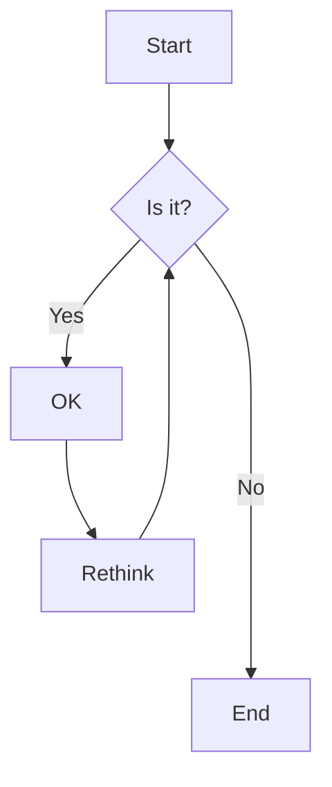
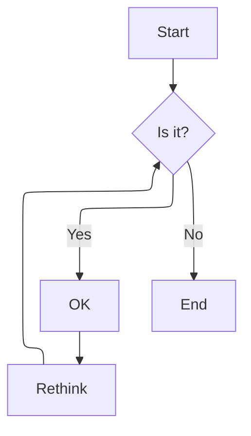

# wiki.loliot.net - Agent Guidelines

## Repository Layout

- `README.md`: Main README file for the repository. (contains docusaurus MDX features)
- `src/`: Custom components for Docusaurus.
- `static/`: Static files such as images, draw.io diagrams, etc.
- `docs/lang/`: Programming language and Programming related documentation.
- `docs/mlops/`: MLOps and related tools documentation.

## Documentation guidelines

### Metadata

Metadata is located at the top of each MDX file.

```mdx
---
id: <id>
title: <title>
sidebar_label: <sidebarLabel>
description: <description>
keywords:
  - <keyword1>
---
```

- `<id>` must be same as the file name without extension.

### Reference block

```mdx
:::info[References]

- [<referenceTitle>](<referenceLink>)

:::
```

- Links to other documentation pages must start with `/docs/` and end with `.mdx`. You may include anchors (`#<anchor>`) if needed.

### Contents

- Use Korean for the main content of the documentation (`docs/**/*.mdx`).
- Use English for code snippets, commands, and configuration files.
- Use mermaid diagrams for flowcharts, architecture diagrams etc.
- Refer to the contents of the Reference block to improve the quality of the documentation.

## docusaurus MDX Features

### Tab

:::info[References]

- [Docusaurus / Docs / Guides / Markdown Features / Tabs](https://docusaurus.io/docs/markdown-features/tabs)

:::

````mdx
import Tabs from "@theme/Tabs";
import TabItem from "@theme/TabItem";

<Tabs
    groupId="os"
    defaultValue="arch"
    values={[
        {label: 'Arch Linux', value: 'arch',},
        {label: 'Debian', value: 'debian',}
    ]}
>

<TabItem value="arch">

```shell

```

</TabItem>

<TabItem value="debian">

```shell

```

</TabItem>

</Tabs>
````

### Admonitions

:::info[References]

- [Docusaurus / Docs / Guides / Markdown Features / Admonitions](https://docusaurus.io/docs/markdown-features/admonitions)

:::

```md
:::note
Gray
:::

:::tip
Green
:::

:::info
Blue
:::

:::warning
Yellow
:::

:::danger
Red
:::

:::::info[Parent]

::::danger[Child]

:::tip[Deep Child]

:::

::::

:::::
```

### Draw.io

:::info[References]

- [./src/components/DrawIOViewer.tsx](./src/components/DrawIOViewer.tsx)

:::

```tsx
import useBaseUrl from "@docusaurus/useBaseUrl";
import DrwaIOViewer from "@site/src/components/DrawIOViewer";

<center>
	<figure>
		<DrwaIOViewer src={useBaseUrl("img/<path>/example.drawio")} />
		<figcaption>Example</figcaption>
	</figure>
</center>;
```

### Mermaid

:::info[References]

- [Docusaurus / Docs / Guides / Markdown Features / Diagrams](https://docusaurus.io/docs/markdown-features/diagrams)

:::

````md

````


````md

````


