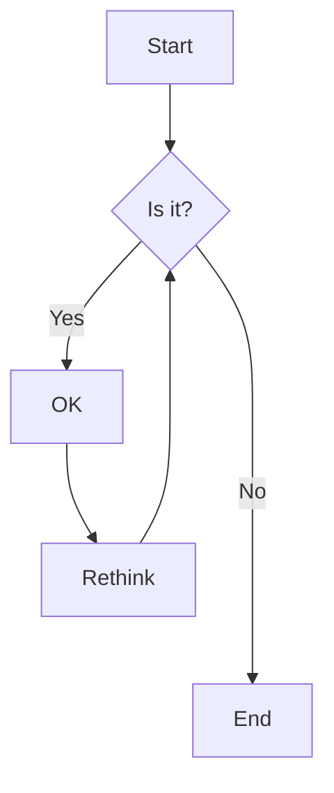
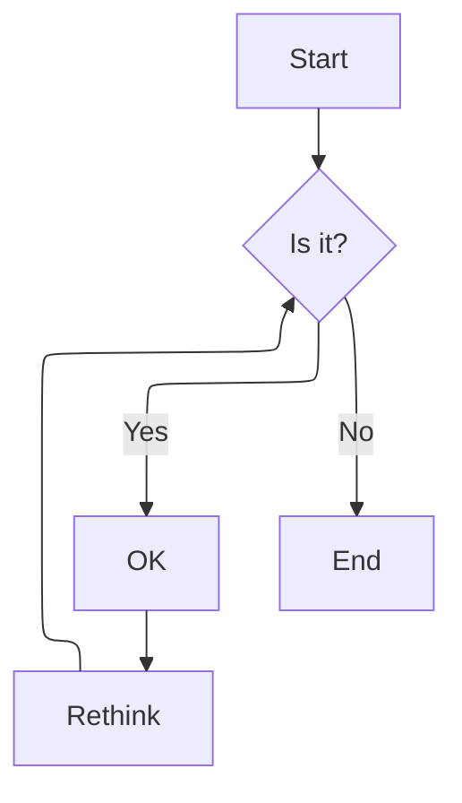

# wiki.loliot.net

## 설치

```shell
mise install
```

```shell
npm install
```

```shell
npm run start
```

## swizzle

```shell
npm run swizzle --list
```

```shell
npm run swizzle @docusaurus/theme-classic DocItem/Content --wrap
```

## docusaurus MDX Features

### Tab

:::info[References]

- [Docusaurus / Docs / Guides / Markdown Features / Tabs](https://docusaurus.io/docs/markdown-features/tabs)

:::

````mdx
import Tabs from "@theme/Tabs";
import TabItem from "@theme/TabItem";

<Tabs
    groupId="os"
    defaultValue="arch"
    values={[
        {label: 'Arch Linux', value: 'arch',},
        {label: 'Debian', value: 'debian',}
    ]}
>

<TabItem value="arch">

```shell

```

</TabItem>

<TabItem value="debian">

```shell

```

</TabItem>

</Tabs>
````

### Admonitions(경고)

:::info[References]

- [Docusaurus / Docs / Guides / Markdown Features / Admonitions](https://docusaurus.io/docs/markdown-features/admonitions)

:::

```md
:::note
회색
:::

:::tip
초록색
:::

:::info
파란색
:::

:::warning
노란색
:::

:::danger
빨간색
:::

:::::info[Parent]

::::danger[Child]

:::tip[Deep Child]

:::

::::

:::::
```

### Draw.io

:::info[References]

- [./src/components/DrawIOViewer.tsx](./src/components/DrawIOViewer.tsx)

:::

```tsx
import useBaseUrl from "@docusaurus/useBaseUrl";
import DrwaIOViewer from "@site/src/components/DrawIOViewer";

<center>
	<figure>
		<DrwaIOViewer src={useBaseUrl("img/<path>/example.drawio")} />
		<figcaption>Example</figcaption>
	</figure>
</center>;
```

### Mermaid

:::info[References]

- [Docusaurus / Docs / Guides / Markdown Features / Diagrams](https://docusaurus.io/docs/markdown-features/diagrams)

:::

````md

````


````md

````


