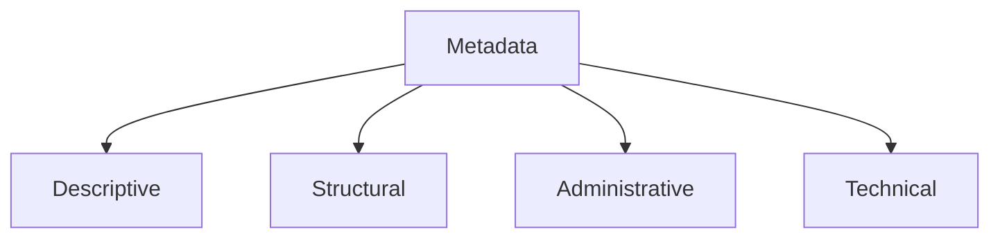

:::info[References]

- [/docs/data/concepts/ontology.mdx](/docs/data/concepts/ontology.mdx)
- [/docs/data/concepts/schema.mdx](/docs/data/concepts/schema.mdx)
- [Understanding Metadata](https://www.niso.org/publications/understanding-metadata-2017)
- [Dublin Core Metadata Initiative](https://www.dublincore.org/specifications/dublin-core/)

:::

## What Metadata Is

Metadata is descriptive information about data, documents, systems, or other resources.

It helps people and software understand what something is, where it came from, how it should be used, and how it should be managed.

Typical metadata answers questions such as:

- What is this resource called?
- Who created it?
- When was it created or updated?
- What format does it use?
- What topic or category does it belong to?
- What policies or permissions apply to it?

## Common Types of Metadata

Metadata is often grouped into a few practical categories.

- `Descriptive metadata`: title, author, tags, keywords, summary
- `Structural metadata`: how parts are arranged, such as chapters, fields, or sections
- `Administrative metadata`: ownership, version, retention, permissions, lineage
- `Technical metadata`: format, encoding, schema version, file type, size

## What Metadata Is Good At

Metadata is useful because it makes resources easier to find, manage, and govern.

- `Discovery`: supports search, indexing, and filtering
- `Governance`: captures ownership, quality, lineage, and policy information
- `Interoperability`: helps systems exchange context around raw data
- `Operations`: improves cataloging, auditing, and lifecycle management

Many platforms depend on metadata even when users do not notice it directly.

## Metadata Versus Schema And Ontology

Metadata, schema, and ontology often overlap in conversation, but their roles are different.

| Concept | Main concern |
| --- | --- |
| Metadata | Description and context around a resource |
| Schema | Structural shape and validation rules |
| Ontology | Shared semantic meaning, relations, and constraints |

For example:

- metadata may say a dataset is owned by `Team A` and was updated yesterday
- schema may say the dataset has fields `customer_id`, `region`, and `revenue`
- ontology may say `customer` is a type of business entity and `region` refers to a geographic area with defined relations

This is why metadata is often necessary but not sufficient. It adds context, but it does not always define precise semantics on its own.

## Practical Example

Imagine a document repository.

Each document may include metadata such as:

- title
- author
- created date
- document type
- confidentiality level
- tags

That metadata helps users search and manage documents. But it still may not fully explain whether a `policy`, `standard`, `procedure`, and `guideline` are semantically different classes with distinct relationships. That deeper meaning is closer to ontology.

## Common Mistakes

- Treating any label set as complete semantic modeling
- Mixing business meaning into loose free-text tags
- Capturing metadata without ownership or governance
- Using inconsistent names for the same descriptive field
- Assuming metadata quality will improve without standards

## Summary

Metadata is contextual information about resources.

It is essential for discovery, management, and governance. Its strength is practical description. Its limitation is that it often describes resources without fully defining their semantic meaning. That is why metadata works best alongside schema and ontology rather than replacing them.
