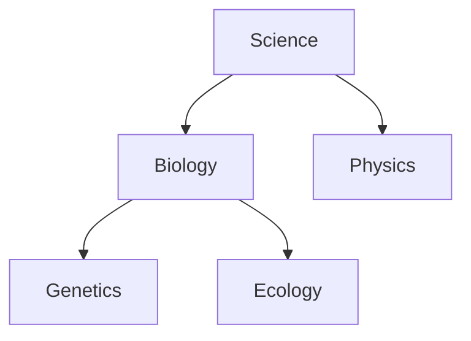

:::info[References]

- [/docs/data/concepts/ontology.mdx](/docs/data/concepts/ontology.mdx)
- [Taxonomy Strategies](https://boxesandarrows.com/taxonomy-strategies/)
- [Library of Congress Linked Data Service](https://id.loc.gov/)

:::

## What Taxonomy Is

A taxonomy is a structured way to classify things into categories, usually in a hierarchy.

Its main purpose is organization. A taxonomy helps people place items into groups so they can browse, filter, search, and manage information more consistently.

Typical examples include:

- product categories in ecommerce
- topic trees in documentation systems
- subject headings in libraries
- issue labels grouped by function or team

## Core Structure

Most taxonomies are simpler than ontologies.

- `Category`: a named bucket such as `Hardware`, `Software`, or `Biology`
- `Subcategory`: a narrower bucket under a broader one
- `Term`: the label used to classify an item
- `Hierarchy`: parent-child structure between terms

The dominant relationship in a taxonomy is usually `broader than` or `narrower than`.

## What Taxonomy Is Good At

Taxonomy is useful when the main problem is classification rather than rich semantics.

- `Navigation`: lets users browse from broad topics to narrow ones
- `Label consistency`: reduces duplicate or competing category names
- `Search filtering`: supports faceted browsing and category constraints
- `Content management`: helps teams decide where information belongs

For many systems, a good taxonomy is the first layer of structure.

## Taxonomy Versus Ontology

Taxonomy and ontology are related, but they are not the same thing.

| Concept | Main concern | Typical structure | Semantic strength |
| --- | --- | --- | --- |
| Taxonomy | Grouping and hierarchy | Parent-child categories | Low to moderate |
| Ontology | Meaning, relations, constraints | Classes, instances, relations, rules | Higher |

A taxonomy can say:

- `Biology` is narrower than `Science`
- `Laptop` is a kind of `Computer`

An ontology can additionally say:

- a `Laptop` is used by a `Person`
- a `Computer` may belong to an `Organization`
- a `Device` has a `serialNumber`
- certain relations are mandatory or forbidden

That is why taxonomy is often part of a broader ontology, but it is usually not enough by itself when systems need strong semantic alignment.

## Practical Example

Imagine a company knowledge portal.

A taxonomy might classify documents as:

- `Engineering`
- `Product`
- `Operations`
- `Security`

Inside `Engineering`, the taxonomy may split into:

- `Frontend`
- `Backend`
- `Infrastructure`

This is useful for navigation and ownership, but it does not explain how `Service`, `Team`, `Incident`, and `Runbook` relate to each other. That is where ontology or a richer semantic model becomes useful.

## Common Mistakes

- Treating taxonomy labels as if they fully define meaning
- Creating overlapping categories with unclear boundaries
- Mixing topic hierarchy with workflow state
- Building trees that are too deep to use comfortably
- Allowing synonyms without governance

## Summary

Taxonomy is a classification system built mainly for grouping and navigation.

It is valuable because it makes information easier to organize and find. Its limitation is that it usually captures hierarchy better than meaning.

Use taxonomy when you need stable categories. Use ontology when you need explicit semantics, relations, and constraints.
