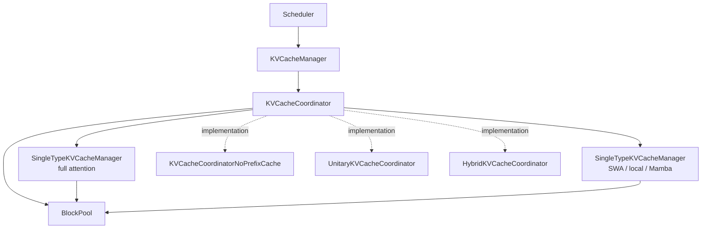
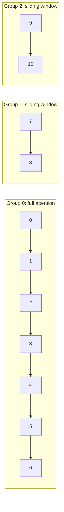
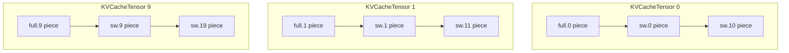
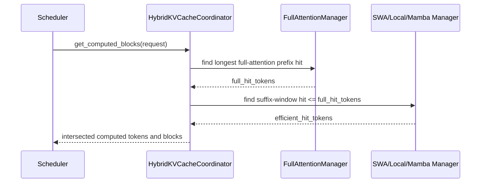

## Scope

:::info[References]

- [vLLM design note: Hybrid KV Cache Manager](https://github.com/vllm-project/vllm/blob/main/docs/design/hybrid_kv_cache_manager.md)
- [vLLM KVCache Analysis](/docs/infrastructure/ai-platform/vllm/kvcache.mdx)
- [KV Cache](/docs/science/llm/kvcache/overview.mdx)
- [Sliding Window Attention KVCache Size](/docs/science/llm/kvcache/sliding-window-attention.mdx)

:::

:::info[Local source paths]

The implementation paths below are relative to the local vLLM checkout used for this note.

- `docs/design/hybrid_kv_cache_manager.md`
- `vllm/v1/core/kv_cache_coordinator.py`
- `vllm/v1/core/kv_cache_manager.py`
- `vllm/v1/core/single_type_kv_cache_manager.py`
- `vllm/v1/core/kv_cache_utils.py`
- `vllm/v1/kv_cache_interface.py`
- `vllm/config/scheduler.py`
- `vllm/config/vllm.py`

:::

Hybrid models mix more than one KV-cache behavior inside the same model. Common patterns are:

- Full attention plus sliding-window attention, as in Gemma 2/3, GPT-OSS-style layouts, Ministral, and Cohere models.
- Full attention plus local or chunked local attention, as in Llama 4-style layouts.
- Full attention plus Mamba-style state layers, as in Bamba, Jamba, and MiniMax-style architectures.
- KV-sharing layers, where one layer reuses the KV cache produced by another layer.

A non-hybrid KV cache manager can reserve the same number of slots for every layer. That wastes memory for efficient-attention layers because sliding-window and local-attention layers only need the recent window, not the whole sequence. The hybrid manager keeps one physical block pool while letting each layer type reserve only the blocks it actually needs.

## Core Requirements

The hybrid KV cache manager must satisfy two requirements at the same time:

1. Allocate layer-type-specific slots.
   - Full attention layers reserve blocks for all tokens that remain in the sequence.
   - Sliding-window or local-attention layers reserve blocks only for the tokens inside the active attention window.
   - Mamba-style layers reserve state according to their state size, not a standard attention KV shape.
2. Preserve prefix caching semantics per layer type.
   - Full attention can reuse a prefix only when every prefix block remains cached from the beginning of the sequence.
   - Sliding-window attention can reuse a prefix when the last tokens needed by the window remain cached.
   - Hybrid models need the intersection of the cache hits across groups.

## Terms

- `KVCacheManager`: scheduler-facing interface for KV cache allocation and cache-hit discovery.
- `KVCacheCoordinator`: coordinator that combines one or more per-type managers into one allocation result for a request.
- `SingleTypeKVCacheManager`: manager for one KV cache group and one cache behavior, such as full attention or sliding-window attention.
- `KVCacheGroup`: a group of layers that share the same KV cache spec and therefore need the same number of logical blocks for a request.
- `block_size`: number of tokens represented by one logical block.
- `kv_hidden_size`: bytes needed to store one token's KV cache for one layer.
- `page_size`: physical bytes represented by one block allocation unit across the grouped layers. The design note uses `num_layers * block_size * kv_hidden_size`; the code-level `KVCacheSpec.page_size_bytes` is per layer and uses `block_size * kv_hidden_size`.

## Architecture



The implementation is layered as follows:

- `KVCacheManager` is the public scheduler-facing layer.
- `KVCacheCoordinator` owns the shared `BlockPool` and creates one `SingleTypeKVCacheManager` per `KVCacheGroup`.
- `KVCacheCoordinatorNoPrefixCache` is used when prefix caching is disabled.
- `UnitaryKVCacheCoordinator` is used when there is only one KV cache group, so there is no cross-group prefix-hit intersection.
- `HybridKVCacheCoordinator` handles the prefix-cache intersection case for a full-attention group plus one efficient-attention group.
- `SingleTypeKVCacheManager` implements group-specific allocation, skipped-token handling, cache-hit lookup, and block release.

## Allocation Model

vLLM uses one memory pool, so every group must be expressible with the same physical page size. The grouping algorithm therefore tries to make each group contain a compatible number of layers.

### Same Hidden Size With Regular Ratios

For a model with 10 full-attention layers and 20 sliding-window layers, the regular ratio is 1 full group to 2 sliding-window groups:

- Group 0: 10 full-attention layers.
- Group 1: 10 sliding-window layers.
- Group 2: 10 sliding-window layers.

If `block_size = 16`, `sliding_window = 32`, and request length is 112 tokens, the request needs:

- 7 blocks for the full-attention group, because all 112 tokens need slots.
- 2 blocks for the first sliding-window group, because only the last 32 tokens need slots.
- 2 blocks for the second sliding-window group, for the same reason.

The allocation has 11 logical blocks total: 7 full blocks plus 2 blocks for each sliding-window group.



### Same Hidden Size Without Regular Ratios

Some models do not have a clean ratio. Gemma-3-27B-style layouts have 52 sliding-window layers and 10 full-attention layers. The heuristic uses the smallest layer count among attention types as the group size:

- Group 0: 10 full-attention layers.
- Groups 1 through 6: 10 sliding-window layers each, except the final group.
- Final sliding-window group: 2 real sliding-window layers plus 8 padding layers.

This reduces the number of groups compared with making many tiny groups, but it can waste memory because padding layers are needed to preserve page-size compatibility.

### Different Hidden Sizes

Hybrid Mamba models can have attention KV hidden sizes and Mamba state sizes that are very different. The current strategy is:

1. Increase the attention `block_size` until `block_size * attention_kv_hidden_size` can cover the Mamba state size.
2. Pad the Mamba state per layer to that same physical size.
3. Apply the same grouping strategy used for irregular ratios.

This can create very large attention block sizes. The upstream design note calls out this area as still evolving.

### KV Sharing

For KV-sharing models, such as Gemma 3n-style layouts, the KV cache manager allocates blocks only for layers that own KV cache. Layers that share another layer's KV cache are ignored during allocation, and model-runner-side patches map the allocation result back onto the sharing layers.

## Memory Layout

For `n` KV cache groups with `m` layers per group, vLLM allocates `m` physical buffers. Each buffer is shared by one layer from each group.

In the 10 full + 20 sliding-window example:

- There are 3 groups and 10 layers per group.
- vLLM allocates 10 physical `KVCacheTensor` buffers.
- `KVCacheTensor 0` is shared by `full.0`, `sw.0`, and `sw.10`.
- Each logical block maps to one piece in each of the 10 physical buffers.



One logical block is therefore represented by one same-index piece across all physical buffers in the group set.

## Prefix Caching

The block pool keys cached blocks by both block hash and KV cache group. Conceptually, the key is:

```text
(block_hash, group_id) -> KVCacheBlock
```

The current code packs this as `BlockHashWithGroupId`, a raw byte key made from the block hash plus a 4-byte big-endian group id. This keeps identical token blocks in different groups independent for cache lookup and eviction.

### Full-Attention Groups

Full attention scans prefix blocks from left to right and stops at the first miss. The hit length is the longest prefix whose full block chain is still cached.

### Sliding-Window or Local-Attention Groups

Sliding-window groups do not need the earliest tokens for future attention. A valid cache hit can be found by checking from the right side of the candidate prefix, because the group only needs the window suffix. vLLM allocates distinct blocks for tokens and frees blocks that move outside the window, rather than using a pure ring buffer, because prefix caching needs stable block hashes.

### Hybrid Intersection

For a full-attention plus efficient-attention model, vLLM computes the shared hit like this:

1. Find the longest full-attention cache hit by scanning left to right.
2. Search the efficient-attention group from right to left, bounded by the full-attention hit length.
3. Return the efficient-attention hit that is also valid for the full-attention group.



The upstream design note describes this path as supporting exactly two attention types for prefix caching: one full-attention group plus one efficient-attention group. If prefix caching is disabled, vLLM can use `KVCacheCoordinatorNoPrefixCache` instead and avoid the intersection logic.

## Eviction and Free Blocks

The implementation uses one LRU-style free queue for all KV cache groups. Blocks return to the free queue when:

- a request finishes;
- a request is preempted and its blocks can be released;
- a sliding-window or local-attention block falls outside the active window.

Because cache keys include the group id, evicting one group's cached block does not imply that another group with the same token hash is also evicted.

## Scheduler Configuration

`SchedulerConfig.disable_hybrid_kv_cache_manager` controls whether vLLM uses the hybrid allocation behavior.

- `False`: use hybrid KV cache allocation when the model has multiple attention/cache types.
- `True`: allocate the same size KV cache for all attention layers, even if some layers are sliding-window or another efficient type.
- `None`: let vLLM choose the default from the environment and startup configuration.

Use the non-hybrid fallback when debugging model correctness, connector behavior, or a platform-specific issue where the hybrid grouping heuristic is suspected. It is usually less memory efficient for hybrid models.

## Practical Reading Notes

- The hybrid manager is about scheduler-side KV block accounting. Worker-side transfer and external KV movement still go through the KV connector lifecycle documented in [vLLM KVCache Analysis](/docs/infrastructure/ai-platform/vllm/kvcache.mdx).
- Prefix caching is group-aware. A cache hit in the full-attention group is not automatically a cache hit in a sliding-window group.
- Sliding-window groups free older blocks during long prefills, so admission control must reason about peak real-held blocks rather than simply total prompt length.
- Mamba and different-hidden-size hybrid layouts are the least stable part of the design and should be rechecked against upstream vLLM before making production assumptions.
