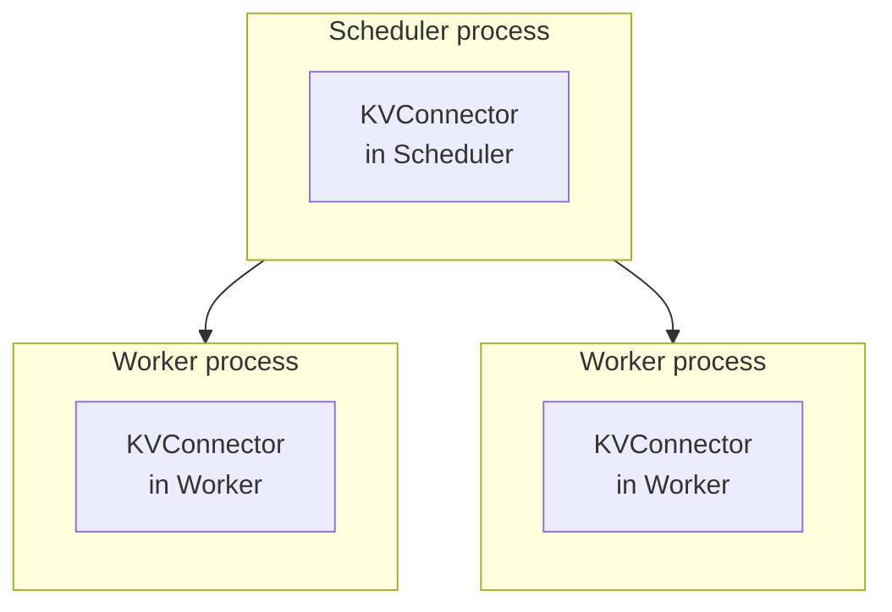
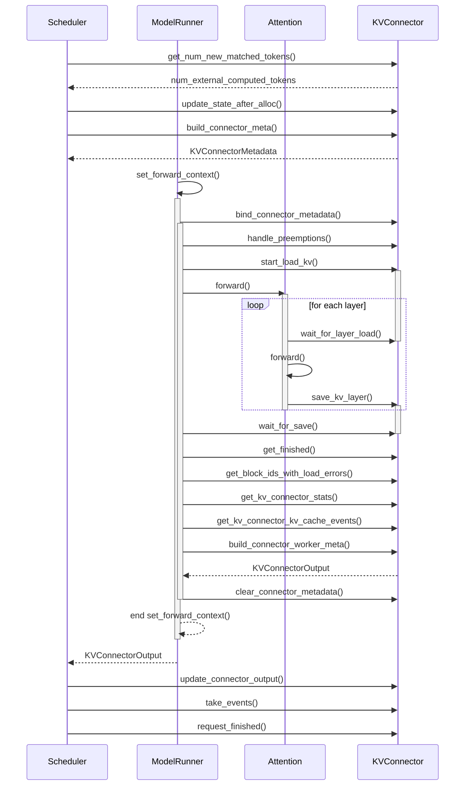

## vLLM Settings

:::info[Local source paths]

The source paths below are relative to the local vLLM checkout used for this note.

- `vllm/engine/arg_utils.py`
- `vllm/config/cache.py`
- `vllm/config/scheduler.py`
- `vllm/distributed/kv_events.py`
- `vllm/ray/ray_env.py`

:::

- Environment variables
  - `PYTHONHASHSEED=<int>`
    - Included in the Ray worker environment allowlist.
    - Set it when deterministic Python hash behavior is required across scheduler and worker processes.
- Scheduler
  - `--enable-chunked-prefill`
- Cache
  - `--enable-prefix-caching`
  - `--block-size <size>`
    - If omitted, `CacheConfig.DEFAULT_BLOCK_SIZE` is used before platform/backend alignment.
  - `--prefix-caching-hash-algo <algo>`
    - Specifies the hash algorithm.
    - `sha256`: default; uses Pickle serialization and SHA-256.
    - `sha256_cbor`: uses canonical CBOR serialization and SHA-256.
    - `xxhash`: uses Pickle serialization and xxHash.
    - `xxhash_cbor`: uses canonical CBOR serialization and xxHash.
- vLLM
  - `--kv-events-config <configJson>`
    - Configuration for the KVEvent publisher.
    - `enable_kv_cache_events: true`
    - `publisher: zmq`
    - `endpoint: tcp://<host>:<port>`
    - `topic: <topic>`
  - `--kv-transfer-config '{"<option>": "<value>", ...}'`
    - `<option>`
      - `kv_connector: <KVConnectorBaseV1Impl>`
        - Specifies the KVConnector implementation.
        - e.g. `NixlConnector`, `MultiConnector`
      - `kv_role: <role>`
        - Specifies one of `kv_producer`, `kv_consumer`, or `kv_both`.
      - `kv_connector_module_path: <module>`
        - Specifies the module path when using a KVConnector implementation that is not included in vLLM.
        - e.g. `lmcache.integration.vllm.lmcache_connector_v1`

## Sliding Window Attention

:::info[References]

- [Hybrid KV Cache Manager](/docs/infrastructure/ai-platform/vllm/hybrid-kv-cache-manager.mdx)
- [Sliding Window Attention KVCache Size](/docs/science/llm/kvcache/sliding-window-attention.mdx)

:::

The general KVCache sizing discussion for Sliding Window Attention lives in the
science-domain KV Cache documentation. Keep this vLLM page focused on vLLM
configuration, connector lifecycle, and prefill scheduling flow.

## KVConnectorBase_V1

:::info[References]

- [vLLM GitHub / PR #15960](https://github.com/vllm-project/vllm/pull/15960)

:::

:::info[Local source paths]

The source paths below are relative to the local vLLM checkout used for this note.

- `vllm/distributed/kv_transfer/kv_connector/v1/base.py`
- `vllm/v1/core/sched/scheduler.py`
- `vllm/v1/worker/gpu/kv_connector.py`
- `vllm/v1/worker/kv_connector_model_runner_mixin.py`
- `vllm/model_executor/layers/attention/kv_transfer_utils.py`
- `vllm/distributed/kv_transfer/kv_connector/v1/multi_connector.py`

:::

A single vLLM instance is structured as follows.

### Runtime Flow

### Worker-Side Hooks

- `register_kv_caches()`
  - Called during worker connector initialization with the per-layer KV cache tensors.
  - Used by connectors that need to pre-register KV buffers, such as NIXL-style transfers.
- `register_cross_layers_kv_cache()`
  - Optional setup hook for a single cross-layer KV cache tensor whose first dimension is `num_layers`.
  - Used only when the connector prefers cross-layer blocks and the model has a uniform layer layout.
- `set_host_xfer_buffer_ops()`
  - Provides xPU-specific host/device copy operations for connectors that transfer through host buffers.
- `bind_connector_metadata()`
  - Called before model execution with scheduler-built metadata.
  - The metadata drives runtime KV load and save behavior on the worker.
- `handle_preemptions()`
  - Called before `start_load_kv()` in the worker pre-forward path.
  - Lets async-save connectors preserve preempted requests or evicted blocks before they are overwritten.
- `start_load_kv()`
  - Worker-side method called from the forward context before the forward pass.
  - Starts loading KV from the connector into vLLM's paged KV buffer, potentially asynchronously.
- `wait_for_layer_load()`
  - Worker-side method called from inside attention layers.
  - Blocks until the KV for a specific layer has been loaded.
  - This enables layer-by-layer pipelining when `start_load_kv()` is asynchronous.
- `save_kv_layer()`
  - Worker-side method called from inside attention layers.
  - Starts saving a layer of paged KVCache from vLLM to the connector, potentially asynchronously.
- `wait_for_save()`
  - Worker-side method called as the forward context exits.
  - Blocks until all save operations are complete, preventing paged KV buffer overwrite before async saves finish.
- `get_finished()`
  - Called with finished request IDs after model execution.
  - Returns request IDs whose asynchronous send/save or receive/load operations have completed.
- `get_block_ids_with_load_errors()`
  - Returns block IDs whose external KV loads failed.
  - The scheduler uses this to adjust computed-token state and recompute invalid blocks.
- `get_kv_connector_stats()`
  - Returns connector statistics collected during the last interval.
- `get_kv_connector_kv_cache_events()`
  - Returns worker-side KV cache events collected during model execution.
- `get_handshake_metadata()`
  - Returns optional out-of-band handshake metadata for P/D worker coordination.
- `build_connector_worker_meta()`
  - Builds worker metadata for the current engine step and sends it back through `KVConnectorOutput`.
- `clear_connector_metadata()`
  - Called after model execution to clear the metadata bound before the forward pass.
- `no_forward()`
  - Worker path that can run connector pre/post processing without a model forward when connector output is available independently.

### Scheduler-Side Hooks

- `get_num_new_matched_tokens()`
  - Scheduler-side method that returns how many additional prefix tokens are available from external KVCache beyond the locally computed tokens.
  - May return `None` when the connector needs more time and the scheduler should query again later.
  - The returned boolean indicates whether the external KV load will happen asynchronously.
- `update_state_after_alloc()`
  - Scheduler-side method called after the KV cache manager allocates blocks for a request.
  - Receives the request, allocated blocks, and the number of external tokens that will be loaded.
  - May be called twice for an async-load request: once for connector-token allocation and again after load completion when additional blocks are allocated.
- `build_connector_meta()`
  - Scheduler-side method that builds metadata for the current scheduler step.
  - The base API requires this method not to mutate `scheduler_output`; calling it resets connector-side scheduler state.
- `on_new_request()`
  - Optional scheduler hook called when a new request is added.
- `update_connector_output()`
  - Called when the scheduler receives `KVConnectorOutput` from worker-side connectors.
  - Carries finished send/receive sets, invalid block IDs, worker metadata, stats, and KV events back into scheduler-side connector state.
- `request_finished()`
  - Scheduler-side method called exactly once before finished request blocks are freed.
  - A connector can return `True` to take responsibility for asynchronous block freeing.
- `request_finished_all_groups()`
  - HMA-aware variant used when a request has block IDs from multiple KV cache groups.
  - `MultiConnector` forwards this to connectors that implement `SupportsHMA`.
- `take_events()`
  - Returns connector-collected KV events since the last call.
- `reset_cache()`
  - Optional connector cache-reset hook used when scheduler reset paths need connector state cleanup.
- `shutdown()`
  - Called during shutdown so connectors can finish async operations and release resources.

## Prefill

:::info[Local source paths]

The source paths below are relative to the local vLLM checkout used for this note.

- `vllm/v1/core/sched/scheduler.py`
- `vllm/v1/core/kv_cache_manager.py`
- `vllm/v1/core/kv_cache_coordinator.py`
- `vllm/v1/core/single_type_kv_cache_manager.py`
- `vllm/v1/core/block_pool.py`
- `vllm/v1/worker/gpu/kv_connector.py`
- `vllm/v1/worker/gpu_model_runner.py`
- `vllm/distributed/kv_transfer/kv_connector/v1/lmcache_connector.py`
- `vllm/distributed/kv_transfer/kv_connector/v1/nixl/scheduler.py`

:::

:::warning

Functions that are called but do not affect the KVCache flow are omitted. The sequence may be slightly inaccurate because unnecessary steps were removed.

:::

Assumptions:

- LMCacheConnector is used.
- NixlConnector is used.
- Prefix cache is enabled.
- The scheduler path includes local prefix-cache lookup first, then external KV lookup through the connector.
- When the connector loads KV asynchronously, the request moves to `WAITING_FOR_REMOTE_KVS` and its blocks are cached after the transfer result is processed.

```mermaid
sequenceDiagram
  box rgba(130, 90, 50, 0.5) Prefill
    participant EngineCore
    participant Scheduler
    participant KVCacheManager
    participant KVCacheCoordinator
    participant SingleTypeKVCacheManager
    participant BlockPool
    participant Executor
    participant ModelRunner
    participant Attention
    participant EventPublisher
    participant MultiConnector
    participant LMCacheConnector
    participant NixlConnector
  end

  box rgba(50, 90, 130, 0.5) Decode
    participant D_NixlConnector as NixlConnector
  end

  EngineCore ->> Scheduler: schedule()
  Scheduler ->> KVCacheManager: get_computed_blocks()
  KVCacheManager ->> KVCacheCoordinator: find_longest_cache_hit()
  KVCacheCoordinator ->> SingleTypeKVCacheManager: find_longest_cache_hit()
  SingleTypeKVCacheManager ->> BlockPool: get_cached_block()
  BlockPool -->> SingleTypeKVCacheManager: cached_blocks
  SingleTypeKVCacheManager -->> KVCacheCoordinator: cached_blocks
  KVCacheCoordinator -->> KVCacheManager: cached_blocks, num_local_computed_tokens
  KVCacheManager -->> Scheduler: cached_blocks, num_local_computed_tokens

  Scheduler ->> MultiConnector: get_num_new_matched_tokens(request, num_local)
  MultiConnector ->> LMCacheConnector: get_num_new_matched_tokens()
  LMCacheConnector -->> MultiConnector: num_external_computed_tokens, load_kv_async
  MultiConnector -->> Scheduler: num_external_computed_tokens, load_kv_async

  alt load_kv_async
    Scheduler ->> Scheduler: num_new_tokens = 0
  else local compute
    Scheduler ->> Scheduler: num_new_tokens = request.num_tokens - (local + external)
    Scheduler ->> Scheduler: apply long prefill threshold and token budget
  end

  Scheduler ->> KVCacheManager: allocate_slots()
  KVCacheManager ->> KVCacheCoordinator: remove_skipped_blocks()
  KVCacheCoordinator ->> SingleTypeKVCacheManager: remove_skipped_blocks()
  SingleTypeKVCacheManager ->> BlockPool: free_blocks()
  KVCacheManager ->> KVCacheCoordinator: allocate_new_computed_blocks()
  KVCacheManager ->> KVCacheCoordinator: allocate_new_blocks()
  KVCacheCoordinator ->> SingleTypeKVCacheManager: allocate_new_blocks()
  SingleTypeKVCacheManager ->> BlockPool: get_new_blocks()
  BlockPool -->> SingleTypeKVCacheManager: new_blocks
  SingleTypeKVCacheManager -->> KVCacheCoordinator: new_blocks
  KVCacheCoordinator -->> KVCacheManager: new_blocks
  opt not load_kv_async
    KVCacheManager ->> KVCacheCoordinator: cache_blocks()
    KVCacheCoordinator ->> SingleTypeKVCacheManager: cache_blocks()
    SingleTypeKVCacheManager ->> BlockPool: cache_full_blocks()
    BlockPool ->> BlockPool: queue.append(BlockStored())
  end
  KVCacheManager -->> Scheduler: new_blocks

  Scheduler ->> MultiConnector: update_state_after_alloc()
  MultiConnector ->> LMCacheConnector: update_state_after_alloc()

  alt load_kv_async
    Scheduler ->> Scheduler: request.status = WAITING_FOR_REMOTE_KVS
    Scheduler ->> Scheduler: request.num_computed_tokens = local + external
  else scheduled prefill work
    Scheduler ->> Scheduler: request.status = RUNNING
    Scheduler ->> Scheduler: request.num_computed_tokens = local + external
  end

  Scheduler ->> MultiConnector: build_connector_meta()
  MultiConnector ->> LMCacheConnector: build_connector_meta()
  LMCacheConnector -->> MultiConnector: connector_metadata
  MultiConnector -->> Scheduler: connector_metadata

  Scheduler ->> KVCacheManager: take_events()
  KVCacheManager ->> BlockPool: take_events()
  BlockPool -->> KVCacheManager: events
  KVCacheManager -->> Scheduler: events

  Scheduler ->> EventPublisher: publish_events()
  Scheduler ->> EngineCore: schedule_output

  opt scheduled prefill work
    EngineCore ->> Executor: execute_model()
    Executor ->> ModelRunner: execute_model()
    ModelRunner ->> ModelRunner: set_forward_context()
    activate ModelRunner
    ModelRunner ->> MultiConnector: bind_connector_metadata()
    ModelRunner ->> MultiConnector: start_load_kv()
    MultiConnector ->> LMCacheConnector: start_load_kv()
    MultiConnector -->> ModelRunner: connector_output
    ModelRunner ->> Attention: forward()
    Attention -->> ModelRunner: model_output
    ModelRunner ->> MultiConnector: wait_for_save()
    MultiConnector ->> LMCacheConnector: wait_for_save()
    ModelRunner ->> MultiConnector: get_finished()
    MultiConnector ->> NixlConnector: get_finished()
    D_NixlConnector ->> NixlConnector: read()
    NixlConnector -->> D_NixlConnector: kv_cache
    NixlConnector -->> MultiConnector: finished_output
    MultiConnector -->> ModelRunner: finished_output
    ModelRunner ->> MultiConnector: clear_connector_metadata()
    ModelRunner ->> ModelRunner: end set_forward_context()
    deactivate ModelRunner
    ModelRunner -->> Executor: model_output
    Executor -->> EngineCore: model_output
  end

  EngineCore ->> Scheduler: update_from_output()
  alt kv_connector_output.invalid_block_ids
    Scheduler ->> Scheduler: _handle_invalid_blocks()
  end
  Scheduler ->> MultiConnector: update_connector_output()
  alt kv_connector_output.finished_recving
    Scheduler ->> Scheduler: finished_recving_kv_req_ids.add(request_id)
  end
  alt kv_connector_output.finished_sending
    Scheduler ->> KVCacheManager: free()
    KVCacheManager ->> KVCacheCoordinator: free()
    KVCacheCoordinator ->> SingleTypeKVCacheManager: free()
    SingleTypeKVCacheManager ->> BlockPool: free_blocks()
  end

  EngineCore ->> Scheduler: schedule()
  alt request is WAITING_FOR_REMOTE_KVS and recv finished
    Scheduler ->> KVCacheManager: cache_blocks()
    KVCacheManager ->> KVCacheCoordinator: cache_blocks()
    KVCacheCoordinator ->> SingleTypeKVCacheManager: cache_blocks()
    SingleTypeKVCacheManager ->> BlockPool: cache_full_blocks()
    Scheduler ->> Scheduler: request.status = WAITING or PREEMPTED
  end
  opt request finishes
    Scheduler ->> KVCacheManager: remove_skipped_blocks()
    Scheduler ->> MultiConnector: request_finished()
    MultiConnector ->> NixlConnector: request_finished()
    NixlConnector -->> MultiConnector: delay_free_blocks, kv_xfer_params
    MultiConnector -->> Scheduler: delay_free_blocks, kv_xfer_params
    opt not delay_free_blocks
      Scheduler ->> KVCacheManager: free()
      KVCacheManager ->> KVCacheCoordinator: free()
      KVCacheCoordinator ->> SingleTypeKVCacheManager: free()
      SingleTypeKVCacheManager ->> BlockPool: free_blocks()
    end
  end

  Scheduler ->> KVCacheManager: take_events()
  KVCacheManager ->> BlockPool: take_events()
  BlockPool -->> KVCacheManager: events
  KVCacheManager -->> Scheduler: events

  Scheduler ->> EventPublisher: publish_events()
  Scheduler ->> EngineCore: schedule_output
```

- `get_computed_blocks()`: finds local prefix-cache hits only when prefix caching is enabled and the request is allowed to read from prefix cache. A full prompt hit still recomputes the last token so logits can be produced.
- `get_num_new_matched_tokens()`: asks the connector how many additional tokens are externally computed and whether their KV must be loaded asynchronously. If the connector cannot answer yet, the scheduler skips the request for this step.
- `num_new_tokens`: for normal prefill, starts from `request.num_tokens - (num_local_computed_tokens + num_external_computed_tokens)` and is then capped by `long_prefill_token_threshold`, the current token budget, encoder-input scheduling, and Mamba block-aligned splitting when those features apply. For async KV load, vLLM sets `num_new_tokens = 0` and allocates slots only for externally computed tokens.
- `allocate_slots()`: handles local computed blocks, externally computed tokens, new tokens, lookahead slots, encoder tokens, full-sequence admission, skipped-block removal for sliding-window attention, and delayed caching for async KV load.
- `update_state_after_alloc()`: passes the request, the currently allocated blocks, and `num_external_computed_tokens` to the connector so it can decide the load or save plan for this scheduler step.
- `WAITING_FOR_REMOTE_KVS`: async KV load moves the request to this state. After `KVConnectorOutput.finished_recving` arrives, the scheduler caches successfully received blocks and promotes the request back to `WAITING` or `PREEMPTED`.
- `update_from_output()`: consumes `KVConnectorOutput`, including `invalid_block_ids`, `finished_recving`, and `finished_sending`. Invalid blocks reduce the computed-token count so the affected portion can be recomputed.
- `request_finished()`: is called only when a request actually finishes. Before the connector receives the block IDs, vLLM removes skipped blocks. The connector may return `delay_free_blocks=True`; in that case the scheduler frees blocks later, after `finished_sending` is reported.
- `free_blocks()`: adds a block to `free_block_queue` when `block.ref_cnt` is 0.
