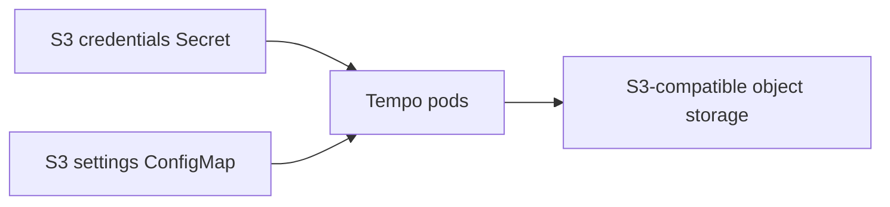

:::info[References]

- [Grafana Community Helm Charts / tempo-distributed](https://grafana-community.github.io/helm-charts)
- [Grafana Tempo / Configure object storage](https://grafana.com/docs/tempo/latest/configuration/)

:::

## Goal

Install Tempo with the `tempo-distributed` Helm chart and configure trace storage with an S3-compatible object storage bucket. The storage flow is:



Tempo reads the object storage endpoint, bucket name, region, and credentials from Kubernetes objects and expands them into the Tempo configuration at runtime.

## Prerequisites

- A running Kubernetes cluster.
- Helm 3.
- An S3-compatible object storage bucket for Tempo trace blocks.
- An access key and secret key with read/write access to the bucket.
- A network path from the Tempo pods to the S3-compatible object storage endpoint.

## Create the namespace and S3 configuration

Create a namespace, a Secret for credentials, and a ConfigMap for non-secret S3 settings.

```yaml title="tempo-storage.yaml"
apiVersion: v1
kind: Namespace
metadata:
  name: tempo
---
apiVersion: v1
kind: Secret
metadata:
  name: tempo-s3-credentials
  namespace: tempo
type: Opaque
stringData:
  AWS_ACCESS_KEY_ID: "<access-key>"
  AWS_SECRET_ACCESS_KEY: "<secret-key>"
---
apiVersion: v1
kind: ConfigMap
metadata:
  name: tempo-s3-settings
  namespace: tempo
data:
  S3_ENDPOINT: "<host>:<port>"
  S3_BUCKET: "<bucket-name>"
  S3_REGION: "<region>"
```

```shell
kubectl apply -f tempo-storage.yaml
```

Check that the objects exist.

```shell
kubectl -n tempo get secret tempo-s3-credentials
kubectl -n tempo get configmap tempo-s3-settings
```

## Install the Helm chart

Use the Grafana Community Helm chart repository.

```shell
helm repo add grafana-community https://grafana-community.github.io/helm-charts
helm repo update grafana-community
helm search repo grafana-community/tempo-distributed -l | head -n 10
```

Pull `tempo-distributed` `2.23.1` and keep a copy of the default values for reference.

```shell
helm pull grafana-community/tempo-distributed --version 2.23.1
helm show values grafana-community/tempo-distributed --version 2.23.1 > tempo-distributed-2.23.1.yaml
```

Use environment expansion so Tempo can read the bucket connection details from the Secret and ConfigMap.

```yaml title="tempo-distributed-values.yaml"
fullnameOverride: tempo

global:
  dnsService: coredns

traces:
  otlp:
    http:
      enabled: true
    grpc:
      enabled: true

storage:
  trace:
    backend: s3
    s3:
      forcepathstyle: true
      insecure: true
      endpoint: "${S3_ENDPOINT}"
      region: "${S3_REGION}"
      bucket: "${S3_BUCKET}"
      access_key: "${AWS_ACCESS_KEY_ID}"
      secret_key: "${AWS_SECRET_ACCESS_KEY}"

extraEnvFrom: &tempoStorageEnv
  - secretRef:
      name: tempo-s3-credentials
  - configMapRef:
      name: tempo-s3-settings

compactor:
  extraArgs:
    - -config.expand-env=true
  extraEnvFrom: *tempoStorageEnv

distributor:
  extraArgs:
    - -config.expand-env=true
  extraEnvFrom: *tempoStorageEnv

ingester:
  extraArgs:
    - -config.expand-env=true
  extraEnvFrom: *tempoStorageEnv

querier:
  extraArgs:
    - -config.expand-env=true
  extraEnvFrom: *tempoStorageEnv

queryFrontend:
  extraArgs:
    - -config.expand-env=true
  extraEnvFrom: *tempoStorageEnv
```

:::warning

Set `storage.trace.s3.endpoint` to `host:port`, not to a full URL. For example, use `s3.example.internal:9000`, not `http://s3.example.internal:9000`. Tempo's S3 client expects the endpoint field without a URL scheme.

:::

Render the manifests before installing.

```shell
helm template tempo tempo-distributed-2.23.1.tgz \
    -n tempo \
    -f tempo-distributed-values.yaml \
    > tempo-distributed.yaml
```

Install or upgrade Tempo.

```shell
helm upgrade -i tempo tempo-distributed-2.23.1.tgz \
    --history-max 5 \
    -n tempo \
    -f tempo-distributed-values.yaml
```

## Scheduling notes

If the cluster has tainted worker pools and Tempo runs multiple replicas, add tolerations to every replicated Tempo component and cache component that must schedule on those nodes. Keep this generic and match the taints used by the cluster.

```yaml title="tempo-distributed-values.yaml"
ingester:
  tolerations:
    - key: example.com/dedicated
      operator: Exists
      effect: NoSchedule

querier:
  tolerations:
    - key: example.com/dedicated
      operator: Exists
      effect: NoSchedule

queryFrontend:
  tolerations:
    - key: example.com/dedicated
      operator: Exists
      effect: NoSchedule

distributor:
  tolerations:
    - key: example.com/dedicated
      operator: Exists
      effect: NoSchedule
```

## Verify

Check that the storage configuration exists.

```shell
kubectl -n tempo get secret tempo-s3-credentials
kubectl -n tempo get configmap tempo-s3-settings
```

Check that Tempo pods are ready.

```shell
kubectl -n tempo get pods -l app.kubernetes.io/instance=tempo
```

Check that Tempo can reach the S3-compatible object storage endpoint by reading logs from the components that write or read trace blocks.

```shell
kubectl -n tempo logs deploy/tempo-distributor --tail=100
kubectl -n tempo logs statefulset/tempo-ingester --tail=100
kubectl -n tempo logs deploy/tempo-querier --tail=100
```

## Uninstall

```shell
helm uninstall -n tempo tempo
```

Delete the storage Secret and ConfigMap only when the trace data can be removed or is no longer needed.

```shell
kubectl -n tempo delete secret tempo-s3-credentials
kubectl -n tempo delete configmap tempo-s3-settings
```
