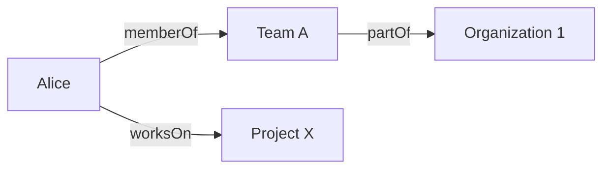

:::info[References]

- [/docs/knowledge/concepts/ontology.mdx](/docs/knowledge/concepts/ontology.mdx)
- [Knowledge Graphs](https://queue.acm.org/detail.cfm?id=3447772)
- [RDF 1.1 Primer](https://www.w3.org/TR/rdf11-primer/)

:::

## What a Knowledge Graph Is

A knowledge graph is a graph-based representation of entities and the relationships between them.

It stores facts as connected nodes and edges so that systems can traverse, query, and combine information across many sources.

In simple terms:

- nodes represent things
- edges represent relationships
- properties add descriptive details

## Core Structure

Most knowledge graphs are built from a small set of recurring ideas.

- `Entity`: a thing such as a person, company, system, or document
- `Relation`: a typed edge such as `memberOf`, `locatedIn`, or `dependsOn`
- `Property`: descriptive data attached to an entity or relation
- `Graph`: the network formed by linked facts

## What Knowledge Graphs Are Good At

Knowledge graphs are useful when information is highly connected.

- `Entity linking`: combine records from multiple systems around the same subject
- `Semantic search`: retrieve results through relations, not only text matching
- `Exploration`: move through related entities and discover neighborhoods of meaning
- `Context assembly`: gather connected facts for analytics, assistants, and workflows

They are especially useful when the same entity appears in many systems under different identifiers or contexts.

## Knowledge Graph Versus Ontology

Ontology and knowledge graph are closely related, but they are not identical.

| Concept | Main purpose |
| --- | --- |
| Ontology | Define the meaning of entities, classes, relations, and constraints |
| Knowledge graph | Store and query concrete connected facts |

An ontology may define:

- `Person` is a class
- `memberOf` links a `Person` to a `Team`
- `Team` is part of an `Organization`

A knowledge graph may store:

- `Alice memberOf Team A`
- `Team A partOf Organization 1`
- `Alice worksOn Project X`

In practice, an ontology often helps a knowledge graph remain coherent. Without shared semantics, graph edges may still exist, but they become harder to interpret, validate, and reuse.

## Practical Example

Imagine an enterprise support platform.

Different tools track:

- employees
- services
- incidents
- repositories
- teams

A knowledge graph can connect these facts:

- which team owns which service
- which repository supports which service
- which incidents affected which customers
- which engineer was on call during a given event

Once the graph exists, systems can answer connected questions more naturally, such as "Which incidents affected services owned by teams in the payments organization?"

## Common Mistakes

- Building a graph without clear relation semantics
- Treating every edge as a generic connection
- Skipping entity identity resolution
- Assuming graph storage alone creates useful knowledge
- Forgetting governance for updates, source quality, and stale facts

## Summary

A knowledge graph stores connected facts about entities and relationships.

Its strength is traversable context. Its quality depends heavily on consistent semantics, clear entity identity, and well-defined relations. That is why ontology and knowledge graph often work best together.
