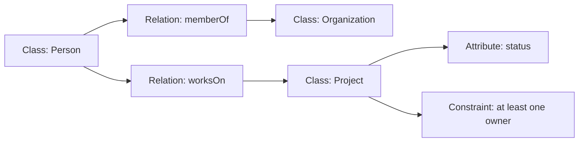

:::info[References]

- [/docs/knowledge/concepts/metadata.mdx](/docs/knowledge/concepts/metadata.mdx)
- [/docs/knowledge/concepts/taxonomy.mdx](/docs/knowledge/concepts/taxonomy.mdx)
- [/docs/knowledge/concepts/schema.mdx](/docs/knowledge/concepts/schema.mdx)
- [/docs/knowledge/concepts/knowledge-graph.mdx](/docs/knowledge/concepts/knowledge-graph.mdx)
- [A Translation Approach to Portable Ontology Specifications](https://tomgruber.org/writing/ontolingua-kaj-1993.pdf)
- [Ontology Development 101: A Guide to Creating Your First Ontology](https://protege.stanford.edu/publications/ontology_development/ontology101.pdf)
- [OWL 2 Web Ontology Language Document Overview](https://www.w3.org/TR/owl2-overview/)

:::

## What Ontology Is

In information modeling, an ontology is a formal and shared way to describe what exists in a domain, how those things are categorized, and how they relate to each other.

An ontology is not just a word list. It tries to make meaning explicit so that people, software systems, and datasets can interpret the same concepts in a consistent way.

At a practical level, an ontology usually answers questions such as:

- What kinds of things exist in this domain?
- How are they different from each other?
- Which relationships are valid?
- Which properties can each thing have?
- Which rules or constraints should always hold?

When teams say they want "shared semantics," they usually want ontology-like behavior even if they do not use the word directly.

## Core Building Blocks

The core parts of an ontology are usually simple, even when the full model becomes large.

- `Class`: a category of thing, such as `Person`, `Organization`, or `Project`
- `Instance`: a concrete member of a class, such as `Alice`, `OpenAI`, or `Project Atlas`
- `Relation`: a meaningful link between things, such as `worksOn`, `memberOf`, or `dependsOn`
- `Attribute`: a property that describes a thing, such as `name`, `startDate`, or `status`
- `Constraint`: a rule that limits what is valid, such as "a project must have at least one owner"

These parts matter because ontology is not only about naming objects. It is about defining the semantics around those objects.

## Ontology Versus Similar Artifacts

Several adjacent artifacts look similar to ontology, but they solve different problems.

| Artifact | Primary focus | Typical strength | Typical limitation |
| --- | --- | --- | --- |
| Taxonomy | Hierarchical categorization | Good for grouping and navigation | Usually too weak to express rich relations |
| Schema | Structural shape of data | Good for validation and storage design | Often says little about domain meaning |
| Metadata | Descriptive labels about data | Good for discovery and management | Often shallow without a shared semantic model |
| Knowledge graph | Connected facts about entities | Good for querying and linking facts | Needs ontology or similar semantics to stay coherent |
| Ontology | Meaning, categories, relations, and constraints | Good for semantic consistency and integration | Costs more to design and govern well |

The practical distinction is this:

- A `taxonomy` tells you how to group things.
- A `schema` tells you how data is shaped.
- A `knowledge graph` stores connected facts.
- An `ontology` tells you what those facts mean.

In real systems, these artifacts often work together rather than replacing each other.

See also:

- [/docs/knowledge/concepts/metadata.mdx](/docs/knowledge/concepts/metadata.mdx)
- [/docs/knowledge/concepts/taxonomy.mdx](/docs/knowledge/concepts/taxonomy.mdx)
- [/docs/knowledge/concepts/schema.mdx](/docs/knowledge/concepts/schema.mdx)
- [/docs/knowledge/concepts/knowledge-graph.mdx](/docs/knowledge/concepts/knowledge-graph.mdx)

## Practical Example

Imagine a team building a project-portfolio platform used by multiple departments.

Without an ontology, one system might treat `owner` as a person, another as a team, and another as a cost center. All three systems may look structurally valid while still disagreeing semantically.

With an ontology, the team can define a shared model such as:

- `Person` and `Team` are different classes
- `Project` is owned by a `Team`
- `Project` may have a sponsor who is a `Person`
- `Person` may be a member of one or more `Team`
- `ArchivedProject` is a subtype of `Project`

This does not require a very academic system. Even a lightweight ontology can reduce ambiguity if the classes, relations, and constraints are explicit.

## How Ontologies Help in Practice

Ontology becomes useful when multiple people or systems need to align on meaning.

- `Data integration`: different datasets can map to the same concepts instead of inventing incompatible labels
- `Search and discovery`: search can use semantic relationships, not only keyword matching
- `Analytics consistency`: dashboards become easier to trust when key terms mean the same thing everywhere
- `Automation`: workflows and agents can act on typed entities and explicit relations instead of fragile text conventions
- `Knowledge graph quality`: graph edges become easier to validate when relation semantics are defined
- `Reasoning potential`: some systems can infer new facts from declared rules and class relationships

In practice, many valuable ontologies are modest. They do not need full formal reasoning to be useful. A clear shared model already removes a large amount of ambiguity.

## Common Mistakes

Ontology work often fails for predictable reasons.

- Treating a taxonomy as a complete ontology
- Using vague relation names such as `linkedTo` for everything
- Modeling labels without clarifying semantics
- Creating too many classes before understanding real use cases
- Ignoring constraints, cardinality, and ownership rules
- Letting each team redefine the same concept independently

A good ontology is usually:

- explicit enough to remove ambiguity
- small enough to govern
- stable enough to reuse
- practical enough to support real decisions and systems

## Summary

Ontology is a shared semantic model for a domain. It helps define what things exist, how they are related, and which rules make those relationships meaningful.

For beginners, the key idea is that ontology is about meaning, not just labels.

For practitioners, the key value is that ontology improves consistency across schemas, metadata, APIs, graphs, and organizational language.
