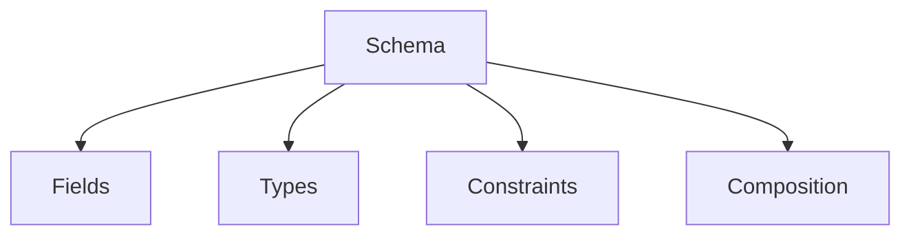

:::info[References]

- [/docs/knowledge/concepts/ontology.mdx](/docs/knowledge/concepts/ontology.mdx)
- [JSON Schema Specification](https://json-schema.org/specification)
- [XML Schema Definition Tutorial](https://www.w3schools.com/xml/schema_intro.asp)

:::

## What Schema Is

A schema defines the structure that data is expected to follow.

It usually answers structural questions such as:

- Which fields exist?
- What types do they have?
- Which fields are required?
- Which nested structures are allowed?
- Which values are valid?

Schemas are central to storage, interchange, and validation because they make expected shapes explicit.

## Core Building Blocks

The exact details depend on the technology, but most schemas define:

- `Fields`: named elements such as `name`, `email`, or `createdAt`
- `Types`: string, number, boolean, object, array, and other domain-specific types
- `Constraints`: required fields, min/max limits, patterns, enums
- `Composition`: nesting, references, inheritance, or reusable fragments



## What Schema Is Good At

Schema is valuable when the main problem is making data valid, predictable, and interoperable.

- `Validation`: reject malformed or incomplete data
- `Storage design`: define columns, documents, objects, or messages
- `API contracts`: specify request and response shapes
- `Tooling`: generate clients, forms, migrations, and documentation

Schema works especially well when the system needs reliable data exchange.

## Schema Versus Ontology

Schema and ontology often coexist, but they answer different questions.

| Concept | Main question |
| --- | --- |
| Schema | "What shape must this data have?" |
| Ontology | "What does this data mean?" |

A schema may say:

- `ownerId` is a required string
- `status` must be one of `draft`, `active`, or `archived`

An ontology may say:

- `owner` must refer to a `Team`, not a `Person`
- `archived` projects cannot be active work items
- `Project` and `Program` are distinct concepts with different relations

This is the core difference: schema is about structure and validity, while ontology is about semantics and interpretation.

## Practical Example

Suppose an API accepts this shape:

```json
{
  "projectId": "p-001",
  "ownerId": "team-7",
  "status": "active"
}
```

The schema can validate:

- `projectId` exists
- `ownerId` is a string
- `status` is one of the allowed values

But the schema alone usually cannot express the full semantic meaning of `ownerId`, such as whether it points to a team, a business unit, or a person. That semantic layer is where ontology helps.

## Common Mistakes

- Assuming structural validity guarantees semantic correctness
- Mixing business meaning into poorly named primitive fields
- Letting multiple incompatible schemas represent the same concept
- Treating schema evolution as only a technical concern instead of a semantic one

## Summary

Schema defines how data is structured and validated.

It is essential for interoperability and quality control, but it does not automatically provide rich semantics. Use schema for shape and validation. Use ontology when meaning and relationships must also be explicit.
