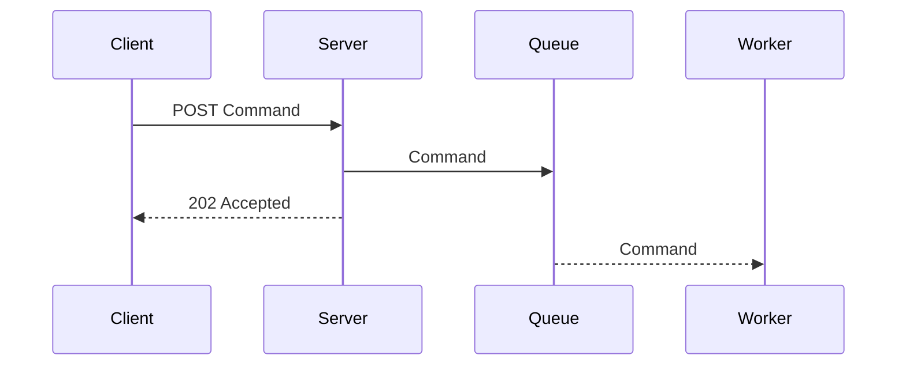
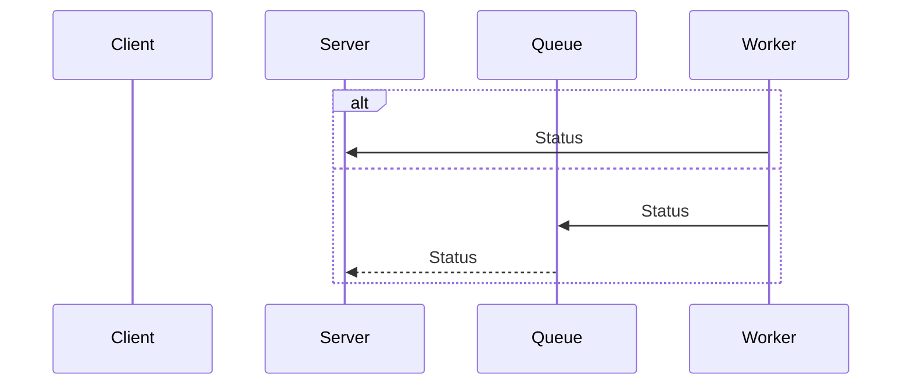
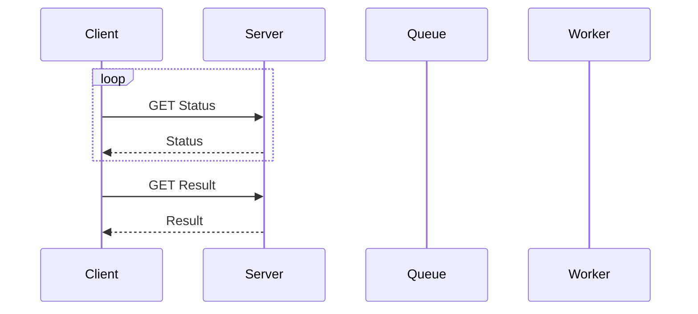
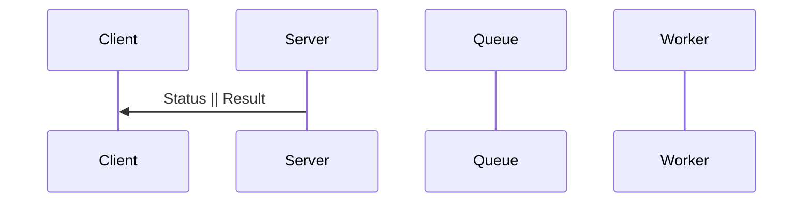
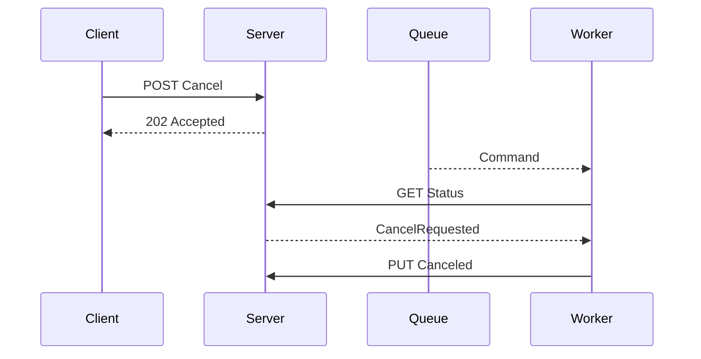

## Long Running Task

클라이언트에서 서버에 요청을 보냈을 때, 서버에서 신속하게 응답을 보내지 못하지만 클라이언트는 서버의 응답을 받아야하는 경우가 있습니다. 예를 들어 처리하는 데 1초가 걸리는 CPU 바운드 작업을 요청했을 때, 대량의 요청이 오는 경우 서버는 1초 이상 응답을 못하거나 요청 자체를 처리하지 못할 수 있습니다.

이런 경우 고민해야하는 사항은

- 서버가 요청을 처리하는 방법
- 서버가 처리를 완료한 후 클라이언트에게 응답을 보내는 방법
- 완료되기 전에 클라이언트가 요청을 취소하는 방법

입니다.

이러한 상황에 대해 Scale up/out만으로 처리할 수 없는 경우 클라이언트, 서버, 워커 사이에서 요청(Command), 상태(Status), 응답(Response)에 대한 설계로 해결할 수 있습니다.

## 요청(Command)

## 상태(Status) && 응답(Result)

### Polling

Polling이 많아지면 서버에 부하가 걸리기 때문에 이를 완화하기 위해 `Retry-After: <date||seconds>` 헤더를 사용하여 클라이언트가 요청 간격을 조절할 수 있도록 하는 것이 좋습니다.

### SSE(Server Sent Event) || Websocket

## 취소(Cancel)

