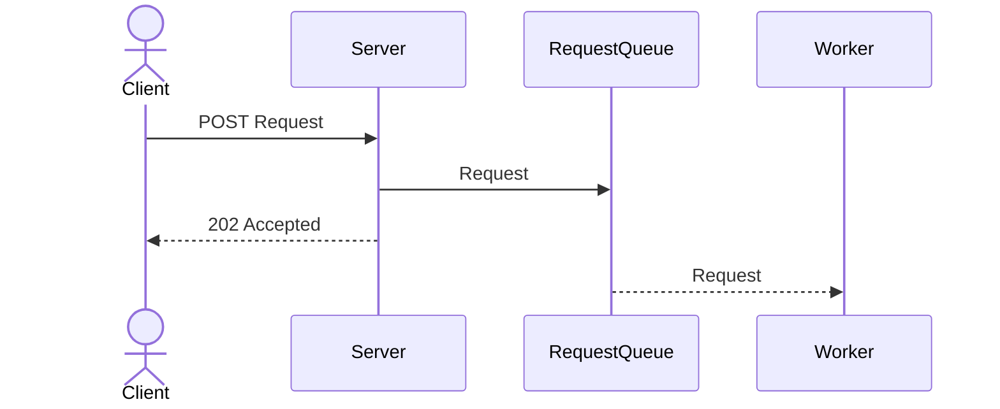
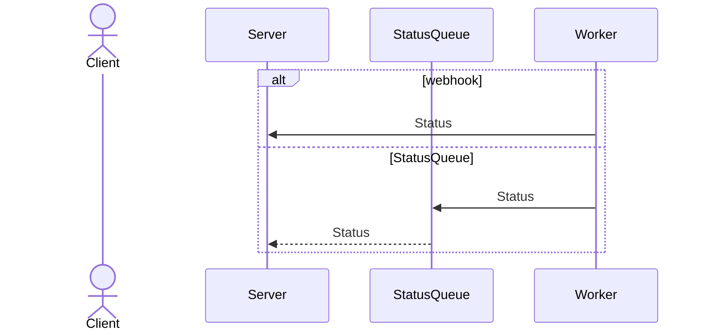
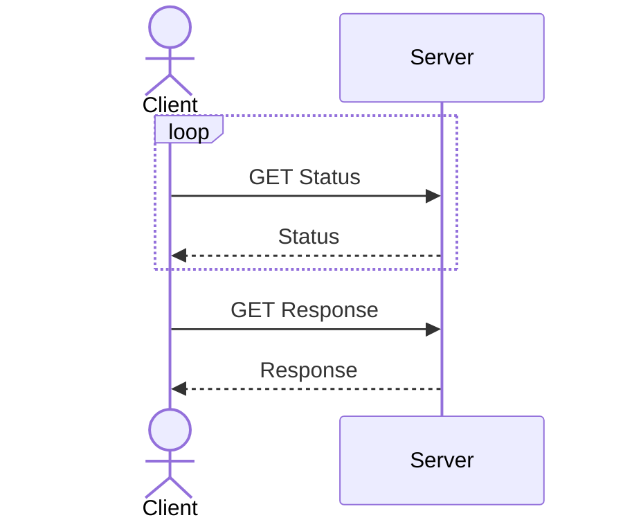
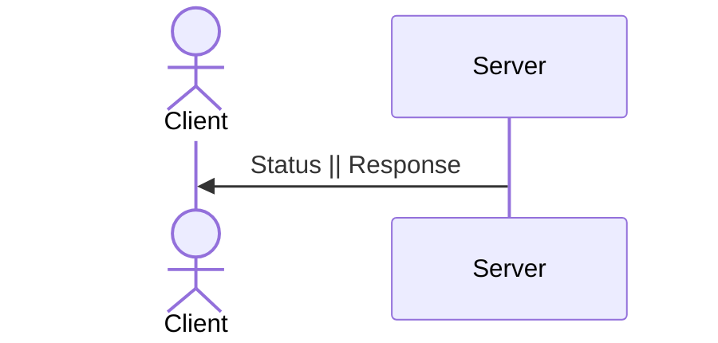
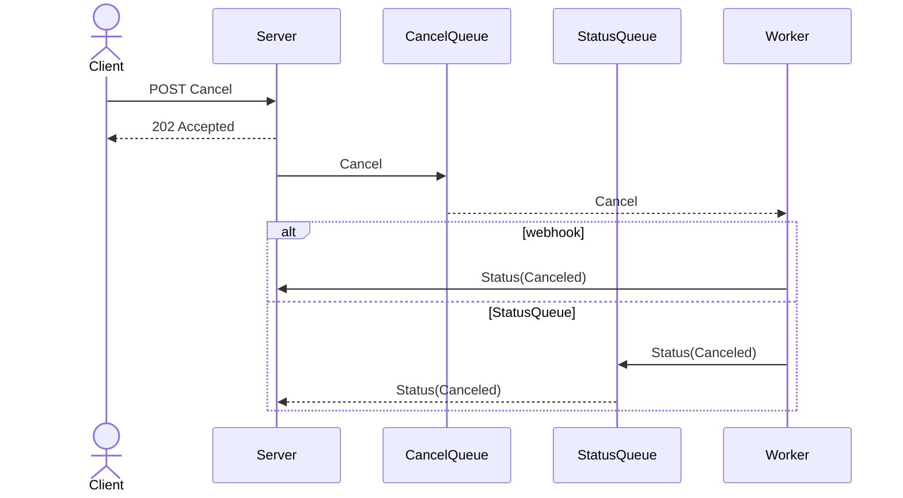

## 장기 실행 작업(Long Running Task)

클라이언트에서 서버에 요청을 보냈을 때, 서버에서 신속하게 응답을 보내지 못하지만 클라이언트는 서버의 응답을 받아야하는 경우가 있습니다. 예를 들어 처리하는 데 1초가 걸리는 CPU 바운드 작업을 요청했을 때, 대량의 요청이 오는 경우 서버는 1초 이상 응답을 못하거나 요청 자체를 처리하지 못할 수 있습니다.

이러한 상황에 대해 Scale up/out만으로 처리할 수 없는 경우

1. 서버를 서버와 워커로 분리
1. 클라이언트가 현재 진행상태를 알 수 있도록 상태(Status) 엔드포인트를 추가
1. 취소가 필요한 장기 실행 작업에 대해서는 취소(Cancel) 정책과 엔드포인트 추가

가 필요합니다.

## 요청(Request)

## 상태(Status) && 응답(Response)

### Polling

Polling이 많아지면 서버에 부하가 걸리기 때문에 이를 완화하기 위해 `Retry-After: <date||seconds>` 헤더를 사용하여 클라이언트가 요청 간격을 조절할 수 있도록 하는 것이 좋습니다.

### SSE(Server Sent Event) || Websocket

## 취소(Cancel)

