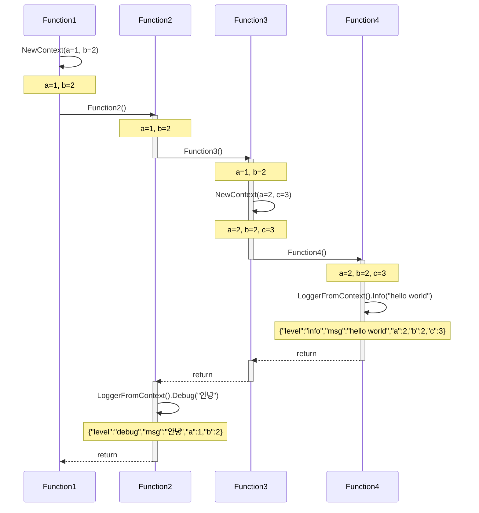

## 구조화된 로깅(Structured Logging)

로그는 애플리케이션이 동작하는 동안 발생하는 이벤트를 기록하는 것입니다. 로그는 다양한 방식으로 활용되는데, 애플리케이션의 동작을 확인하거나, 에러 발생 시 원인을 파악하는 등의 목적으로 사용됩니다.

많은 양의 로그를 다루기 위해서는 로그를 쿼리할 수 있도록 저장하는 것이 필요합니다. 이를 위해 구조화된 로깅(Structured Logging)을 사용하는데, 여기서 구조화된 로깅이란 사람과 컴퓨터 모두 이해하기 쉽도록 사전 정의된 구조로 기록하는 방법을 말합니다. 일반적으로 `key-value 쌍으로 구성된 이벤트 데이터`가 사용되며, `json 포멧`을 사용합니다.

예시는 아래와 같습니다.

```json
{
  "level": "info",
  "time": 1684741898.0446076,
  "caller": "contextual-logging/test.go:12",
  "msg": "hello world",
  "request_id": "c5b76167-e82e-48d9-95cc-fdeb4d30dfbc",
  "foo": "bar",
  "nest": {
    "foo": "bar"
  }
}
```

## 문맥에 따른 로깅(Contextual Logging)

문맥에 따른 로깅(Contextual Logging)은 로깅하는 시점의 컨텍스트 정보를 로그에 포함시키는 방법을 말합니다. 예를 들어, HTTP 요청을 처리하는 핸들러에서 로그를 남길 때, `request_id`, `user_id` 등을 로그에 포함시키는 것입니다.

문제는 문맥 정보를 추가하는 시점과 로그를 남기는 시점이 다르다는 것입니다. 예를 들어 서버 애플리케이션에서 `request_id`는 미들웨어에서 요청을 확인하여 값을 얻고, 로그는 도메인 로직을 구현한 함수에서 남기는 경우가 있습니다. 이런 경우 정보가 여러 함수를 거쳐 전달되어야 하는데, 인자로 전달하면 함수마다 관련 인자를 추가해야하고 수정할 때 어려워질 수 있습니다.

컨텍스트를 관리하기 위한 모듈을 제공하는 언어가 많기 때문에, 이를 활용하면 문맥에 따른 로깅을 쉽게 구현할 수 있습니다.



- NewContext: 이전 컨텍스트가 있는 경우 이전 컨텍스트를 복사해서 컨텍스트를 만들고, 없으면 새로운 컨텍스트를 만든 후에 인자로 받은 필드를 컨텍스트에 추가 또는 업데이트합니다.
- FieldsFromContext: 컨텍스트에서 필드 리스트를 가져옵니다.
- LoggerFromContext: 컨텍스트에서 필드 리스트가 포함된 로거를 가져옵니다.
