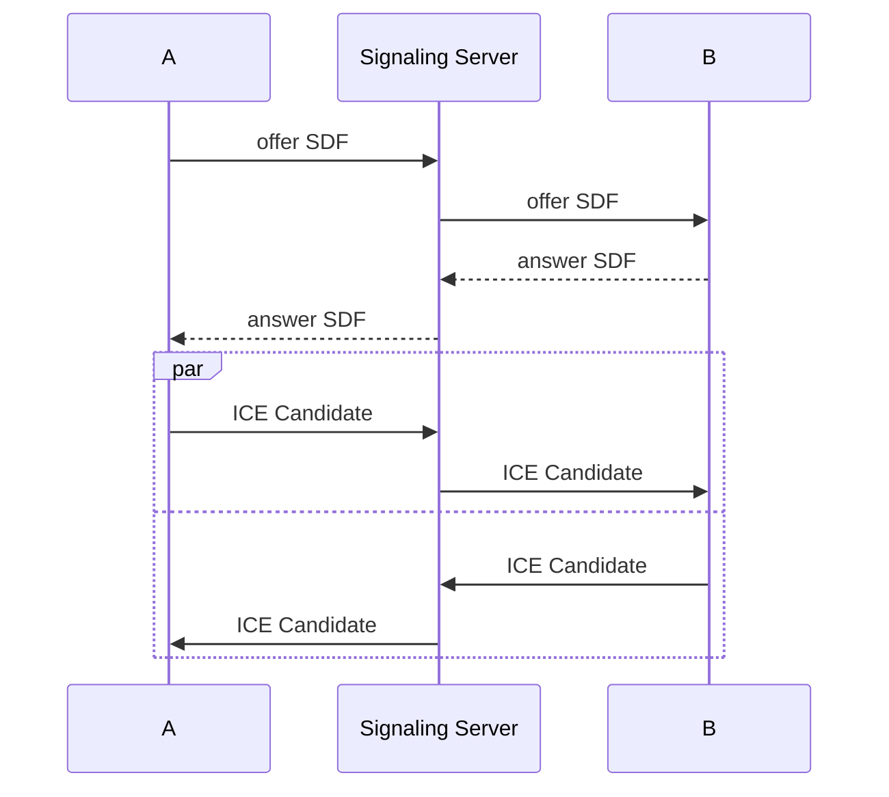

## 용어

### ICE(Interactive Connectivity Establishment)

### NAT(Network Address Translation)

### STUN(Session Traversal Utilities for NAT)

### TURN(Traversal Using Relays around NAT)

### SDP(Session Description Protocol)

### Signaling

## 연결 방식

### P2P(Peer to Peer)

- 정보 교환이 필요한 클라이언트 사이에 메쉬를 형성합니다
- 서버는 클라이언트 간 연결을 위한 정보를 제공하는 역할만 합니다
- 클라이언트 간 직접 연결을 사용하기 때문에 속도가 빠릅니다
- 데이터 전송 시 연결된 모든 클라이언트로 전송하기 때문에 클라이언트 수가 많을 수록 부하가 심해집니다

### SFU(Selective Forwarding Unit)

- 미디어 트래픽을 중계하는 미디어 서버를 사용합니다
- 클라이언트는 데이터 전송을 미디어 서버로만 하므로(1 업스트림) P2P 대비 클라이언트 부하가 적습니다
- 미디어 서버로 인해 서버 부하가 P2P 대비 큽니다
- P2P 대비 N:M 연결 수를 늘릴 수 있습니다

### MCU(Multipoint Control Unit)

- 미디어 서버에서 여러 클라이언트의 데이터를 단일 스트림으로 만들어서 각 클라이언트로 전송하므로(1 다운스트림) SFU 대비 클라이언트 부하가 적습니다
- 데이터를 단일 스트림으로 만드는 작업으로 인해 서버 부하가 SFU 대비 큽니다
- SFU 대비 N:M 연결 수를 늘릴 수 있습니다
