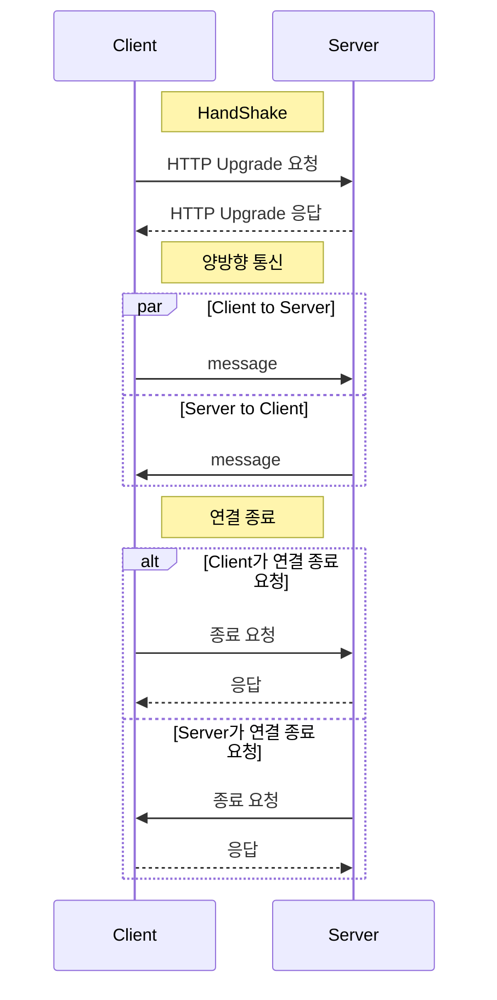

- https://www.rfc-editor.org/rfc/rfc6455

## 동작 방식



## Opening Handshake

```http
GET /chat HTTP/1.1
Host: api.loliot.net
Upgrade: websocket
Connection: Upgrade
Sec-WebSocket-Key: dGhlIHNhbXBsZSBub25jZQ==
Origin: https://wiki.loliot.net
Sec-WebSocket-Protocol: chat, superchat
Sec-WebSocket-Version: 13
```

- `Sec-WebSocket-Key`: base64로 인코딩된 16바이트의 랜덤 값입니다
- `Sec-WebSocket-Protocol`: 클라이언트가 지원하는 프로토콜 목록입니다
- `Origin`: CORS를 위한 헤더입니다

```http
HTTP/1.1 101 Switching Protocols
Upgrade: websocket
Connection: Upgrade
Sec-WebSocket-Accept: s3pPLMBiTxaQ9kYGzzhZRbK+xOo=
Sec-WebSocket-Protocol: chat
```

- `Sec-WebSocket-Accept`: `Sec-WebSocket-Key`값에 `258EAFA5-E914-47DA-95CA-C5AB0DC85B11`를 붙여 SHA-1 해시를 취한 후 base64로 인코딩한 값입니다
- `Sec-WebSocket-Protocol`: 서버가 선택한 프로토콜입니다

## Data Framing

```txt
 0                   1                   2                   3
 0 1 2 3 4 5 6 7 8 9 0 1 2 3 4 5 6 7 8 9 0 1 2 3 4 5 6 7 8 9 0 1
+-+-+-+-+-------+-+-------------+-------------------------------+
|F|R|R|R| opcode|M| Payload len |    Extended payload length    |
|I|S|S|S|  (4)  |A|     (7)     |             (16/64)           |
|N|V|V|V|       |S|             |   (if payload len==126/127)   |
| |1|2|3|       |K|             |                               |
+-+-+-+-+-------+-+-------------+ - - - - - - - - - - - - - - - +
|     Extended payload length continued, if payload len == 127  |
+ - - - - - - - - - - - - - - - +-------------------------------+
|                               |Masking-key, if MASK set to 1  |
+-------------------------------+-------------------------------+
| Masking-key (continued)       |          Payload Data         |
+-------------------------------- - - - - - - - - - - - - - - - +
:                     Payload Data continued ...                :
+ - - - - - - - - - - - - - - - - - - - - - - - - - - - - - - - +
|                     Payload Data continued ...                |
+---------------------------------------------------------------+
```

- `FIN`
  - `0x0`: Frame이 더 있음
  - `0x1`: 마지막 Frame
- `opcode`
  - `0x1`: 텍스트
  - `0x2`: 바이너리
  - `0x8`: 연결 종료
- `MASK`
  - `0x0`: Frame이 마스킹되지 않음
  - `0x1`: Frame이 마스킹됨

:::warning
Client에서 Server로 보내는 데이터는 반드시 마스킹되어야 합니다
:::
