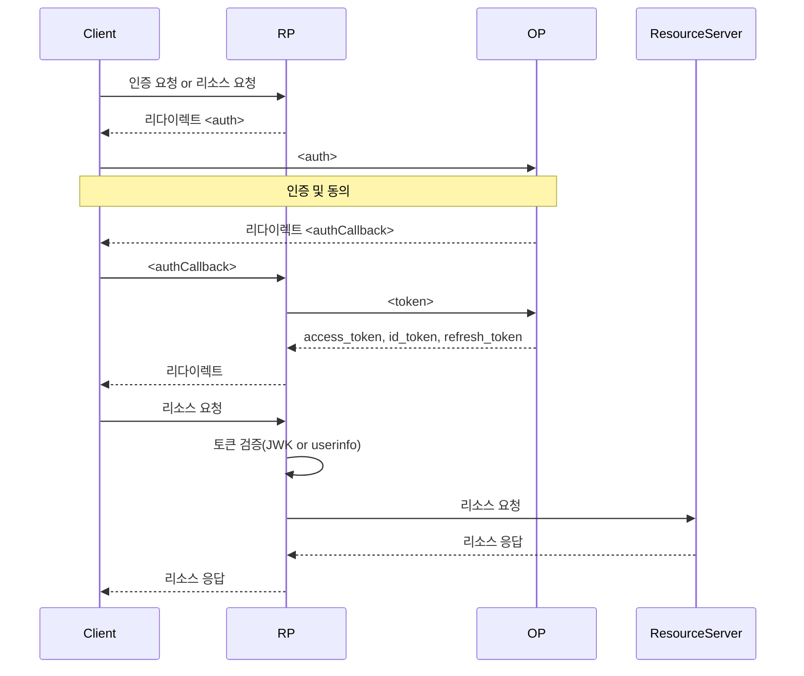

## Authorization Code Grant

- `<auth>`
  - `GET <authorizationEndpoint>`
    - Query
      - `client_id=<clientID>`
      - `redirect_uri=<authCallbackURL>`
      - `response_type=code`
      - `scope=<scope>`
      - `state=<state>`
      - `nonce=<nonce>`
- `<authCallback>`
  - `GET <authCallbackURL>`
    - Query
      - `code=<code>`
      - `state=<state>`
- `<token>`
  - `POST <tokenEndpoint>`
    - Header
      - `Authorization: Basic <base64(<clientID>:<clientSecret>)>`
    - Body
      - `grant_type=authorization_code`
      - `code=<code>`
      - `redirect_rui=<redirectURI>`
