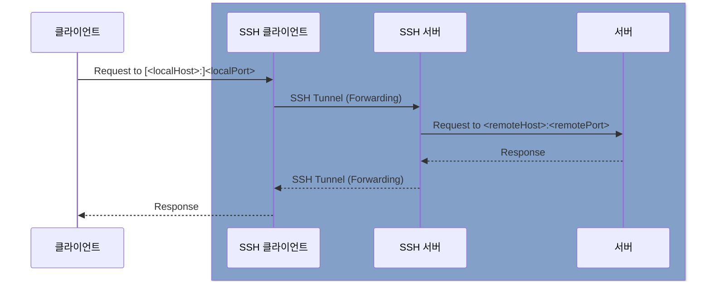
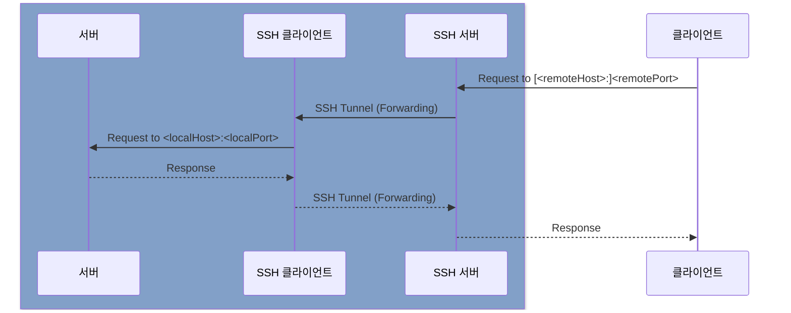

## SSH agent 실행

```shell
eval "$(ssh-agent -s)"
```

```shell title=".zshrc"
plugins=(
    ssh-agent
)
```

## SSH 설정

### 키 생성

```shell
ssh-keygen -t ed25519 -N "" -C "hhk7734@gmail.com" -f <path>
```

```shell
ssh-keygen -t rsa -b 2048 -N "" -C "hhk7734@gmail.com" -f <path>
```

SSH 키는 기본적으로 `~/.ssh` 디렉토리에 저장하고, 권한은 `0600`으로 설정합니다.

:::warning
파일 접근 권한은 로컬과 원격 모두 설정되어 있어야 합니다.
:::

```shell
ssh-add ~/.ssh/<private>
```

```shell
ssh-copy-id -i ~/.ssh/<public> [<flag>] <user>@<host>
```

- `<flag>`
  - `-p <port>`

### config

- https://man.openbsd.org/ssh_config
- https://www.ssh.com/academy/ssh/config

<br />

- `~/.ssh/config` 또는 `/etc/ssh/ssh_config` 파일에 아래 설정을 추가하여 `ssh` 커맨드를 사용할 때 필요한 옵션을 미리 설정할 수 있습니다.
- 커맨드와 파일에 중복 선언된 옵션이 있다면 우선순위에 따라 처리됩니다.
  - 우선순위 입니다.
    - 커맨드 `-o <option>`
    - `~/.ssh/config`
    - `/etc/ssh/ssh_config`
  - 파일 내에서 여러번 선언된 옵션은 처음 선언된 값이 사용됩니다.

```shell title="~/.ssh/config"
# 전역 설정
IdentityFile <path>

# 호스트별 설정
Host <alias> # 192.168.* 처럼 와일드카드도 사용 가능합니다.
  HostName <host> # 선언하지 않으면 <alias>가 사용됩니다.
  User <user>
  PreferredAuthentications publickey
  IdentityFile <path>
  AddKeysToAgent yes
```

## SSH로 원격 서버 접속

```shell
ssh <flag> <user>@<host> [<command>]
```

## SSH Tunnel

:::info[Reference]

- [A Visual Guide to SSH Tunnels](https://iximiuz.com/en/posts/ssh-tunnels/)

:::

### Local Port Forwarding

```shell
ssh [-f] -N \
  -L [<localHost>:]<localPort>:<remoteHost>:<remotePort> \
  [-p <sshdPort>] <user>@<host>
```



- `-f`: 백그라운드로 실행합니다.
- `-L [<localHost>:]<localPort>:<remoteHost>:<remotePort>`
  - `<localHost>`: 생략되면 `localhost`로 설정됩니다.
  - `<remoteHost>`
    - sshd가 접근 가능한 호스트를 설정하면됩니다.
    - sshd가 bastion 서버와 같은 역할을 할 수 있습니다.

### Remote Port Forwarding

```shell
ssh [-f] -N \
  -R [<remoteHost>:]<remotePort>:<localHost>:<localPort> \
  [-p <sshdPort>] <user>@<host>
```



- `-f`: 백그라운드로 실행합니다.
- `-R [<remoteHost>:]<remotePort>:<localHost>:<localPort>`
  - `<remoteHost>`: 생략되면 `0.0.0.0`으로 설정됩니다.
  - `<localHost>`
    - SSH 클라이언트가 접근 가능한 호스트를 설정하면됩니다.
    - SSH 클라이언트가 bastion 서버와 같은 역할을 할 수 있습니다.

## SSH ProxyJump

```shell
ssh -o 'ProxyJump <proxyArgs>[,<proxyArgs>]' \
    <hostArgs>
```

- `<proxyArgs>`
  - `<proxyAlias>`
  - `<proxyUser>@<proxyHost>[:<proxyPort>]`

`-o ProxyJump`는 `-J`로 대체할 수 있습니다.

`ProxyJump`를 지원하지 않는 버전의 경우 아래와 같이 `ProxyCommand`를 활용할 수 있습니다.

```shell
ssh -o 'ProxyCommand ssh -W %h:%p <proxyArgs>' \
    <hostArgs>
```

- `<proxyArgs>`에는 프록시 서버에 접속하기 위한 인자를 입력합니다.
- `<hostArgs>`에는 목적지 서버에 접속하기 위한 인자를 입력합니다.

## SSH Host Key

- https://www.ssh.com/academy/ssh/host-key

Host Key는 SSH 프로토콜에서 컴퓨터를 인증하는 데 사용되는 키 쌍입니다. 일반적으로 `/etc/ssh/ssh_host_<type>_key`, `/etc/ssh/ssh_host_<type>_key.pub` 가 저장되어있습니다.

SSH 서버에 최초 접속 시 인증을 통과하면 공개 키는 SSH 클라이언트의 `~/.ssh/known_hosts`에 호스트와 함께 저장됩니다. 이후 접속 시 Host Key가 변경되었을 경우 저장된 공개키를 지우고 다시 인증 과정을 거쳐야합니다.

상황에 따라 Host Key를 무시하고 접속해야할 때가 있는데, 아래와 같이 옵션을 설정할 수 있습니다.

```shell title="~/.ssh/config"
Host 192.168.*
  StrictHostKeyChecking no
  UserKnownHostsFile=/dev/null
```

### SSH 환경변수 설정

```shell title="~/.ssh/config"
Host *
  SetEnv TERM=xterm-256color
```
