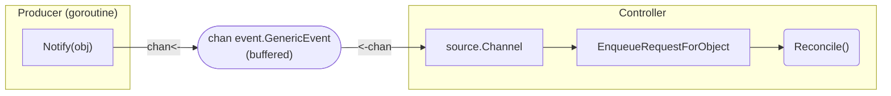

## SetupWithManager

```go
// SetupWithManager sets up the controller with the Manager.
func (r *TestReconciler) SetupWithManager(mgr ctrl.Manager) error {
    b := ctrl.NewControllerManagedBy(mgr).Name("test")

    // ...

    return b.Complete(r)
}
```

## `For` Resource 설정

`For`는 controller가 관리해야하는 primary resource를 지정합니다. 일반적으로 Custom Resource가 사용되고, 하나만 등록 가능합니다. reconciler는 `For`로 등록된 resource에 대한 **생성, 업데이트, 삭제 이벤트를 감지**하여 트리거됩니다.

```go
    b = b.For(&v1alpha1.Test{})
```

## `Owns` Resource 설정

`Owns`는 controller가 관리하는 secondary resource를 지정합니다. secondary resource를 생성하고 `controllerutil.SetControllerReference`를 사용하여 소유권을 설정하면, reconciler는 `Owns`로 등록된 resource에 대한 **생성, 업데이트, 삭제 이벤트를 감지**하여 트리거됩니다.

```go
    b = b.Owns(&appsv1.Deployment{})
```

OwnerReference가 설정된 secondary resource는 primary resource 삭제 시 함께 삭제됩니다.

## `Watches` Resource 설정

`Watches`는 controller가 생성하지는 않았지만 resource관리에 필요한 secondary resource를 지정합니다. reconciler는 `Watches`로 등록된 resource에 대한 **생성, 업데이트, 삭제 이벤트를 감지**하여 트리거됩니다.

```go
    b = b.Watches(&corev1.ConfigMap{}, handler.EnqueueRequestsFromMapFunc(func(ctx context.Context, obj client.Object) []reconcile.Request {
            // 어떤 primary resource를 확인해야 하는지 찾는 로직 구현
            return []reconcile.Request{}
        }))
```

## `WatchesRawSource`로 외부 이벤트 트리거

`For`, `Owns`, `Watches`는 모두 **Kubernetes API server의 watch 이벤트**(리소스의 생성/수정/삭제)에 의해 트리거됩니다. 하지만 Kubernetes 리소스 변경과 무관한 외부 신호로 reconcile을 트리거해야 하는 경우가 있습니다.

예를 들어:

- 주기적으로 메트릭을 수집한 뒤, 새 메트릭이 수집될 때마다 reconcile을 트리거
- 외부 시스템(webhook, 메시지 큐 등)에서 이벤트를 수신하여 reconcile을 트리거
- 타이머 기반으로 reconcile을 트리거 (`ctrl.Result{RequeueAfter: ...}`로 부족한 경우)

이런 경우 `source.Channel`과 `event.GenericEvent`를 사용하여 Go channel을 통해 reconcile을 트리거할 수 있습니다.

### 구조



- **Producer**는 `chan<- event.GenericEvent` (write-only)를 받아 이벤트를 보냅니다.
- **Controller**는 `<-chan event.GenericEvent` (read-only)를 `WatchesRawSource`로 등록합니다.
- channel의 `GenericEvent.Object`에 담긴 Name/Namespace가 reconcile 대상 primary resource를 결정합니다.

### 사용법

```go title="main.go"
import "sigs.k8s.io/controller-runtime/pkg/event"

// 양방향 channel 생성 (적절한 buffer 크기 설정)
trigger := make(chan event.GenericEvent, 1024)

// Producer에게 write-only channel 전달
producer := NewProducer(trigger)

// Controller에게 read-only channel 전달
controller := &TestReconciler{
    Trigger: trigger,
}
```

```go title="producer.go"
import "sigs.k8s.io/controller-runtime/pkg/event"

type Producer struct {
    trigger chan<- event.GenericEvent // write-only
}

func NewProducer(trigger chan<- event.GenericEvent) *Producer {
    return &Producer{trigger: trigger}
}

func (p *Producer) Notify(obj client.Object) {
    select {
    case p.trigger <- event.GenericEvent{Object: obj}:
    default:
        // channel이 가득 찬 경우 drop (다음 주기에 재시도)
    }
}
```

```go title="controller.go"
import (
    "sigs.k8s.io/controller-runtime/pkg/event"
    "sigs.k8s.io/controller-runtime/pkg/handler"
    "sigs.k8s.io/controller-runtime/pkg/source"
)

type TestReconciler struct {
    client.Client
    Trigger <-chan event.GenericEvent // read-only, nil if not used
}

func (r *TestReconciler) SetupWithManager(mgr ctrl.Manager) error {
    b := ctrl.NewControllerManagedBy(mgr).
        For(&v1alpha1.Test{}).
        Named("test")

    if r.Trigger != nil {
        b = b.WatchesRawSource(
            source.Channel(r.Trigger, &handler.EnqueueRequestForObject{}),
        )
    }

    return b.Complete(r)
}
```

### 주의사항

- `source.Channel`을 통한 이벤트는 `For`에 설정한 predicate를 **거치지 않습니다**. `WatchesRawSource`는 predicate 필터링 없이 직접 work queue에 enqueue합니다.
- channel buffer가 가득 차면 이벤트가 유실될 수 있으므로, `select`의 `default` case로 drop을 처리하거나 충분한 buffer 크기를 설정해야 합니다.
- `GenericEvent.Object`의 `Name`과 `Namespace`가 reconcile 대상을 결정합니다. 올바른 primary resource 정보를 담아야 합니다.
- `Trigger`가 `nil`인 경우 `source.Channel`에 전달하면 panic이 발생하므로 반드시 nil 체크가 필요합니다.

## predicate로 이벤트 필터링

`For`, `Owns`, `Watches`로 등록된 resource에 대해 predicate를 사용하여 이벤트를 필터링할 수 있습니다.

```go
pred := predicate.Funcs{
    CreateFunc: func(e event.CreateEvent) bool {
        return true
    },
    UpdateFunc: func(e event.UpdateEvent) bool {
        return true
    },
    DeleteFunc: func(e event.DeleteEvent) bool {
        return true
    },
    GenericFunc: func(e event.GenericEvent) bool {
        return true
    },
}
```

```go
    b = b.Owns(&v1alpha1.Test{}, builder.WithPredicates(pred))
```
