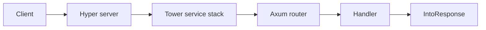

:::info[References]

- [axum](https://docs.rs/axum/latest/axum/)
- [tokio-rs / axum](https://github.com/tokio-rs/axum)
- [axum / examples](https://github.com/tokio-rs/axum/tree/main/examples)

:::

## Axum

Axum is a Rust web framework built on the Tokio ecosystem. It uses Tower services and Hyper HTTP types, so Axum applications compose naturally with middleware, routers, extractors, and response types from the broader async Rust stack.

The core application shape is:

```rust
use axum::{
    routing::get,
    Router,
};

async fn hello() -> &'static str {
    "hello"
}

fn app() -> Router {
    Router::new().route("/", get(hello))
}
```

Axum handlers are plain async functions. Request data is parsed through extractors, and handler return values are converted into HTTP responses through `IntoResponse`.

## Common Topics

- [Request and response parsing](/docs/language/rust/axum/request-response.mdx)

## Runtime Shape



Axum itself focuses on routing, extraction, response conversion, and middleware composition. Tokio provides the async runtime, Hyper handles HTTP, and Tower provides the service and middleware abstraction.
