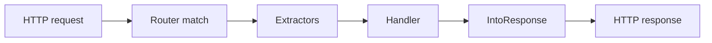

:::info[References]

- [axum / extract](https://docs.rs/axum/latest/axum/extract/index.html)
- [axum / response](https://docs.rs/axum/latest/axum/response/index.html)
- [axum / Json](https://docs.rs/axum/latest/axum/struct.Json.html)
- [axum / FromRequest](https://docs.rs/axum/latest/axum/extract/trait.FromRequest.html)
- [axum / FromRequestParts](https://docs.rs/axum/latest/axum/extract/trait.FromRequestParts.html)
- [axum / IntoResponse](https://docs.rs/axum/latest/axum/response/trait.IntoResponse.html)
- [validator](https://docs.rs/validator/latest/validator/)
- [Axum overview](/docs/language/rust/axum/overview.mdx)

:::

## Mental Model

Axum does not usually call request handling "parsing". It models request parsing as **extraction** and response construction as **conversion into a response**.



- Request-side parser: an extractor that implements `FromRequestParts` or `FromRequest`.
- Response-side builder: a return value that implements `IntoResponse`.
- Error path: extractor failures become rejection responses before the handler runs.

## Request Extractors

An Axum handler receives typed values through extractor arguments.

```rust
use axum::{
    extract::{Json, Path, Query, State},
    routing::post,
    Router,
};
use serde::{Deserialize, Serialize};
use uuid::Uuid;

#[derive(Clone)]
struct AppState;

#[derive(Deserialize)]
struct Pagination {
    page: Option<u64>,
    per_page: Option<u64>,
}

#[derive(Deserialize)]
struct CreateUserRequest {
    username: String,
    email: String,
}

#[derive(Serialize)]
struct UserResponse {
    id: Uuid,
    username: String,
}

async fn create_user(
    State(state): State<AppState>,
    Path(team_id): Path<Uuid>,
    Query(pagination): Query<Pagination>,
    Json(payload): Json<CreateUserRequest>,
) -> Json<UserResponse> {
    let _ = (state, team_id, pagination, payload);

    Json(UserResponse {
        id: Uuid::new_v4(),
        username: "alice".to_owned(),
    })
}

fn app(state: AppState) -> Router {
    Router::new()
        .route("/teams/{team_id}/users", post(create_user))
        .with_state(state)
}
```

Common extractors:

| Source                   | Extractor         | Trait family       | Consumes body |
| ------------------------ | ----------------- | ------------------ | ------------- |
| path parameters          | `Path<T>`         | `FromRequestParts` | no            |
| query string             | `Query<T>`        | `FromRequestParts` | no            |
| shared application state | `State<T>`        | `FromRequestParts` | no            |
| headers                  | `HeaderMap`       | `FromRequestParts` | no            |
| whole request            | `Request`         | `FromRequest`      | yes           |
| raw body                 | `String`, `Bytes` | `FromRequest`      | yes           |
| JSON body                | `Json<T>`         | `FromRequest`      | yes           |

## Extractor Order

Extractors run from left to right in the handler signature.

Body-consuming extractors must be last because an HTTP request body is a stream that can only be consumed once. This is why `Json<T>`, `String`, `Bytes`, and `Request` belong at the end of the argument list.

```rust
use axum::{
    body::Bytes,
    extract::Path,
};
use uuid::Uuid;

async fn ok(Path(id): Path<Uuid>, body: Bytes) {
    let _ = (id, body);
}
```

This shape is invalid because `Bytes` consumes the body before `Path` runs:

```rust
use axum::{
    body::Bytes,
    extract::Path,
};
use uuid::Uuid;

async fn invalid(body: Bytes, Path(id): Path<Uuid>) {
    let _ = (body, id);
}
```

The rule maps to Axum traits:

- `FromRequestParts` reads request metadata without consuming the body.
- `FromRequest` may consume the body and can only appear once as the final extractor.

## JSON Request Parsing

`Json<T>` parses the request body with `serde`.

```rust
use axum::{extract::Json, http::StatusCode};
use serde::Deserialize;

#[derive(Deserialize)]
struct LoginRequest {
    username: String,
    password: String,
}

async fn login(Json(payload): Json<LoginRequest>) -> StatusCode {
    let _ = payload;
    StatusCode::NO_CONTENT
}
```

The request is rejected before the handler runs when:

- `Content-Type` is not `application/json` or a compatible JSON media type;
- the body is not syntactically valid JSON;
- JSON is valid but cannot be deserialized into `T`;
- buffering the request body fails.

## Handling Parse Errors

Wrap an extractor in `Result` when a handler needs local control over parse failures.

```rust
use axum::{
    extract::{rejection::JsonRejection, Json},
    http::StatusCode,
    response::IntoResponse,
};
use serde::Deserialize;
use serde_json::json;

#[derive(Deserialize)]
struct CreateUserRequest {
    username: String,
}

async fn create_user(
    payload: Result<Json<CreateUserRequest>, JsonRejection>,
) -> impl IntoResponse {
    match payload {
        Ok(Json(payload)) => (
            StatusCode::CREATED,
            Json(json!({
                "username": payload.username,
            })),
        )
            .into_response(),
        Err(err) => (
            err.status(),
            Json(json!({
                "error": "invalid_request",
                "message": err.body_text(),
            })),
        )
            .into_response(),
    }
}
```

Use this pattern for route-specific error messages. For shared API errors, prefer a custom extractor or a custom error type that implements `IntoResponse`.

## Custom Request Extractor

Use `FromRequestParts` when the extractor only needs metadata such as headers, method, URI, extensions, or state.

```rust
use axum::{
    extract::{FromRequestParts, State},
    http::{request::Parts, StatusCode},
};

#[derive(Clone)]
struct AppState {
    expected_api_key: String,
}

struct ApiKey(String);

impl FromRequestParts<AppState> for ApiKey {
    type Rejection = StatusCode;

    async fn from_request_parts(
        parts: &mut Parts,
        state: &AppState,
    ) -> Result<Self, Self::Rejection> {
        let Some(value) = parts.headers.get("x-api-key") else {
            return Err(StatusCode::UNAUTHORIZED);
        };

        let Ok(value) = value.to_str() else {
            return Err(StatusCode::UNAUTHORIZED);
        };

        if value != state.expected_api_key {
            return Err(StatusCode::UNAUTHORIZED);
        }

        Ok(ApiKey(value.to_owned()))
    }
}

async fn protected(State(_state): State<AppState>, ApiKey(_key): ApiKey) {}
```

Use `FromRequest` when the extractor must consume the body. If the extractor just wraps an existing body extractor such as `Json<T>`, delegate to that extractor and map its rejection into the API shape you want.

## `ValidatedJson<T>`

`ValidatedJson<T>` is a custom body extractor pattern for APIs that need both JSON parsing and schema validation. The implementation below follows the pattern used in `crates/gateway/src/http/common.rs` from Heimdall AIGateway.

```rust
use axum::{
    extract::{rejection::JsonRejection, FromRequest, Request},
    response::{IntoResponse, Response},
    Json,
};
use serde::de::DeserializeOwned;
use validator::{Validate, ValidationErrors};

#[derive(Debug, Clone, Copy, Default)]
struct ValidatedJson<T>(pub T);

#[derive(Debug)]
enum ValidatedJsonRejection {
    Json(JsonRejection),
    Validation(ValidationErrors),
}

impl IntoResponse for ValidatedJsonRejection {
    fn into_response(self) -> Response {
        match self {
            Self::Json(rejection) => rejection.into_response(),
            Self::Validation(errors) => (
                axum::http::StatusCode::BAD_REQUEST,
                format!("validation error: {errors}"),
            )
                .into_response(),
        }
    }
}

impl<T, S> FromRequest<S> for ValidatedJson<T>
where
    T: DeserializeOwned + Validate,
    S: Send + Sync,
{
    type Rejection = ValidatedJsonRejection;

    async fn from_request(req: Request, state: &S) -> Result<Self, Self::Rejection> {
        let Json(value) = Json::<T>::from_request(req, state)
            .await
            .map_err(ValidatedJsonRejection::Json)?;

        value
            .validate()
            .map_err(ValidatedJsonRejection::Validation)?;

        Ok(Self(value))
    }
}
```

The extractor has two stages:

1. `Json::<T>::from_request(req, state)` consumes the body and deserializes JSON into `T`.
2. `value.validate()` runs `validator` rules on the deserialized value.

Use it in a handler the same way as `Json<T>`:

```rust
use axum::Json;
use serde::{Deserialize, Serialize};
use validator::Validate;

#[derive(Debug, Deserialize, Validate)]
struct CreateUserRequest {
    #[validate(length(min = 1))]
    username: String,
}

#[derive(Debug, Serialize)]
struct CreateUserResponse {
    username: String,
}

async fn create_user(
    ValidatedJson(payload): ValidatedJson<CreateUserRequest>,
) -> Json<CreateUserResponse> {
    Json(CreateUserResponse {
        username: payload.username,
    })
}
```

This keeps validation at the boundary. The handler only receives a value that has already passed JSON parsing and validation.

## Response Builders

Anything that implements `IntoResponse` can be returned from a handler.

```rust
use axum::{
    http::StatusCode,
    response::{Html, IntoResponse},
    Json,
};
use serde::Serialize;

#[derive(Serialize)]
struct Health {
    ok: bool,
}

async fn empty() -> StatusCode {
    StatusCode::NO_CONTENT
}

async fn html() -> Html<&'static str> {
    Html("<p>Hello</p>")
}

async fn json() -> Json<Health> {
    Json(Health { ok: true })
}

async fn with_status() -> impl IntoResponse {
    (StatusCode::CREATED, Json(Health { ok: true }))
}
```

Useful response forms:

| Return value                 | Meaning                              |
| ---------------------------- | ------------------------------------ |
| `()`                         | empty `200 OK` response              |
| `StatusCode`                 | empty response with that status      |
| `String` or `&'static str`   | text response                        |
| `Html<T>`                    | HTML response                        |
| `Json<T>`                    | JSON response where `T: Serialize`   |
| `(StatusCode, R)`            | response `R` with an explicit status |
| `([(HeaderName, value)], R)` | response `R` with headers            |
| `(StatusCode, headers, R)`   | response `R` with status and headers |

## Custom Error Response

For application errors, implement `IntoResponse` once and return `Result<T, AppError>` from handlers.

```rust
use axum::{
    http::StatusCode,
    response::{IntoResponse, Response},
    Json,
};
use serde_json::json;

enum AppError {
    NotFound,
    Conflict,
}

impl IntoResponse for AppError {
    fn into_response(self) -> Response {
        let (status, code) = match self {
            AppError::NotFound => (StatusCode::NOT_FOUND, "not_found"),
            AppError::Conflict => (StatusCode::CONFLICT, "conflict"),
        };

        (status, Json(json!({ "error": code }))).into_response()
    }
}

async fn get_user() -> Result<Json<serde_json::Value>, AppError> {
    Err(AppError::NotFound)
}
```

This keeps route handlers focused on domain flow while centralizing the HTTP status and error body mapping.

## Practical Rules

- Use `Path<T>`, `Query<T>`, and `Json<T>` with typed DTOs instead of manually parsing strings.
- Put body-consuming extractors last.
- Use `Result<Extractor, Rejection>` only when the handler needs route-local rejection handling.
- Use `FromRequestParts` for auth, correlation IDs, and header-derived values.
- Use `FromRequest` only when the custom extractor must consume the request body.
- Wrap `Json<T>` in a custom extractor such as `ValidatedJson<T>` when every route using the DTO needs validation before business logic.
- Return tuples and `Json<T>` for normal responses.
- Implement `IntoResponse` for application error enums.
