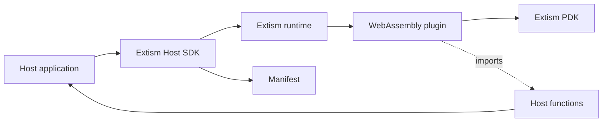

:::info[References]

- [Extism / Overview](https://extism.org/docs/overview)
- [Extism / Host SDKs](https://extism.org/docs/concepts/host-sdk/)
- [Extism / Plug-in Development Kits](https://extism.org/docs/concepts/pdk/)
- [Extism / Plug-in](https://extism.org/docs/concepts/plug-in)
- [Extism / The Manifest](https://extism.org/docs/concepts/manifest/)
- [Extism / Host Functions](https://extism.org/docs/concepts/host-functions/)
- [Extism / Configuration](https://extism.org/docs/concepts/configuration/)
- [Extism / Memory](https://extism.org/docs/concepts/memory/)
- [Extism / Write a Plug-in](https://extism.org/docs/quickstart/plugin-quickstart/)
- [Extism / Run a Plug-in](https://extism.org/docs/quickstart/host-quickstart/)

:::

Extism is a WebAssembly plugin system for embedding user-provided extensions into a host application without loading native shared libraries into the host process. The host owns the application, policy, data access, and runtime configuration. The plugin is a WebAssembly module that exposes callable functions and can use only the capabilities the host grants.

## Architecture



The main boundary is between the host and the WebAssembly module:

- The host embeds an Extism Host SDK for its implementation language.
- The plugin author writes extension code with an Extism PDK and compiles it to Wasm.
- The manifest tells the host where the Wasm module comes from and which runtime limits or permissions apply.
- Host functions are optional imports that let a plugin call back into host-owned behavior.

## Runtime Flow

1. The host receives or selects a plugin manifest.
2. The Host SDK creates a plugin instance from the manifest.
3. The host calls an exported plugin function by name.
4. Extism copies host input into plugin-accessible memory.
5. Plugin code reads input through its PDK, runs extension logic, and writes output.
6. Extism copies the output back to the host.
7. If the plugin needs a host capability, it calls an imported host function rather than directly reaching into host internals.

## Host SDK

The host is the application being extended. The Host SDK is the library the host uses to load plugins, create plugin instances, call exports, provide configuration, and register host functions.

Use the host side for policy decisions:

- plugin source selection
- manifest validation
- memory and response-size limits
- WASI enablement
- filesystem path mappings
- outbound HTTP policy
- host function registration

## PDK

A PDK is the plugin-authoring layer. It hides the lower-level WebAssembly ABI details and gives plugin code a language-friendly way to read input, write output, read configuration, use variables, make allowed HTTP calls, and call host functions.

Extism supports plugins written in multiple languages as long as they compile to a compatible Wasm module with the PDK behavior included.

## Manifest

The manifest is the host-visible plugin contract. It can describe:

- one or more Wasm sources
- expected hashes for plugin integrity
- memory limits
- maximum HTTP response size
- variable storage limits
- allowed host filesystem mappings when WASI is enabled
- plugin configuration values

Keep the manifest narrow. A plugin should receive only the filesystem, network, and configuration access it needs for the current extension point.

## Host Functions

Host functions are the controlled escape hatch from plugin code back into host behavior. Use them when a plugin needs application-specific capabilities such as reading a host database, using a service client, checking authorization, or emitting an application event.

Design host functions as a stable plugin API:

- keep names explicit and versioned when compatibility matters
- pass small typed values or encoded payloads instead of host object references
- validate every request at the host boundary
- keep user data safe for the plugin lifetime
- require thread-safe shared state when plugin instances can run concurrently

## Capability Model

Extism is useful when the application needs extension code that is portable and constrained by default. The host decides which capabilities exist; the plugin does not automatically inherit the host process privileges.

Use a deny-by-default model:

- Do not enable WASI unless the plugin needs it.
- Do not mount host paths unless the plugin needs file access.
- Do not provide host functions for broad internal services.
- Do not pass secrets as generic config unless they are intended plugin inputs.
- Treat plugin output as untrusted data and validate it before use.

## Minimal Shape

```text
host application
├── Host SDK dependency
├── plugin manifest loader
├── host function registry
└── extension point
    ├── create plugin instance
    ├── call exported function
    └── validate output

plugin project
├── PDK dependency
├── exported plugin functions
├── optional host function imports
└── build output: plugin.wasm
```

## When To Use

Use Extism when plugin authors should be able to write extensions in more than one language, when the host should avoid native dynamic-library loading, or when plugin permissions need to be explicit.

Avoid it when the extension point needs full in-process access to host objects, very fine-grained synchronous callbacks across a large API surface, or a language-specific ecosystem plugin API is already the real product contract.
