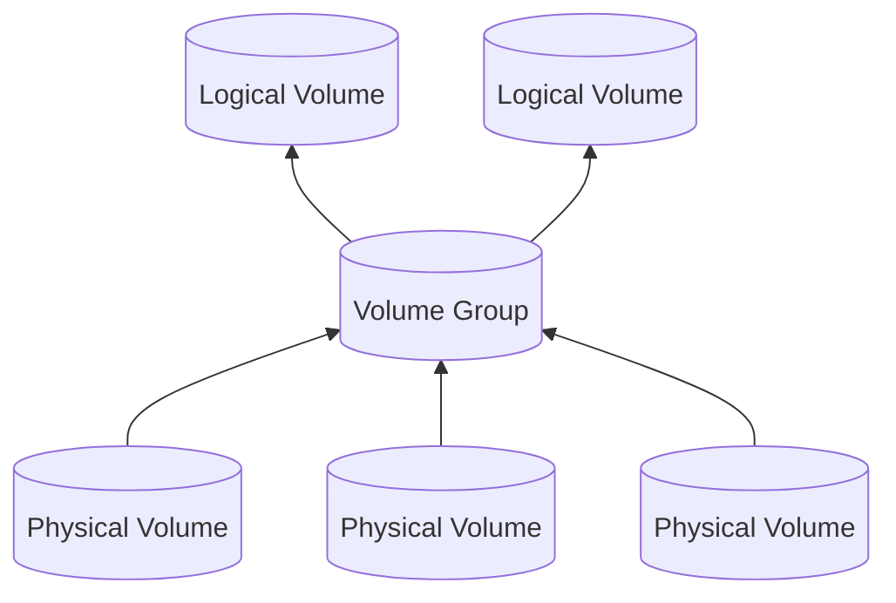

## Logical Volume Manager(LVM)

<strong>Logical Volume Manager(LVM)</strong>는 물리적 볼륨들 위에 추상 계층을 생성한 후 그 위에 논리적인 볼륨을 만들어
관리하는 도구입니다. 논리적 볼륨을 사용하면 시스템 중단 없이 디스크 크기를 조정할 수 있고, 여러 디스크를 하나의 큰
디스크인 것처럼 사용할 수 있습니다.



- [Physical Volume(PV)](#physical-volumepv): 실제 디스크나 디스크의 파티션을 의미합니다.
- [Volume Group(VG)](#volume-groupvg): 여러 PV를 하나의 큰 논리적 저장 공간으로 묶은 것입니다.
- [Logical Volume(LV)](#logical-volumelv): 사용자가 사용할 수 있는 논리적 파티션입니다.

## Physical Volume(PV)

### PV 생성

`lvmdiskscan` 명령어로 PV로 사용가능한 디스크 또는 파티션을 확인할 수 있습니다.

```shell
$ sudo lvmdiskscan
  /dev/sda1 [     465.76 GiB] LVM physical volume
  /dev/sdb  [      <3.64 TiB]
  /dev/sdc1 [     237.47 GiB]
  /dev/sdc2 [       1.00 GiB]
  1 disk
  2 partitions
  0 LVM physical volume whole disks
  1 LVM physical volumes
```

```shell
sudo pvcreate <pv> [<pv>...]
```

- `<pv>`: `/dev/<blockDevice>`

### PV 조회

```shell
sudo pvdisplay
```

```shell
sudo pvs
```

## Volume Group(VG)

### VG 생성

```shell
sudo vgcreate <vgName> <pv> [<pv>...]
```

### VG 조회

```shell
sudo vgdisplay
```

```shell
sudo vgs
```

## Logical Volume(LV)

### LV 생성

```shell
sudo lvcreate <flags> <vgName>
```

- `-n|--name <name>`
- `-L|--size <size>[B|S|K|M|G|T|P|E]`
  - S = 512 bytes
- `-l|--extents <extents>[%<VG|LV|PVS|FREE|ORIGIN>]`
  - `100%FREE`를 사용하면 VG free space의 100%를 할당합니다.
  - `60%VG`를 사용하면 VG 크기의 60%를 할당합니다.

### LV 조회

```shell
sudo lvdisplay
```

```shell
sudo lvs
```

### LV 확장

```shell
sudo lvextend <flags> <lvPath>
```

- `-L|--size [+]<size>[B|S|K|M|G|T|P|E]`
  - `+`는 현재 크기에 설정한 값만큼 추가한다는 것을 의미합니다.
  - S = 512 bytes
- `-l|--extents [+]<extents>[%<VG|LV|PVS|FREE|ORIGIN>]`
  - `+`는 현재 크기에 설정한 값만큼 추가한다는 것을 의미합니다.
  - `+50%FREE`를 사용하면 VG free space의 50%를 추가합니다.
- `-r|--resizefs`
  - fsadm을 사용하여 파일 시스템 크기를 자동으로 조정합니다.
  - ext2, ext3, ext4, ReiserFS, XFS을 지원합니다.
