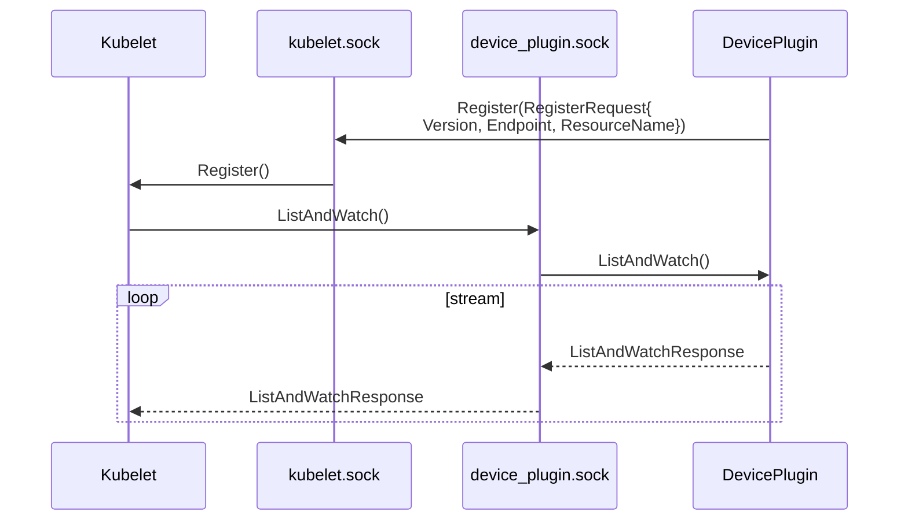

## Device Plugin

:::info[References]

- [Kubernetes Docs / Concepts / Extending Kubernetes / Device Plugins](https://kubernetes.io/docs/concepts/extend-kubernetes/compute-storage-net/device-plugins/)

:::

### Device Plugin 등록



socket의 기본 경로는 `/var/lib/kubelet/device-plugins/`입니다.

## CDI

- https://github.com/cncf-tags/container-device-interface/blob/main/SPEC.md

:::warning
Kubernetes 1.28에서 Alpha, 1.29에서 Beta로 추가되는 기능입니다.
:::

요약

- 장치 설치
  - 관리자가 컴퓨터에 타사 장치 드라이버(및 타사 장치)를 설치합니다.
  - 장치 드라이버 설치 소프트웨어(DaemonSet?)는 잘 알려진 경로(`/etc/cdi/vendor.json`)에 설정 파일을 작성합니다.
- 컨테이너 런타임
  - `--device <device>` 플래그를 사용하여 컨테이너를 시작합니다.
  - 컨테이너 런타임은 설정 파일을 읽고 유효성 검사를 합니다.
  - 컨테이너 런타임은 컨테이너 이미지를 가져옵니다.
  - 컨테이너 런타임은 OCI 사양을 생성하고, 설정 파일에 맞춰 변경합니다.

## CDI 설정

- https://github.com/cncf-tags/container-device-interface/blob/main/SPEC.md#cdi-json-specification

```json title="/etc/cdi"
{
	"cdiVersion": "0.7.0",
	"kind": "<prefix>/<name>",
	"containerEdits": {},
	"devices": [
		{
			"name": "<device>",
			"containerEdits": {
				"env": ["<key>=<value>"],
				"deviceNodes": [
					{
						"hostPath": "<hostPath>",
						"path": "<path>",
						"permissions": "<permissions>"
					}
				],
				"mounts": [
					{
						"hostPath": "<hostPath>",
						"containerPath": "<containerPath>",
						"options": []
					}
				],
				"hooks": [
					{
						"hookName": "<hookName>",
						"path": "<hostPath>",
						"args": []
					}
				]
			}
		}
	]
}
```

- `kind`
  - `prefix`는 벤더 정보를 나타내는 도메인입니다.(Ex. nvidia.com)
  - `name`은 장치의 이름입니다.(Ex. gpu)
  - `podman run --device <prefix>/<name>=<device>`으로 사용됩니다.
- `containerEdits`
  - 사용자가 `devices`에 명시된 장치 중 하나라도 요청한 경우 OCI 사양에 반영할 내용입니다.
  - `deviceNodes`
    - `hostPath`
    - `path`
    - `permissions`: `r`, `w`, `m`으로 구성된 장치의 cgroup 권한이니다.
      - `m`: 장치를 생성할 수 있습니다.
  - `mounts`
    - `hostPath`
    - `containerPath`
    - `options`: 마운트 옵션입니다.
  - `hooks`
    - `hookName`: 훅이 실행되어야할 시점입니다.
      - `createRuntime`, `createContainer`, `startContainer`, `poststart`, `poststop`
- `devices`
  - `name`
  - `containerEdits`
    - 사용자가 해당 장치를 요청한 경우 OCI 사양에 반영할 내용입니다.
