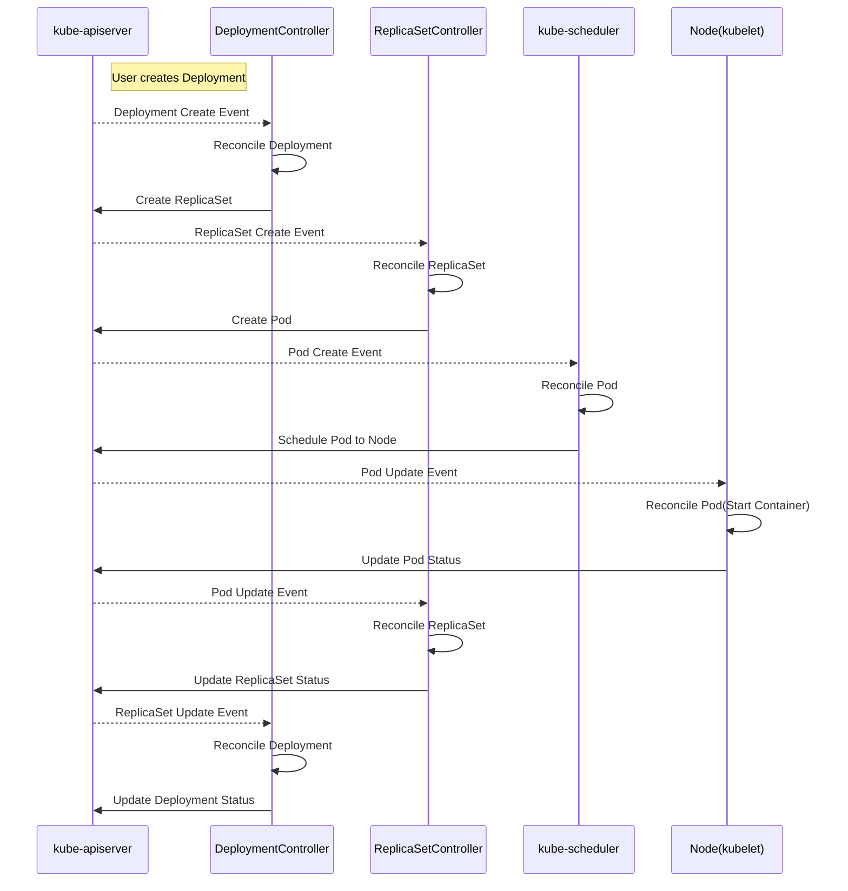

## Controller

- [Controllers](https://kubernetes.io/docs/concepts/architecture/controller/)

로봇 공학이나 자동화 분야에서 컨트롤 루프는 시스템의 상태를 제어하는 무한 루프를 의미합니다. 컨트롤 루프는 현재 상태(current state)를 확인하고, 원하는 상태(desired state)로 변경하기 위해 필요한 작업을 수행합니다.

Kubernetes에서 컨트롤러는 리소스를 원하는 상태로 유지하기 위해 작동하는 컨트롤 루프입니다. 컨트롤러를 묶어서 관리하는 애플리케이션을 컨트롤러 매니저라고 합니다.

- `kube-controller-manager`: `kube-apiserver`와 소통하여 내장된 리소스들을 제어하는 매니저입니다.
- `cloud-controller-manager`: `kube-apiserver`, `cloud-provider-apiserver`와 소통하여 컴퓨트, 네트워크, 스토리지 등 인프라와 일부 리소스들을 제어하는 매니저입니다.

## Deployment Example

- [What is a Controller](https://book-v1.book.kubebuilder.io/basics/what_is_a_controller)
- [deployment_controller.go](https://github.com/kubernetes/kubernetes/blob/master/pkg/controller/deployment/deployment_controller.go)

