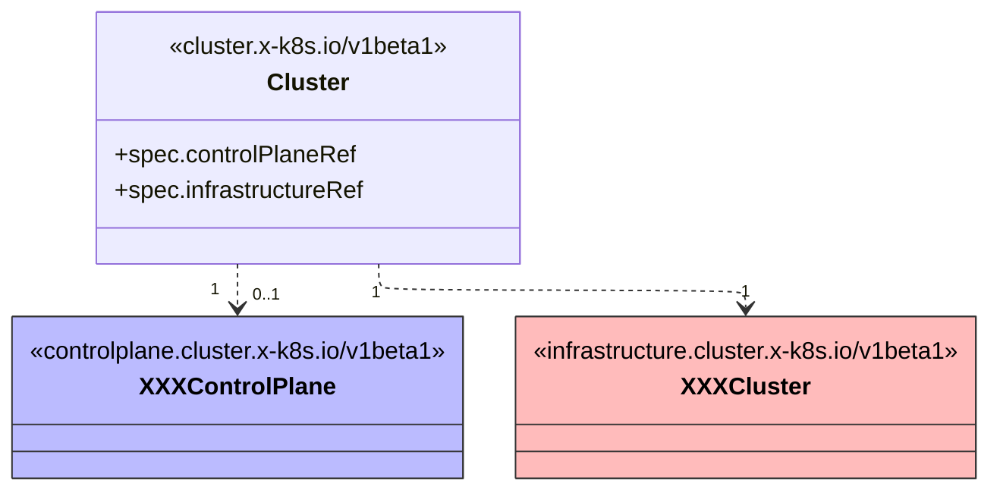
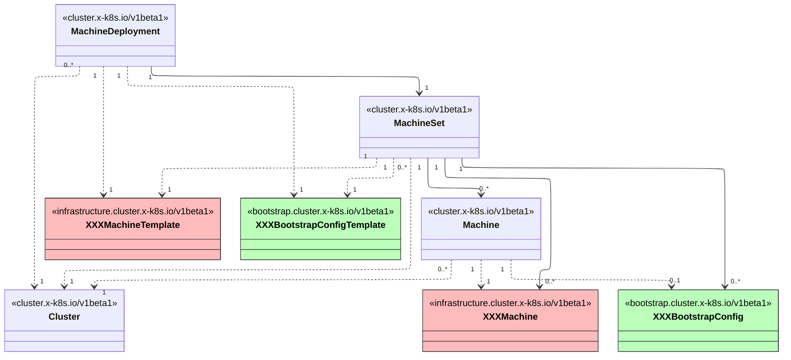

## Cluster

:::info[Reference]

- [crds Docs / Cluster API / Cluster](https://doc.crds.dev/github.com/kubernetes-sigs/cluster-api/cluster.x-k8s.io/Cluster/v1beta1@v1.10.4)

:::



- `Cluster`를 삭제하면 **관련된 모든 리소스가 삭제됩니다**.

```yaml
apiVersion: cluster.x-k8s.io/v1beta1
kind: Cluster
spec:
  clusterNetwork:
    pods:
      cidrBlocks:
        - 10.243.0.0/16
    services:
      cidrBlocks:
        - 10.95.0.0/16
  controlPlaneRef:
    apiVersion: controlplane.cluster.x-k8s.io/v1beta1
    kind: XXXControlPlane
    name: <name>
  infrastructureRef:
    apiVersion: infrastructure.cluster.x-k8s.io/v1beta1
    kind: XXXCluster
    name: <name>
```

- `clusterNetwork`
  - `pods`
    - `cidrBlocks: []`
  - `services`
    - `cidrBlocks: []`
- `controlPlaneRef`
  - `apiVersion: controlplane.cluster.x-k8s.io/v1beta1`
  - `kind: XXXControlPlane`
  - `name: <name>`
  - `namespace: <namespace>`
- `infrastructureRef`
  - `apiVersion: infrastructure.cluster.x-k8s.io/v1beta1`
  - `kind: XXXCluster`
  - `name: <name>`
  - `namespace: <namespace>`

```shell
clusterctl describe cluster <clusterName>
```

```shell
clusterctl get kubeconfig <clusterName> > <clusterName>-config.yaml
```

## Worker

:::info[Reference]

- [crds Docs / Cluster API / MachineDeployment](https://doc.crds.dev/github.com/kubernetes-sigs/cluster-api/cluster.x-k8s.io/MachineDeployment/v1beta1@v1.10.4)

:::



- `Machine`을 삭제하면 `XXXMachine`, `XXXBootstrapConfig`이 삭제됩니다.

```yaml
apiVersion: cluster.x-k8s.io/v1beta1
kind: MachineDeployment
spec:
  clusterName: <clusterName>
  replicas: <replicas>
  selector:
    matchLabels:
      cluster.x-k8s.io/cluster-name: <clusterName>
  template:
    metadata:
      labels:
        cluster.x-k8s.io/cluster-name: <clusterName>
    spec:
      clusterName: <clusterName>
      bootstrap:
        configRef:
          apiVersion: bootstrap.cluster.x-k8s.io/v1beta1
          kind: XXXBootstrapConfigTemplate
          name: <name>
      infrastructureRef:
        apiVersion: infrastructure.cluster.x-k8s.io/v1beta1
        kind: XXXMachineTemplate
        name: <name>
```

- `template`
  - `spec`
    - `bootstrap`
      - `configRef`
        - `apiVersion: bootstrap.cluster.x-k8s.io/v1beta1`
        - `kind: XXXConfigTemplate`
        - `name: <name>`
        - `namespace: <namespace>`
    - `infrastructureRef`
      - `apiVersion: infrastructure.cluster.x-k8s.io/v1beta1`
      - `kind: XXXMachineTemplate`
      - `name: <name>`
      - `namespace: <namespace>`

```shell
clusterctl describe cluster <clusterName>
```
