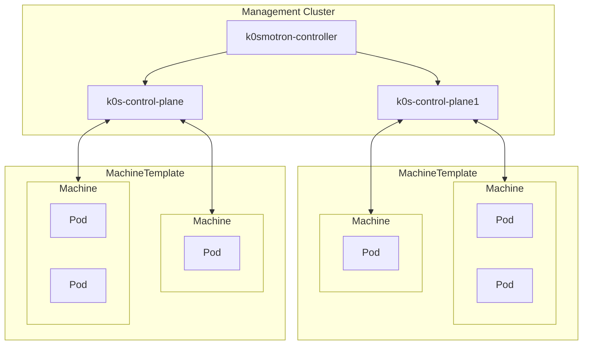
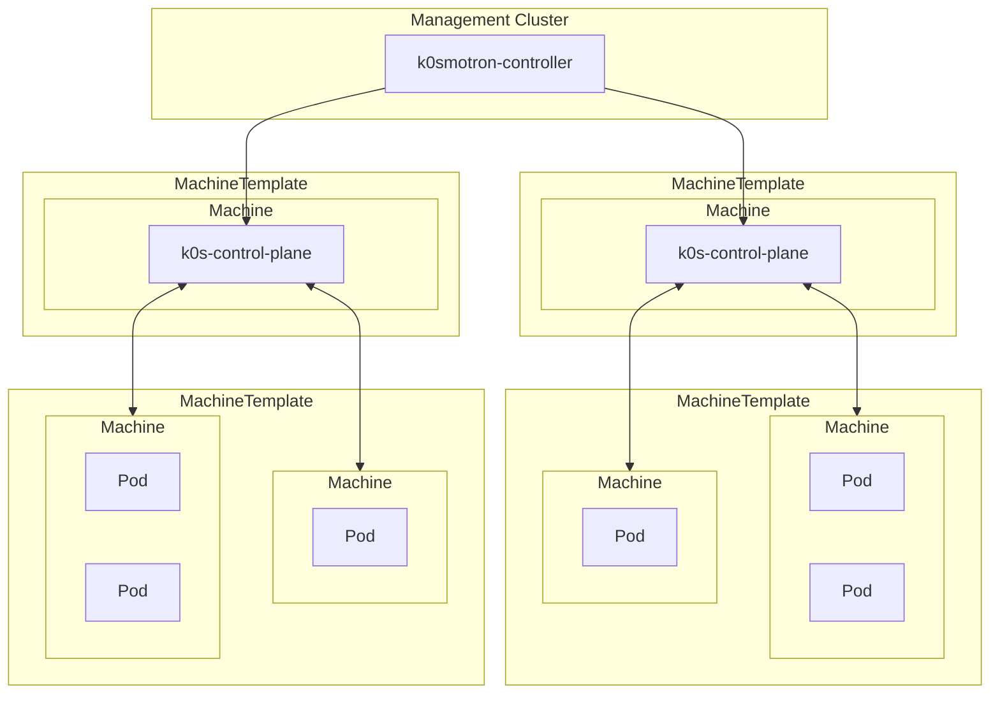

## ControlPlaneProvider

```yaml
---
apiVersion: v1
kind: Namespace
metadata:
  name: capi-k0smotron-control-plane

---
apiVersion: operator.cluster.x-k8s.io/v1alpha2
kind: ControlPlaneProvider
metadata:
  name: k0sproject-k0smotron
  namespace: capi-k0smotron-control-plane
spec:
  version: v1.7.0
```

- `version: <version>`
  - [k0smotron GitHub / Releases](https://github.com/k0sproject/k0smotron/releases)

## K0smotronControlPlane

:::info[Reference]

- [k0smotron Docs / Reference / controlplane # K0smotronControlPlane.spec](https://docs.k0smotron.io/stable/resource-reference/controlplane.cluster.x-k8s.io-v1beta1/#k0smotroncontrolplanespec)

:::

k0smotron은 Management Cluster 내에 k0s control plane을 생성하고 worker들만 Machine에서 실행되는 구조입니다.



```yaml
apiVersion: controlplane.cluster.x-k8s.io/v1beta1
kind: K0smotronControlPlane
spec:
  version: v1.32.6+k0s.0
  etcd:
    persistence:
      storageClass: <storageClass>
  replicas: 3
  service:
    type: LoadBalancer
    apiPort: 6443
    konnectivityPort: 8132
```

- `version: <version>`
  - [k0s GitHub / Releases](https://github.com/k0sproject/k0s/releases)
- `k0sConfig`
  - `apiVersion: k0s.k0sproject.io/v1beta1`
  - `kind: ClusterConfig`
  - `spec`
    - [k0s # Controller](/docs/mlops/kubernetes/cluster/k0s/k0s.mdx#controller)
    - `network`
      - `podCIDR`, `serviceCIDR`, `clusterDomain`값을 입력하지 않으면 자동으로 Cluster CR의 정보를 사용합니다.

## K0sControlPlane

k0s는 control plane과 worker 모두 Machine에서 실행되는 구조입니다.


