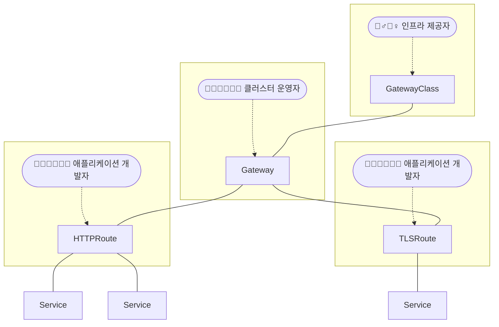

## RBAC

:::info[Reference]

- [Gateway API / Concepts / Roles and Personas](https://gateway-api.sigs.k8s.io/concepts/roles-and-personas/)
- [Gateway API / Concepts / Security Model](https://gateway-api.sigs.k8s.io/concepts/security-model/)

:::

<center>



</center>

아래와 같이 **3 Tier model** 또는 **4 Tier model**로 관리 범위를 구분할 수 있습니다.

|                     | GatewayClass | Gateway | Route |
| ------------------- | :----------: | :-----: | :---: |
| 인프라 제공자       |      ✅      |   ✅    |  ✅   |
| 클러스터 운영자     |      ❌      |   ✅    |  ✅   |
| 애플리케이션 개발자 |      ❌      |   ❌    |  ✅   |

|                     | GatewayClass |    Gateway     |     Route      |
| ------------------- | :----------: | :------------: | :------------: |
| 인프라 제공자       |      ✅      |       ✅       |       ✅       |
| 클러스터 운영자     | 상황에 따름  |       ✅       |       ✅       |
| 애플리케이션 관리자 |      ❌      | 특정 Namespace | 특정 Namespace |
| 애플리케이션 개발자 |      ❌      |       ❌       | 특정 Namespace |

## Crossing Namespace

:::info[Reference]

- [Gateway API / Concepts / Security Model](https://gateway-api.sigs.k8s.io/concepts/security-model/)

:::

권한 관리에 Namespace를 활용하는 경우, Namespace 간에 리소스 접근 제어를 해야할 수 있습니다. 이 때 활용할 수 있는 것이 Namespace Selector와 ReferenceGrant입니다.

### Route binding

```yaml
apiVersion: gateway.networking.k8s.io/v1
kind: Gateway
spec:
  listeners:
    - allowedRoutes:
        namespaces:
          from: Selector
          selector:
            - key: kubernetes.io/metadata.name
              operator: In
              values:
                - <namespace1>
                - <namespace2>
```

### ReferenceGrant

- [ReferenceGrant](/docs/mlops/kubernetes/network/gateway-api/route#referencegrant)
