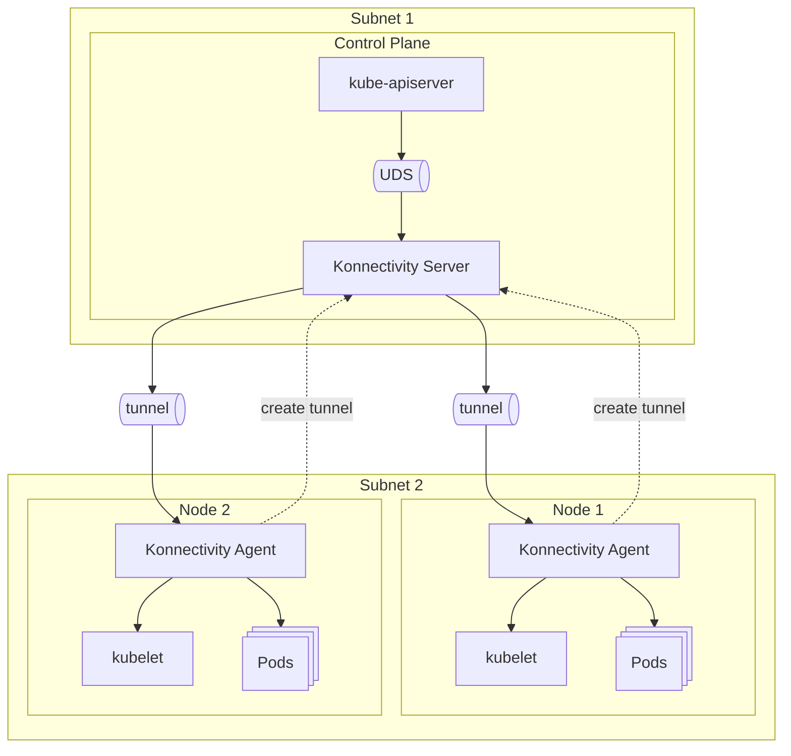

## Konnectivity

:::info[References]

- [apiserver-network-proxy GitHub](https://github.com/kubernetes-sigs/apiserver-network-proxy)

:::



Node에서 Control Plane은 접근할 수 있지만, Control Plane에서 Node는 접근할 수 없는 경우가 있습니다. 이때, Konnectivity를 사용하여 각 Node의 agent가 미리 server와 tunnel을 만들어두면 kube-apiserver가 Node의 kubelet에 접근할 수 있습니다.

## 설정

### Konnectivity server

:::info[References]

- [Kubernetes Docs / Tasks / Extend Kubernetes / Set up Konnectivity service](https://kubernetes.io/docs/tasks/extend-kubernetes/setup-konnectivity/)

:::

```yaml
apiVersion: v1
kind: ConfigMap
data:
  egress-selector-configuration.yaml: |
    apiVersion: apiserver.k8s.io/v1beta1
    kind: EgressSelectorConfiguration
    egressSelections:
      - name: cluster
        connection:
          proxyProtocol: GRPC
          transport:
            uds:
              udsName: /run/konnectivity/konnectivity-server.socket
```

```yaml
apiVersion: apps/v1
kind: Deployment
spec:
  template:
    metadata:
      labels:
        app.kubernetes.io/name: control-plane
        app: control-plane
    spec:
      containers:
        - name: konnectivity-server
          image: registry.k8s.io/kas-network-proxy/proxy-server:v0.33.0
          command:
            - /proxy-server
          args:
            - --uds-name=/run/konnectivity/konnectivity-server.socket
            - --authentication-audience=system:konnectivity-server
            # ...
          ports:
            - name: konnectivity-agent
              containerPort: 8132
            - name: konnectivity-admin
              containerPort: 8133
            - name: konnectivity-health
              containerPort: 8134
          volumeMounts:
            - name: konnectivity-uds
              mountPath: /run/konnectivity
        - name: kube-apiserver
          image: registry.k8s.io/kube-apiserver:v1.32.6
          command:
            - kube-apiserver
          args:
            - --egress-selector-config-file=/etc/kubernetes/konnectivity/configurations/egress-selector-configuration.yaml
            # ...
          ports:
            - name: kube-apiserver
              containerPort: 6443
          volumeMounts:
            - name: konnectivity-uds
              mountPath: /run/konnectivity
            - name: egress-selector-configuration
              mountPath: /etc/kubernetes/konnectivity/configurations
      volumes:
        - name: konnectivity-uds
          emptyDir:
            medium: Memory
        - name: egress-selector-configuration
          configMap:
            name: konnectivity-egress-selector-configuration
            defaultMode: 420
```

```yaml
apiVersion: v1
kind: Service
spec:
  type: LoadBalancer
  selector:
    app.kubernetes.io/name: control-plane
    app: control-plane
  ports:
    - name: konnectivity-agent
      port: 8132
      targetPort: konnectivity-agent
    - name: konnectivity-admin
      port: 8133
      targetPort: konnectivity-admin
    - name: konnectivity-health
      port: 8134
      targetPort: konnectivity-health
    - name: kube-apiserver
      port: 6443
      targetPort: kube-apiserver
```

### Konnectivity agent

```yaml
apiVersion: apps/v1
kind: DaemonSet
spec:
  template:
    spec:
      containers:
        - name: konnectivity-agent
          image: registry.k8s.io/kas-network-proxy/proxy-agent:v0.33.0
          command:
            - /proxy-agent
          args:
            - --proxy-server-host=<IP>
            # ...
```
