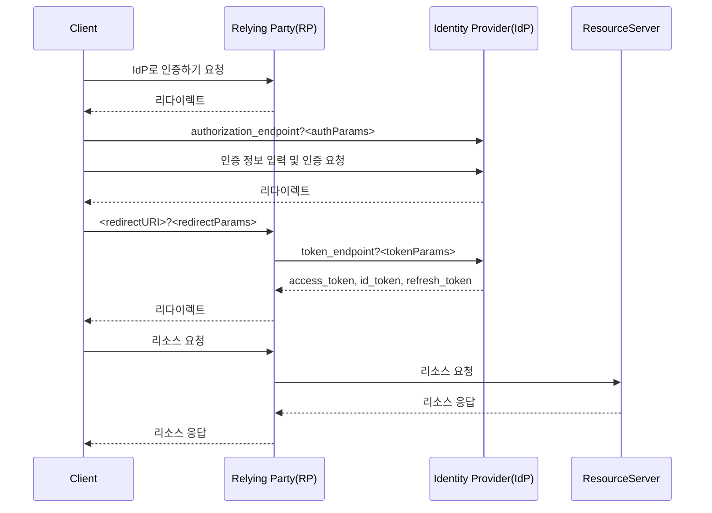

## OIDC

:::info

- https://openid.net/specs/openid-connect-discovery-1_0.html#ProviderConfig

OIDC 클라이언트는 `<issuer>/.well-known/openid-configuration`에서

- authorization_endpoint
- token_endpoint
- grant_types_supported
- response_types_supported
- scopes_supported

등의 정보를 얻어서 사용합니다.

:::

### Authorization Code Grant

- https://datatracker.ietf.org/doc/html/rfc6749#section-4.1

<center>



</center>

- `<authParams>`
  - `client_id=<clientID>`
  - `redirect_uri=<redirectURI>`
  - `response_type=code`
  - `scope=<scope>`
  - `state=<state>`
- `<redirectParams>`
  - `code=<code>`
  - `state=<state>`
- `<tokenParams>`
  - `client_id=<clientID>`
  - `client_secret=<clientSecret>`
  - `grant_type=authorization_code`
  - `code=<code>`

## Test

### token_endpoint

```shell
curl '<token_endpoint>' \
  -H 'Content-Type: application/x-www-form-urlencoded' \
  -d 'client_id=<clientID>' \
  -d 'client_secret=<clientSecret>' \
  -d 'grant_type=password' \
  -d 'username=<user>' \
  -d 'password=<password>' \
| jq '.'
```
