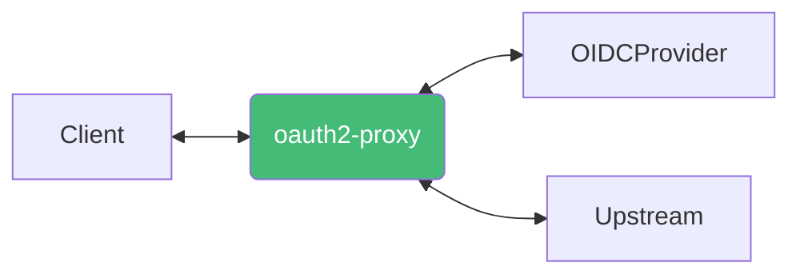
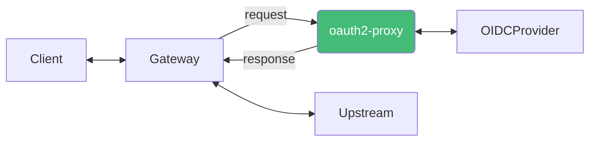
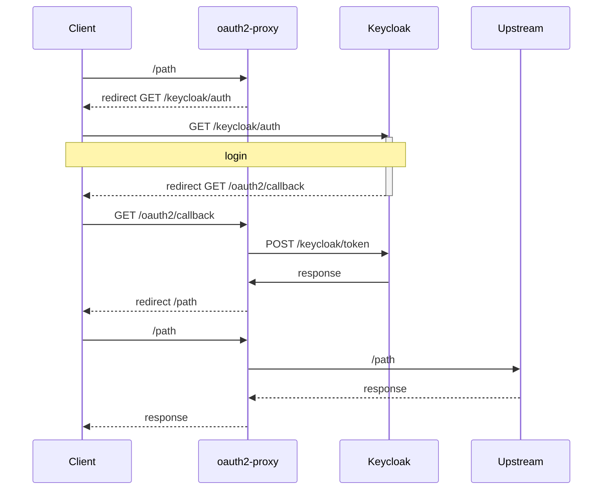

## 인증 방식

### OAuth2 + Reverse Proxy

<center>



</center>

<center>OAuth2Proxy가 인증 역할과 리버스 프록시 역할 모두 수행</center>

<br />

- `--upstream=<upstream-url>[,<upstream-url>...]`
  - 리버스 프록시에서 사용할 upstream 서버를 설정합니다
  - `/path`가 매핑됩니다

### OAuth2

<center>



</center>

<center>OAuth2Proxy가 인증 역할만 수행</center>

- `--upstream=static://202`
  - upstream 서버를 설정하지 않고 인증이 성공한 경우 `202`, 실패한 경우 `401` 응답을 반환합니다

## 설정

- https://oauth2-proxy.github.io/oauth2-proxy/docs/configuration/overview#command-line-options

옵션을 전달하는 방식은 3가지가 있습니다.

- `args`으로 옵션을 전달
- 파일
  - `--config=<config-path>`
  - 옵션의 `-`를 `_`로 변경
  - 여러번 사용할 수 있는 옵션의 경우 마지막에 s를 붙이고 `[]` 리스트로 변경
- `env`
  - 옵션의 소문자를 대문자로, `-`를 `_`로 변경
  - `OAUTH2_PROXY_`을 앞에 붙임
- alpha config
  - `--alpha-config=<config-path>`
  - alpha 테스트 중인 설정 방법으로 yaml 파일을 사용합니다.
  - alpha config를 사용하면 위의 3 가지 방법중 호환되지 않는 옵션들이 생깁니다.
  - https://oauth2-proxy.github.io/oauth2-proxy/docs/configuration/alpha-config

## Deployment

```yaml
apiVersion: v1
kind: ConfigMap
metadata:
  name: <name>
  namespace: <namespace>
data:
  oauth2-proxy.yaml: |-
    upstreamConfig:
      upstreams:
        - id: <id>
          path: /
          uri: http://<upstreamName>.<upstreamNamespace>.svc
    injectRequestHeaders:
      - name: x-forwarded-email
        values:
          - claim: email
    injectResponseHeaders:
      - name: x-forwarded-email
        values:
          - claim: email
    providers: []
    server:
      BindAddress: 0.0.0.0:4180
      SecureBindAddress: ""
    metricsServer:
      BindAddress: 0.0.0.0:44180
      SecureBindAddress: ""
```

```yaml
apiVersion: v1
kind: Service
metadata:
  name: <name>
  namespace: <namespace>
spec:
  type: ClusterIP
  selector:
    <key>: <value>
  ports:
    - name: http
      port: 4180
      targetPort: http
      protocol: TCP
```

```yaml
apiVersion: apps/v1
kind: Deployment
metadata:
  name: <name>
  namespace: <namespace>
spec:
  selector:
    matchLabels:
      <key>: <value>
  template:
    metadata:
      labels:
        <key>: <value>
    spec:
      containers:
        - name: oauth2-proxy
          image: quay.io/oauth2-proxy/oauth2-proxy:v7.4.0
          args:
            - --alpha-config=/opt/oauth2-proxy/oauth2-proxy.yaml
          env: []
          ports:
            - name: http
              containerPort: 4180
              protocol: TCP
            - name: metrics
              containerPort: 44180
              protocol: TCP
          volumeMounts:
            - name: <volumeName>
              mountPath: /opt/oauth2-proxy
              readOnly: true
          readinessProbe:
            periodSeconds: 10
            httpGet:
              path: /ping
              port: 4180
      volumes:
        - name: <name>
          configMap:
            name: <configMapName>
            defaultMode: 0644
```

## Keycloak OIDC

- [Keycloak OIDC](/docs/mlops/mlops/auth/keycloak/openid-connect)
- https://oauth2-proxy.github.io/oauth2-proxy/docs/configuration/oauth_provider/#keycloak-oidc-auth-provider

<br />

- `--redirect-url=<client-url>/oauth2/callback`
- `--oidc-issuer-url=https://<keycloak-url>/realms/<realm>`
- `--allowed-group=<group>`
- `--email-domain=*`
- `--cookie-secret=<cookie-secret>`
  - https://oauth2-proxy.github.io/oauth2-proxy/docs/configuration/overview#generating-a-cookie-secret

```yaml title="oauth2-proxy.yaml"
providers:
  - id: keycloak-oidc
    provider: keycloak-oidc
    clientID: <clientID>
    clientSecret: <clientSecret>
    scope: openid profile email groups
    allowedGroups:
      - <group>
    code_challenge_method: S256
    oidcConfig:
      issuerURL: https://<keycloak-url>/realms/<realm>
      # discovery를 사용하면 <issuerURL>/.well-known/openid-configuration 에서
      # loginURL, redeemURL, profileURL, jwksURL, supportedCodeChallengeMethods를 가져옵니다
      # skipDiscovery: false
      emailClaim: email
      groupsClaim: groups
      audienceClaims:
        - aud
```

:::info
`allowedGroups`로 `role:<role>`을 사용할 수 있습니다.
:::

<center>



</center>

- /keycloak/auth
  - path: `<keycloakURL>/realms/<realm>/protocol/openid-connect/auth`
  - query
    - `client_id=<clientID>`
    - `oauth2/callback=<redirectURI>`
    - `response_type=code`
    - `scope=<scope>`: openid+profile+email+groups
    - `state=<state>`
    - `nonce=<nonce>`
- /oauth2/callback
  - path: `<oauth2ProxyURL>/oauth2/callback`
  - query
    - `state=<state>`
    - `session_state=<sessionState>`
    - `code=<code>`
- /keycloak/token
  - path: `<keycloakURL>/realms/<realm>/protocol/openid-connect/token`
  - header
    - `Authorization: Basic <base64(<clientID>:<clientSecret>)>`
    - `Content-Type: application/x-www-form-urlencoded`
  - body
    - `"grant_type=authorization_code&code=<code>&redirect_rui=<redirectURI>"`
