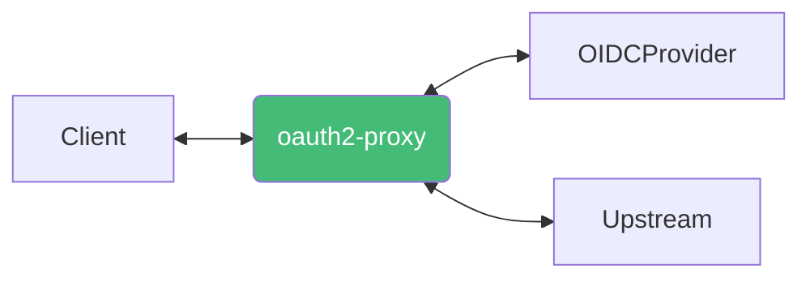
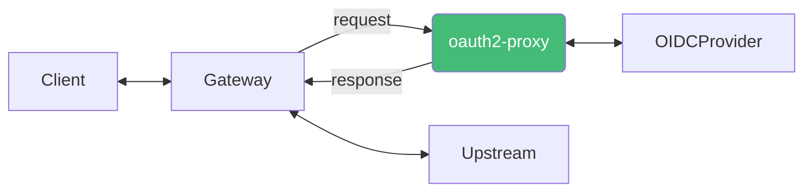

## Configuration

- https://oauth2-proxy.github.io/oauth2-proxy/docs/configuration/overview#command-line-options

옵션을 전달하는 방식은 3가지가 있습니다.

- `args`으로 옵션을 전달
- 파일
  - `args: ["--config=<config-path>"]`
  - 옵션의 `-`를 `_`로 변경
  - 여러번 사용할 수 있는 옵션의 경우 마지막에 s를 붙이고 `[]` 리스트로 변경
- `env`
  - 옵션의 소문자를 대문자로, `-`를 `_`로 변경
  - `OAUTH2_PROXY_`을 앞에 붙임

### OAuth2 + Reverse Proxy

<center>



</center>

<center>OAuth2Proxy가 인증 역할과 리버스 프록시 역할 모두 수행</center>

<br />

- `--upstream=<upstream-url>[,<upstream-url>...]`
  - 리버스 프록시에서 사용할 upstream 서버를 설정합니다
  - `/path`가 매핑됩니다

### OAuth2

<center>



</center>

<center>OAuth2Proxy가 인증 역할만 수행</center>

- `--upstream=static://202`
  - upstream 서버를 설정하지 않고 인증이 성공한 경우 `202`, 실패한 경우 `401` 응답을 반환합니다

## Deployment

```yaml
apiVersion: v1
kind: Secret
metadata:
  name: <name>
  namespace: <namespace>
type: Opaque
stringData:
  OAUTH2_PROXY_XXX: XXX
```

```yaml
apiVersion: v1
kind: Service
metadata:
  name: <name>
  namespace: <namespace>
spec:
  type: ClusterIP
  selector:
    <key>: <value>
  ports:
    - name: http
      port: 4180
      targetPort: http
      protocol: TCP
```

```yaml
apiVersion: apps/v1
kind: Deployment
metadata:
  name: <name>
  namespace: <namespace>
spec:
  selector:
    matchLabels:
      <key>: <value>
  template:
    metadata:
      labels:
        <key>: <value>
    spec:
      containers:
        - name: oauth2-proxy
          image: quay.io/oauth2-proxy/oauth2-proxy:v7.2.1
          args:
            - --http-address=0.0.0.0:4180
          envFrom:
            - secretRef:
                name: <secretName>
          ports:
            - name: http
              containerPort: 4180
              protocol: TCP
          readinessProbe:
            periodSeconds: 10
            httpGet:
              path: /ping
              port: 4180
```

## Keycloak OIDC

- [Keycloak OIDC](/docs/mlops/mlops/auth/keycloak/openid-connect)
- https://oauth2-proxy.github.io/oauth2-proxy/docs/configuration/oauth_provider/#keycloak-oidc-auth-provider

<br />

- `--provider=keycloak-oidc`
- `--client-id=<client-id>`
- `--client-secret=<client-secret>`
- `--redirect-url=<client-url>/oauth2/callback`
- `--oidc-issuer-url=https://<keycloak-url>/auth/realms/<realm>`
- `--allowed-groups=<group>`
- `--email-domain=*`
- `--cookie-secret=<cookie-secret>`
  - https://oauth2-proxy.github.io/oauth2-proxy/docs/configuration/overview#generating-a-cookie-secret
