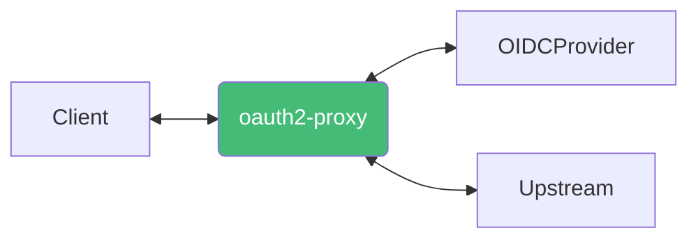
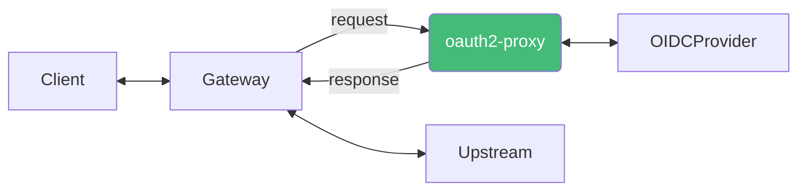

## 인증 방식

### OAuth2 Reverse Proxy



<center>OAuth2Proxy가 인증 역할과 리버스 프록시 역할 모두 수행</center>

<br />

- `--upstream=<upstream-url>[,<upstream-url>...]`
  - 리버스 프록시에서 사용할 upstream 서버를 설정합니다
  - `/path`가 매핑됩니다

### OAuth2 Middleware



<center>OAuth2Proxy가 인증 역할만 수행</center>

- `--upstream=static://202`
  - upstream 서버를 설정하지 않고 인증이 성공한 경우 `202`, 실패한 경우 `401` 응답을 반환합니다

## 설치

:::info[Reference]

- [oauth2-proxy manifests GitHub / helm / oauth2-proxy](https://github.com/oauth2-proxy/manifests/tree/main/helm/oauth2-proxy)

:::

```shell
helm repo add oauth2-proxy https://oauth2-proxy.github.io/manifests
```

```shell
helm repo update oauth2-proxy \
&& helm search repo oauth2-proxy/oauth2-proxy -l | head -n 10
```

```shell
helm pull oauth2-proxy/oauth2-proxy --version 7.12.17
```

```shell
helm show values oauth2-proxy/oauth2-proxy --version 7.12.17 > oauth2-proxy-7.12.17.yaml
```

:::info

terraform으로 쿠키 시크릿을 생성할 수 있습니다.

```hcl
resource "random_password" "oauth2_proxy_cookie_secret" {
  length           = 32
  override_special = "-_"
}
```

:::

```yaml title="oauth2-proxy-values.yaml"
config:
  # proxyVarsAsSecrets: true
  clientID: <clientID>
  clientSecret: <clientSecret>
  cookieSecret: <cookieSecret>

  configFile: |
    email_domains = [ "*" ]

    provider = "oidc"
    oidc_issuer_url = "<issuerURL>"
    scope = "openid email profile groups"
    redirect_url = "<clientURL>/oauth2/callback"

    upstreams = [ "<upstreamURL>" ]
```

```shell
helm template oauth2-proxy oauth2-proxy/oauth2-proxy \
    --version 7.12.17 \
    -n oauth2-proxy \
    -f oauth2-proxy-values.yaml \
    > oauth2-proxy.yaml
```

```shell
helm upgrade -i oauth2-proxy oauth2-proxy/oauth2-proxy \
    --history-max 5 \
    --version 7.12.17 \
    -n oauth2-proxy \
    -f oauth2-proxy-values.yaml
```

## 설정

:::info[Reference]

- [oauth2-proxy Docs / Configuration / Overview](https://oauth2-proxy.github.io/oauth2-proxy/configuration/overview)

:::

옵션을 전달하는 방식은 3가지가 있습니다.

- `args`으로 옵션을 전달
- 파일
  - `--config=<config-path>`
  - 옵션의 `-`를 `_`로 변경
  - 여러번 사용할 수 있는 옵션의 경우 마지막에 s를 붙이고 `[]` 리스트로 변경
- `env`
  - 옵션의 소문자를 대문자로, `-`를 `_`로 변경
  - `OAUTH2_PROXY_`을 앞에 붙임
- alpha config
  - `--alpha-config=<config-path>`
  - alpha 테스트 중인 설정 방법으로 yaml 파일을 사용합니다.
  - alpha config를 사용하면 위의 3 가지 방법중 호환되지 않는 옵션들이 생깁니다.
  - https://oauth2-proxy.github.io/oauth2-proxy/docs/configuration/alpha-config
