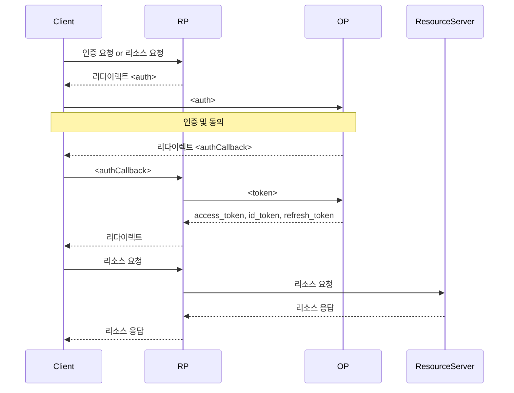

## OIDC

- [How OIDC Works](https://openid.net/developers/how-connect-works/)

<br />

- OIDC
  - OpenID Connect
  - Minimal: Core
  - Dynamic: Minimal, Discovery, Dynamic Client Registration
  - Complete: Dynamic, Session Management, Form Post Response Mode
- OP
  - OpenID Connect Provider
- RP
  - Relying Party

## Discovery

- [Discovery](https://openid.net/specs/openid-connect-discovery-1_0.html)

OP는 `GET <issuer>/.well-known/openid-configuration`를 통해 설정정보를 노출합니다.

- 필수(required)
  - `issuer: <issuer>`
    - 이 OP가 발급한 ID token의 `iss`의 값과 같아야합니다.
  - `authorization_endpoint: <authorizationEndpoint>`
  - `token_endpoint: <tokenEndpoint>`
    - Implicit Flow만 사용하는 경우 필수가 아닙니다.
  - `jwks_uri: <jwksURI>`
    - RP가 OP로부터 받은 토큰의 서명을 검증하기 위해 사용할 수 있는 JWK 정보를 제공하는 주소입니다.
  - `response_types_supported: [<responseType>]`
    - Dynamic OP는 `code`, `id_token`, `id_token token`을 필수로 지원해야합니다.
  - `subject_types_supported: [<subjectType>]`
    - `public`, `pairwise`
  - `id_token_signing_alg_values_supported: [<alg>]`
    - `RS256`를 필수로 지원해야합니다.
- 추천(recommended)
  - `userinfo_endpoint: <userinfoEndpoint>`
  - `registration_endpoint: <registrationEndpoint>`
  - `scopes_supported: [<scope>]`
    - `openid`를 필수로 지원해야합니다.
  - `claims_supported: [<claim>]`
  - `end_session_endpoint: <endSessionEndpoint>`
- 선택(optional)
  - `response_modes_supported: [<responseMode>]`
  - `grant_types_supported: [<grantType>]`
    - Dynamic OP는 `authorization_code`, `implicit`을 필수로 지원해야합니다.
  - `acr_values_supported: [<acrValue>]`
  - `id_token_encryption_alg_values_supported: [<alg>]`
  - `id_token_encryption_enc_values_supported: [<enc>]`
  - `userinfo_signing_alg_values_supported: [<alg>]`
  - `userinfo_encryption_alg_values_supported: [<alg>]`
  - `userinfo_encryption_enc_values_supported: [<enc>]`
  - `request_object_signing_alg_values_supported: [<alg>]`
  - `request_object_encryption_alg_values_supported: [<alg>]`
  - `request_object_encryption_enc_values_supported: [<enc>]`
  - `token_endpoint_auth_methods_supported: [<method>]`
  - `token_endpoint_auth_signing_alg_values_supported: [<alg>]`
  - `display_values_supported: [<display>]`
  - `claim_types_supported: [<claimType>]`
  - `service_documentation: <serviceDocumentationURL>`
  - `claims_locales_supported: [<locale>]`
  - `ui_locales_supported: [<locale>]`
  - `claims_parameter_supported: <boolean>`
  - `request_parameter_supported: <boolean>`
  - `request_uri_parameter_supported: <boolean>`
  - `require_request_uri_registration: <boolean>`
  - `op_policy_uri: <policyURI>`
  - `op_tos_uri: <tosURI>`

## Authorization Code Flow

- [Core / Authorization Code Flow](https://openid.net/specs/openid-connect-core-1_0.html#CodeFlowAuth)

<center>



</center>

- `<auth>`
  - `GET <authorizationEndpoint>`
    - Query
      - `client_id=<clientID>`
      - `redirect_uri=<authCallbackURL>`
      - `response_type=code`
      - `scope=<scope>`
      - `state=<state>`
      - `nonce=<nonce>`
- `<authCallback>`
  - `GET <authCallbackURL>`
    - Query
      - `code=<code>`
      - `state=<state>`
- `<token>`
  - `POST <tokenEndpoint>`
    - Header
      - `Authorization: Basic <base64(<clientID>:<clientSecret>)>`
    - Body
      - `grant_type=authorization_code`
      - `code=<code>`
      - `redirect_rui=<redirectURI>`

## Test

### token_endpoint

```shell
curl '<token_endpoint>' \
  -H 'Content-Type: application/x-www-form-urlencoded' \
  -d 'client_id=<clientID>' \
  -d 'client_secret=<clientSecret>' \
  -d 'grant_type=password' \
  -d 'username=<user>' \
  -d 'password=<password>' \
| jq '.'
```
