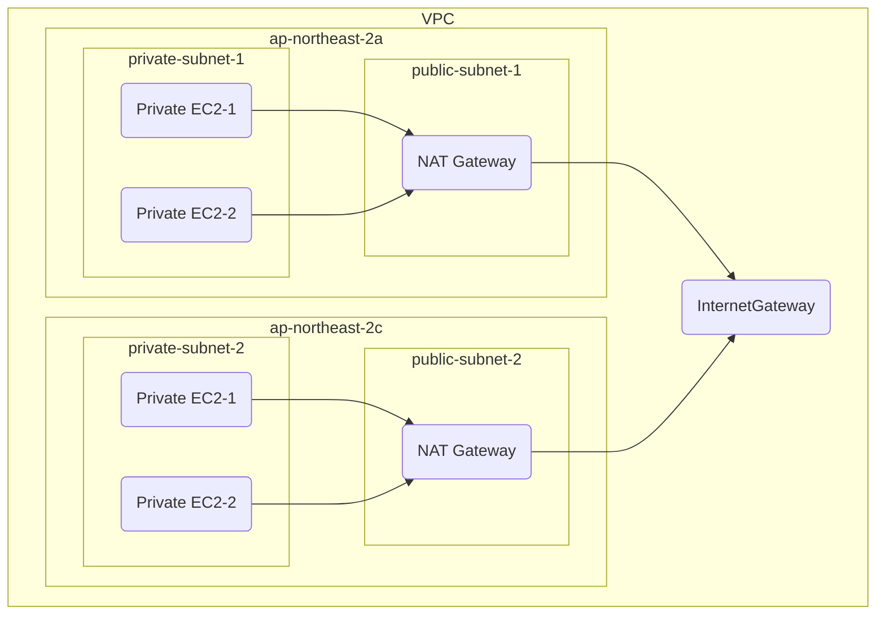

<center>



</center>

## VPC & Internet Gateway

```typescript
import * as aws from "@pulumi/aws";
import * as variable from "@src/variable";

const vpcName = "vpc";
const vpc = new aws.ec2.Vpc(
  vpcName,
  {
    enableDnsHostnames: true,
    enableDnsSupport: true,
    instanceTenancy: "default",
    cidrBlock: "172.16.0.0/18",
    tags: {
      Name: vpcName,
      "loliot.net/stack": variable.stackName,
    },
  },
  { protect: true }
);

const igwName = "igw";
const igw = new aws.ec2.InternetGateway(
  igwName,
  {
    vpcId: vpc.id,
    tags: {
      Name: igwName,
      "loliot.net/stack": variable.stackName,
    },
  },
  { protect: true }
);

const igwRouteTableName = `${igwName}-rtb`;
const igwRouteTable = new aws.ec2.RouteTable(
  igwRouteTableName,
  {
    vpcId: vpc.id,
    routes: [
      {
        cidrBlock: "0.0.0.0/0", // 모든 IP에 대한 요청을
        gatewayId: igw.id, // Internet Gateway로 연결
      },
    ],
    tags: {
      Name: igwRouteTableName,
      "loliot.net/stack": variable.stackName,
    },
  },
  { protect: true }
);
```

### RouteTable

- VPC에는 암시적 라우터가 있습니다
- RouteTable은 Subnet에 대한 라우팅 정의입니다
- Subnet에 명시적으로 RouteTable을 연결하지 않으면 기본 RouteTable에 연결됩니다
- Subnet은 하나의 RouteTable에만 연결됩니다
- RouteTable에는 여러개의 Subnet을 연결할 수 있습니다
- RouteTable에는 기본적으로 VPC 내부 통신을 위한 로컬 라우팅이 포함됩니다

## Public Subnet && NAT Gateway

```typescript
const publicSubnet1Name = "public-subnet-1";
const publicSubnet1 = new aws.ec2.Subnet(
  publicSubnet1Name,
  {
    vpcId: vpc.id,
    cidrBlock: "172.16.0.0/25",
    availabilityZone: "ap-northeast-2a",
    tags: {
      Name: publicSubnet1Name,
      "loliot.net/stack": variable.stackName,
      "kubernetes.io/cluster/eks": "shared",
    },
  },
  { protect: true }
);

new aws.ec2.RouteTableAssociation(
  `${igwRouteTableName}-association-1`,
  {
    routeTableId: igwRouteTable.id,
    subnetId: publicSubnet1.id,
  },
  { protect: true }
);

const ngw1Name = "ngw-1";
const ngw1EIPName = `${ngw1Name}-eip`;
const ngw1 = new aws.ec2.NatGateway(
  ngw1Name,
  {
    allocationId: new aws.ec2.Eip(ngw1EIPName, {
      tags: {
        Name: ngw1EIPName,
        "loliot.net/stack": variable.stackName,
      },
    }).id,
    subnetId: publicSubnet1.id,
    tags: {
      Name: ngw1Name,
      "loliot.net/stack": variable.stackName,
    },
  },
  { protect: true }
);

const ngw1RouteTableName = `${ngw1Name}-rtb`;
const ngw1RouteTable = new aws.ec2.RouteTable(
  ngw1RouteTableName,
  {
    vpcId: vpc.id,
    routes: [
      {
        cidrBlock: "0.0.0.0/0",
        gatewayId: ngw1.id,
      },
    ],
    tags: {
      Name: ngw1RouteTableName,
      "loliot.net/stack": variable.stackName,
    },
  },
  { protect: true }
);
```

## Private Subnet

```typescript
const privateSubnet1Name = "private-subnet-1";
const privateSubnet1 = new aws.ec2.Subnet(
  privateSubnet1Name,
  {
    vpcId: vpc.id,
    cidrBlock: "172.16.60.0/22",
    availabilityZone: "ap-northeast-2a",
    tags: {
      Name: privateSubnet1Name,
      "loliot.net/stack": variable.stackName,
      "kubernetes.io/cluster/eks": "shared",
    },
  },
  { protect: true }
);

new aws.ec2.RouteTableAssociation(
  `${ngw1RouteTableName}-association-1`,
  {
    routeTableId: ngw1RouteTable.id,
    subnetId: privateSubnet1.id,
  },
  { protect: true }
);
```
