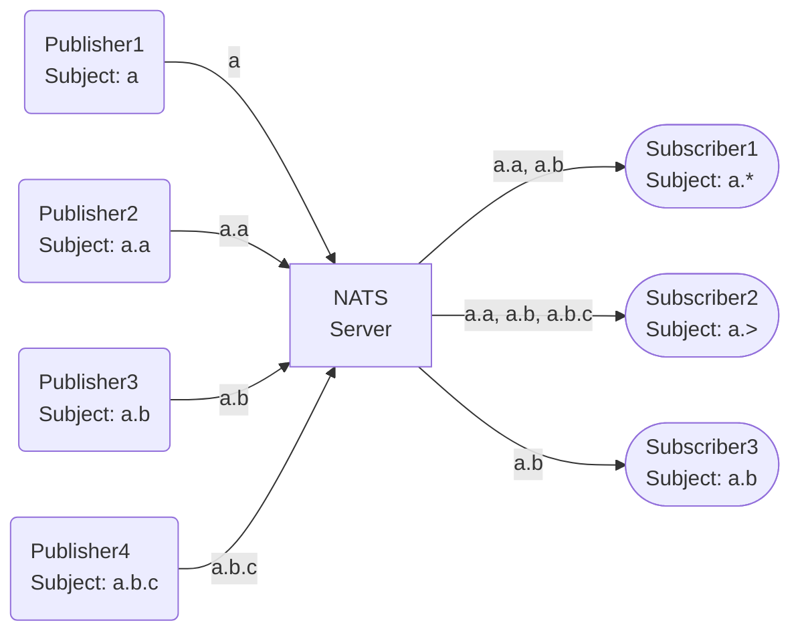

## Publish-Subscribe

<center>



</center>

- 1:N(fanout)
- fire-and-forget, `Subject: a` 인 메시지는 전달되지 않고 사라집니다

## Queue Group

<center>

```mermaid
flowchart LR
    P1(<div align=left>Publisher1<br/>Subject: a.a</div>)
    P2(<div align=left>Publisher2<br/>Subject: a.b</div>)
    P3(<div align=left>Publisher3<br/>Subject: a.b.c</div>)
    NATS[NATS<br/>Server]
    S1([<div align=left>Subscriber1<br/>Subject: a.></div>])
    C1
    C2
    C3
    P1 -- a.a --> NATS
    P2 -- a.b --> NATS
    P3 -- a.b.c --> NATS
    NATS -- a.a, a.b, a.b.c --> S1
    NATS -. a.a, a.b .-> C1
    NATS -. a.a, a.b, a.b.c .-> C2
    NATS -. a.b .-> C3
```

</center>

- Subscriber1은 모든 메시지를 전달 받습니다
- `QueueGroup: q`로 묶여 있는 경우 Subject에 맞춰 랜덤하게 한 Consumer만 메시지를 전달 받습니다
- `Subject: a.a`인 메시지는 Subscriber1 and ( Consumer1 or Consumer2 )에게 전달 됩니다

## Request-Reply

## JetStream

### Push

<center>

```mermaid
flowchart LR
    P1(<div align=left>Publisher1<br/>Subject: a.a</div>)
    P2(<div align=left>Publisher2<br/>Subject: a.b</div>)
    P3(<div align=left>Publisher3<br/>Subject: a.b.c</div>)
    NATS[NATS<br/>Server]
    S[(<div align=left>Stream: s<br/>Subjects: a.><br/>Storage: file</div>)]
    C1[<div align=left>Consumer: c1<br/>Mode: Push<br/>FilterSubject: a.><br/>DeliverSubject: s.c1</div>]
    C2[[<div align=left>Consumer: c2<br/>Mode: Push<br/>FilterSubject: a.*<br/>DeliverSubject: s.c2<br/>DeliverGroup: c2</div>]]
    S1([<div align=left>Subscriber1<br/>Stream: s<br/>Durable: c1</div>])
    S2([<div align=left>Subscriber2<br/>Stream: s<br/>Durable: c1</div>])
    c1
    c2
    P1 -- a.a --> NATS
    P2 -- a.b --> NATS
    P3 -- a.b.c --> NATS
    subgraph JetStream
    NATS --> S
    S -- a.a, a.b, a.b.c --> C1
    S -- a.a, a.b --> C2
    end
    C1 -- a.a, a.b, a.b.c --> S1
    C1 -- a.a, a.b, a.b.c --> S2
    C2 -. a.a, a.b .-> c1
    C2 -. a.a, a.b .-> c2
```

</center>

:::warning
DeliverSubject를 구독하는 일반 Subscriber도 작동을하지만 JetStream Push Consumer는 저장된 메시지 중에 얼마나 보냈는지를 체크해야하는 것 때문인 지 복잡한 subscribe or consume에서는 생각하지 못한 문제가 발생할 수 있습니다.
:::

### Pull
