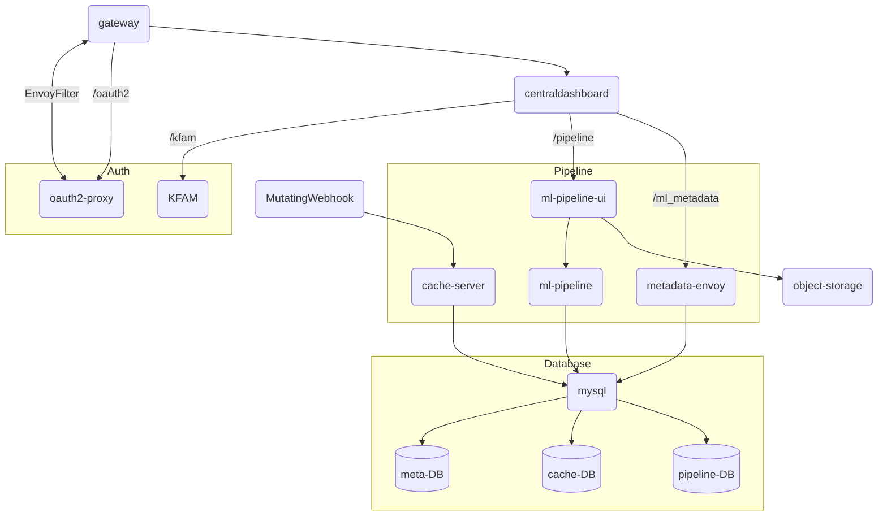

```mermaid
flowchart
  G(gateway)
  C(centraldashboard)
  OBJ(object-storage)

  subgraph ABox [Auth]
    A(oauth2-proxy)
    KFAM(KFAM)
  end

  subgraph PBox [Pipeline]
    META(metadata-envoy)
    CACHE(cache-server)
    PIPE(ml-pipeline)
    PUI(ml-pipeline-ui)
  end

  subgraph DBox [Database]
    DB(mysql)
    MDB[(meta-DB)]
    CDB[(cache-DB)]
    PDB[(pipeline-DB)]
  end

  MW(MutatingWebhook)

  G <--EnvoyFilter --> A
  G -- /oauth2 --> A
  G --> C
  PUI --> PIPE
  C -- /kfam --> KFAM
  C -- /pipeline --> PUI
  C -- /ml_metadata --> META
  DB --> MDB & CDB & PDB
  META --> DB
  PIPE --> DB
  CACHE --> DB
  MW --> CACHE
  PUI --> OBJ
```
