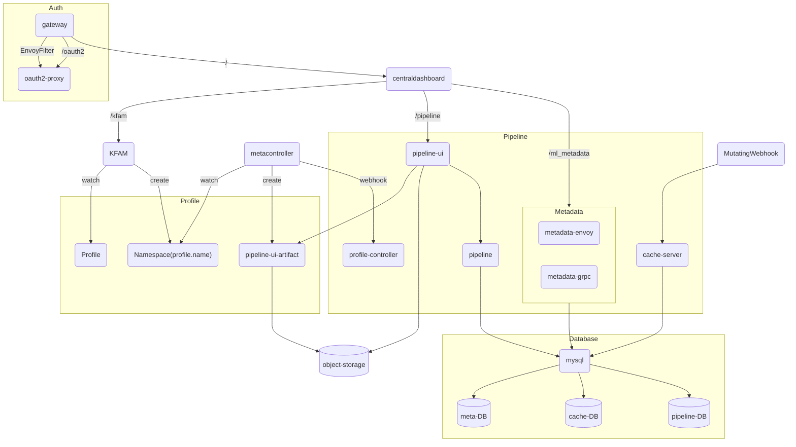

## Architecture

:::info
`oauth2-proxy`를 사용하는 부분은 기존과 다르게 커스텀한 부분입니다.
:::

```mermaid
flowchart
  subgraph Auth
    Gateway(gateway)
    Oauth2Proxy(oauth2-proxy)
  end

  Gateway --EnvoyFilter --> Oauth2Proxy
  Gateway -- /oauth2 --> Oauth2Proxy

  CentralDashboard(centraldashboard)
  ObjectStorage[(object-storage)]
  MetaController(metacontroller)
  KFAM(KFAM)


  subgraph PBox [Pipeline]
    subgraph META [Metadata]
      METAE(metadata-envoy)
      METAG(metadata-grpc)
    end
    CACHE(cache-server)
    Pipeline(pipeline)
    PipelineUI(pipeline-ui)
    ProfileController(profile-controller)
  end

  subgraph DBox [Database]
    DB(mysql)
    MDB[(meta-DB)]
    CDB[(cache-DB)]
    PDB[(pipeline-DB)]
  end

  subgraph PFBox [Profile]
    Profile(Profile)
    ProfileNamespace("Namespace(profile.name)")
    PiepelineUIArtifact(pipeline-ui-artifact)
  end

  MW(MutatingWebhook)

  Gateway -- / --> CentralDashboard
  PipelineUI --> PiepelineUIArtifact
  PipelineUI --> ObjectStorage
  PipelineUI --> Pipeline
  CentralDashboard -- /kfam --> KFAM
  CentralDashboard -- /pipeline --> PipelineUI
  CentralDashboard -- /ml_metadata --> META
  DB --> MDB & CDB & PDB
  META --> DB
  Pipeline --> DB
  CACHE --> DB
  MW --> CACHE
  MetaController -- webhook --> ProfileController
  KFAM -- watch --> Profile
  KFAM -- create --> ProfileNamespace
  MetaController -- watch --> ProfileNamespace
  MetaController -- create --> PiepelineUIArtifact
  PiepelineUIArtifact --> ObjectStorage
```
