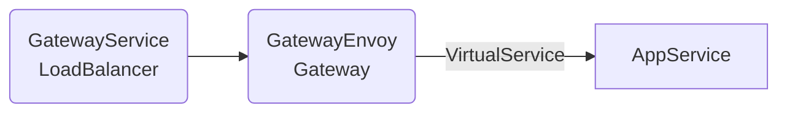
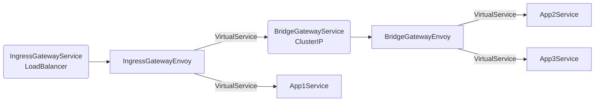

## Gateway & Envoy

Istio에서 Gateway는 독립적으로 배포된 Envoy로 들어오는 트래픽을 관리하는 리소스입니다. 일반적으로 IngressGateway EgressGateway라고 부르는 Envoy Pod이 있고, 이 Pod을 바라보는 Service의 타입과 포트 설정에 따라 실재 트래픽이 들어오는 곳이 결정됩니다.

:::warning
Service에 설정된 포트로 트래픽이 들어가더라도 Gateway에 해당 포트에 대한 설정이 없다면 트래픽이 통과되지 않습니다.
:::

<center>



</center>

## Gateway

### 설치

```shell
helm show values istio/gateway \
    --version 1.20.2 \
    > ingress-values.yaml
```

```yaml title="ingress-values.yaml"
revision: 1-20-2

service:
  ports:
    - name: status-port
      port: 15021
      targetPort: 15021
      protocol: TCP
      nodePort: <nodePort>
    - name: http2
      port: 80
      targetPort: 8080
      protocol: TCP
      nodePort: <nodePort>
    - name: https
      port: 443
      targetPort: 8443
      protocol: TCP
      nodePort: <nodePort>
  # https://istio.io/latest/docs/reference/config/labels/
  # https://istio.io/latest/docs/reference/config/annotations/
  annotations:
    service.beta.kubernetes.io/aws-load-balancer-type: "nlb"
    service.beta.kubernetes.io/aws-load-balancer-proxy-protocol: "*"
    proxy.istio.io/config: '{"gatewayTopology" : { "numTrustedProxies": 2 } }'
  externalTrafficPolicy: "Local"

resources:
  requests:
    cpu: 100m
    memory: 128Mi
  limits:
    cpu: 2000m
    memory: 1024Mi

autoscaling:
  enabled: true
  minReplicas: 2
  maxReplicas: 5
  targetCPUUtilizationPercentage: 80

labels: {}

tolerations: []

affinity:
  nodeAffinity:
    requiredDuringSchedulingIgnoredDuringExecution:
      nodeSelectorTerms:
        # LoadBalancer를 사용할 수 있는 AZ를 지정합니다.
        - matchExpressions:
            - key: topology.kubernetes.io/zone
              operator: In
              values:
                - ap-northeast-2a
                - ap-northeast-2c
  podAntiAffinity:
    preferredDuringSchedulingIgnoredDuringExecution:
      - podAffinityTerm:
          labelSelector:
            matchExpressions:
              - key: app
                operator: In
                values:
                  - istio-ingress
          topologyKey: "kubernetes.io/hostname"
        weight: 50
```

:::info
https://istio.io/latest/docs/tasks/security/authorization/authz-ingress/#source-ip-address-of-the-original-client
:::

```shell
helm template istio-ingress istio/gateway \
    --version 1.20.2 \
    -n istio-system \
    -f ingress-values.yaml \
    > ingress.yaml
```

```shell
helm upgrade istio-ingress istio/gateway \
    --install \
    --history-max 3 \
    --version 1.20.2 \
    -n istio-system \
    -f ingress-values.yaml
```

### Gateway CRD

- https://istio.io/latest/docs/reference/config/networking/gateway/

```yaml
apiVersion: networking.istio.io/v1alpha3
kind: Gateway
metadata:
  name: <name>
  namespace: <namespace>
spec:
  selector:
    # 이 설정을 적용하고 싶은 Gateway Pod의 Label을 설정합니다.
    # 기본적으로 이 리소스의 namespace와 다른 namespace까지 적용됩니다. 같은 namespace에만
    # 적용하고 싶다면 istiod의 PILOT_SCOPE_GATEWAY_TO_NAMESPACE를 설정해햐바니다.
    <key>: <value>
  servers:
    - name: <name> # Optional, 설정한다면 servers 내에서 고유해야며 디버깅 등에 사용됩니다.
      port:
        name: <name>
        number: <servicePort> # Service의 port 중 하나를 설정합니다.
        # HTTP|HTTPS|GRPC|HTTP2|MONGO|TCP|TLS
        protocol: HTTP
      # 해당 port로 들어오는 트래픽 중 처리할 host를 설정합니다.
      # 가장 왼쪽 subdomain 파트에 wildcard를 사용할 수 있습니다.
      # namespace를 설정하지 않으면 전체 네임 스페이스서 사용가능합니다.
      hosts:
        - <host>
        - <namespace>/<host>
      # TLS 설정이 필요한 경우 아래와 같이 설정합니다.
      # https://istio.io/latest/docs/reference/config/networking/gateway/#ServerTLSSettings
      tls:
        # httpsRedirect: true
        mode: <mode> # PASSTHROUGH|SIMPLE|MUTUAL|AUTO_PASSTHROUGH|ISTIO_MUTUAL
        credentialName: <secret name> # CA, TLS 인증서를 가지고 있는 Secret의 name
```

:::warning
`TLS` 프로토콜을 사용하는 경우 연결을 종료하지 않고 SNI 헤더를 기반으로 라우팅하므로 주의해야합니다.
:::

## Gateway간 연결

Envoy는 인증을 처리하거나 트래픽 내용을 변경하는 등 다양한 작업을 할 수 있습니다. 다양한 문제 상황이 존재할 수 있지만 아래와 같이 설정하고 BridgeGateway에만 EnvoyFilter를 사용하여 트래픽을 제어하는 방식도 있습니다.


