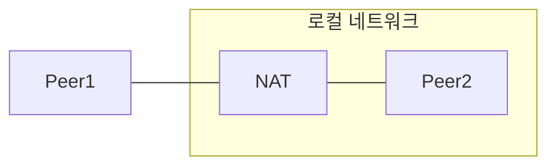
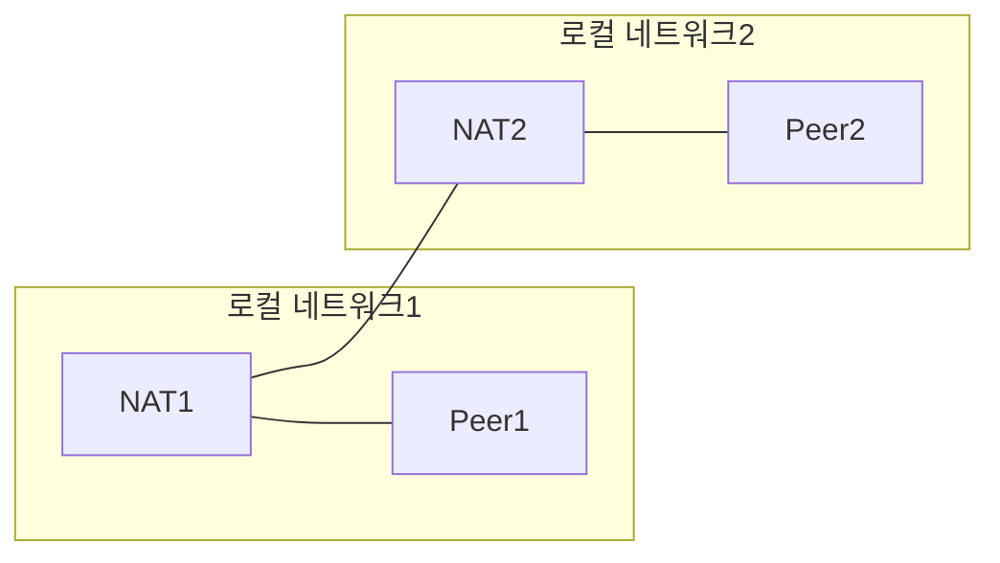
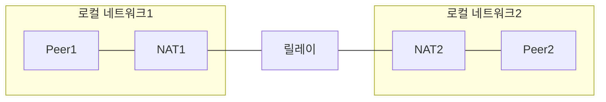

import Tabs from "@theme/Tabs";
import TabItem from "@theme/TabItem";

## WireGuard

- https://www.wireguard.com/

> WireGuard® is an extremely simple yet fast and modern VPN that utilizes **state-of-the-art** [cryptography](https://www.wireguard.com/protocol/).

WireGuard는 최첨단 암호화 기술을 활용한 매우 단순하고 빠르며 현대적인 VPN입니다.

서버와 클라이언트 모두 네트워크 인터페이스를 생성하며 이를 위한 설정 파일이 있습니다. `wg0`라는 네트워크 인터페이스를 설정하려면 `/etc/wireguard/wg0.conf` 파일을 생성하여 설정하면 됩니다.

## Cryptokey Routing Table

서버의 설정파일 예시는 아래와 같습니다.

```ini title="/etc/wireguard/wg0.conf"
[Interface]
PrivateKey = yAnz5TF+lXXJte14tji3zlMNq+hd2rYUIgJBgB3fBmk=
ListenPort = 51820

# Peer1
[Peer]
PublicKey = xTIBA5rboUvnH4htodjb6e697QjLERt1NAB4mZqp8Dg=
AllowedIPs = 10.192.122.3/32, 10.192.124.1/24

# Peer2
[Peer]
PublicKey = TrMvSoP4jYQlY6RIzBgbssQqY3vxI2Pi+y71lOWWXX0=
AllowedIPs = 10.192.122.4/32, 192.168.0.0/16

# Peer3
[Peer]
PublicKey = gN65BkIKy1eCE9pP1wdc8ROUtkHLF2PfAqYdyYBz6EA=
AllowedIPs = 10.10.10.230/32
```

패킷이 `Peer` -\> `Interface` 방향으로 전달되면 `PrivateKey`로 패킷을 복호화합니다. 그리고 source IP가 해당 피어의 `AllowedIPs`에 포함되어 있다면 네트워크 인터페이스로 보내고 아니면 버립니다. 예를 들어 Peer1이 패킷을 보냈을때, source IP가 `10.192.122.3`이었다면 이 패킷을 허용하고 아니면 삭제합니다.

패킷이 `Interface` -\> `Peer` 방향으로 전달되면 destination IP를 확인하여 피어 목록에서 해당 IP를 `AllowedIPs`로 가진 피어를 찾습니다. 피어를 찾았다면 패킷을 해당 피어의 `PublicKey`로 암호화하여 해당 피어의 가장 최근 엔드포인트로 보냅니다. 예를 들어 destination IP가 `10.10.10.230`이었다면 Peer3에게 패킷을 보냅니다.

## 패킷 라우팅 방식

### 직접 연결

<center>


</center>

### 한 피어가 로컬 네트워크에 있는 경우

<center>



</center>

### 피어들이 각자 다른 로컬 네트워크에 있는 경우

<center>



</center>

<center>또는</center>

<center>



</center>

## 설치 및 사전준비

- https://www.wireguard.com/install/

<Tabs
    groupId="os"
    defaultValue="debian"
    values={[
        {label: 'Debian', value: 'debian',},
        {label: 'Mac OS', value: 'mac',}
    ]}
>

<TabItem value="debian">

```shell
sudo apt install wireguard
```

</TabItem>

<TabItem value="mac">

```shell
brew install wireguard-tools
```

</TabItem>

</Tabs>

패킷 암호화/복호화에 사용될 키를 생성합니다.

```shell
umask 077 && wg genkey | sudo tee /etc/wireguard/privatekey \
  | wg pubkey | sudo tee /etc/wireguard/publickey
```

포워딩이 필요한 경우 ip_forward를 허용하도록 설정합니다.

```shell
echo "net.ipv4.ip_forward=1" | sudo tee /etc/sysctl.d/99-wireguard.conf > /dev/null \
&& sudo sysctl -p /etc/sysctl.d/99-wireguard.conf
```

## 설정

```ini title="/etc/wireguard/<interface>.conf"
[Interface]
# 주석
<key> = <value>

[Peer]
<key> = <value>
```

- `[Interface]`
  - `<key>`
    - `Address`
      - 인터페이스에 할당할 IP 주소 목록입니다.
      - `,`로 구분하여 여러 개를 지정할 수 있습니다.
      - IP4와 IP6을 지정할 수 있습니다.
      - CIDR mask를 쓸 수 있습니다.
      - 여러번 선언될 수 있습니다.
    - `DNS`
      - 인터페이스의 DNS 주소 목록입니다.
      - `,`로 구분하여 여러 개를 지정할 수 있습니다.
      - IP4, IP6, hostname을 지정할 수 있습니다.
      - 여러번 선언될 수 있습니다.
    - `PrivateKey`
      - 복호화에 사용될 개인키입니다.
    - `PreUp`, `PostUp`, `PreDown`, `PostDown`
      - `wg-quick up|down <intreface>` 명령을 실행하기 전/후에 실행할 bash 스크립트입니다.
      - `%i`는 `<interface>`로 치환됩니다.
      - 여러번 선언될 수 있습니다.
    - `SaveConfig`
      - `true`로 설정한 경우 `<interface>`가 제거되기 전 변경된 사항이 있다면 `/etc/wireguard/<interface>.conf`에 반영됩니다.
- `[Peer]`
  - 여러번 선언할 수 있습니다.
  - `<key>`
    - `AllowedIPs`
      - 라우팅에 사용될 IP 주소 목록입니다.
    - `PublicKey`
      - 암호화에 사용될 공개키입니다.
    - `Endpoint`
      - 엔드포인트 정보가 없을 때 사용되는 기본값입니다.
      - 기본적으로 WireGuard는 다른 피어로부터 패킷을 받을 때 해당 피어의 엔드포인트 정보를 갱신합니다.
      - 최초 통신 시 또는 통신이 끊어진 후 일정 시간이 지나면 해당 피어의 엔드포인트를 알 수 없습니다.
    - `PersistentKeepalive`
      - 피어에게 ping을 보내는 주기입니다.
      - 기본값은 0으로 ping을 보내지 않습니다.
      - ping을 받은 피어는 보낸 피어의 엔드포인트 정보를 갱신합니다.
      - 25로 설정하는 것이 합리적입니다.(https://www.wireguard.com/quickstart/)

## wg-quick

### 실행

```shell
sudo wg-quick up <interface>
```

:::info

서비스에 등록하면 컴퓨터가 재부팅되어도 자동으로 실행됩니다.

```shell
sudo systemctl enable wg-quick@<interface>
```

```shell
sudo systemctl start wg-quick@<interface>
```

:::

### 설정 업데이트

```shell
wg syncconf <interface> <(wg-quick strip <interface>)
```

### 중지

```shell
sudo wg-quick down <interface>
```
