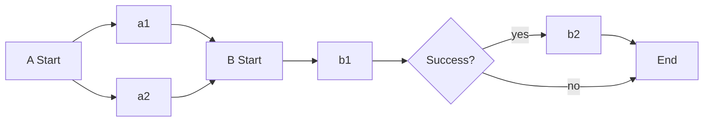

## Workflow

- https://argoproj.github.io/argo-workflows/fields/#workflowspec

```yaml
apiVersion: argoproj.io/v1alpha1
kind: Workflow
metadata:
  generateName: hello-world-
spec:
  entrypoint: <templateName> # 처음 시작되어야 할 템플릿 이름
  templates:
    - <template>
```

### `templates`

- https://argoproj.github.io/argo-workflows/fields/#template

#### `container`

쿠버네티스의 container spec을 그대로 사용하시면 됩니다.

- https://argoproj.github.io/argo-workflows/fields/#container

```yaml
spec:
  entrypoint: container-test
  templates:
    - name: container-test
      container:
        image: docker/whalesay
        command: [cowsay]
        args: ["hello world"]
```

`daemon`을 `true`로 설정하면 데몬이 호출된 템플릿 범위의 모든 작업이 완료될 때까지 실행됩니다. 전체 작업에서 임시로 사용될 데이터베이스를 생성하는 등의 용도로 사용할 수 있습니다.

```yaml
spec:
  template:
    - name: <templateName>
      daemon: true
      container:
        image: postgres:15.3
        ports:
          - name: postgres
            containerPort: 5432
```

#### `script`

- https://argoproj.github.io/argo-workflows/fields/#scripttemplate

```yaml
spec:
  entrypoint: script-test
  templates:
    - name: script-test
      script:
        image: python:alpine3.6
        command: [python]
        source: |
          import random
          i = random.randint(1, 100)
          print(i)
```

#### `resource`

쿠버네티스 resource를 직접 선언할 수 있습니다.

- https://argoproj.github.io/argo-workflows/fields/#resourcetemplate

```yaml
spec:
  entrypoint: resource-test
  serviceAccountName: argo-workflow
  templates:
    - name: resource-test
      steps:
        - - name: submit-resource
            template: create-pod

        - - name: delete-resource
            arguments:
              parameters:
                - name: selector
                  value: cleanup=true
            template: delete-resource

    - name: create-pod
      resource:
        action: create
        manifest: |
          apiVersion: v1
          kind: Pod
          metadata:
            generateName: hello-world-
            labels:
              cleanup: "true"
          spec:
            containers:
            - name: hello-world
              image: docker/whalesay
              command: [cowsay]
              args: ["hello world"]

    - name: delete-resource
      inputs:
        parameters:
          - name: selector
      resource:
        action: delete
        flags: ["pod", "--selector", "{{inputs.parameters.selector}}"]
```

#### `suspend`

- https://argoproj.github.io/argo-workflows/fields/#suspendtemplate

```yaml
spec:
  entrypoint: suspend-test
  templates:
    - name: suspend-test
      suspend:
        duration: "20s"
```

#### `steps`

`steps`는 연속적인 template 실행 순서를 정의할 수 있는 방법 중 하나입니다. 리스트 안의 리스트로 구성됩니다.

- https://argoproj.github.io/argo-workflows/fields/#workflowstep

```yaml
spec:
  entrypoint: steps-test
  templates:
    - name: steps-test
      steps:
        - - name: a1
            template: work1
          - name: a2
            template: work2
        - - name: b1
            template: work3
          - name: b2
            template: work4
            when: "{{steps.b1.outputs.result}} == success"
```

위와 같이 정의한 경우 아래와 같은 순서로 진행됩니다. `a1`, `a2`는 병렬로 실행되고, `b2`는 `b1`의 결과에 따라 실행됩니다.

<center>



</center>

#### `dag`

`dag`는 연속적인 template 실행 순서를 정의할 수 있는 방법 중 하나입니다. 의존성이 없는 작업은 바로 실행됩니다.

- https://argoproj.github.io/argo-workflows/fields/#dagtemplate

```yaml
spec:
  entrypoint: dag-test
  templates:
    - name: dag-test
      dag:
        tasks:
          - name: a1
            template: work1
          - name: a2
            template: work2
          - name: b1
            dependencies: [a1, a2]
            template: work3
          - name: b2
            dependencies: [b1]
            template: work4
            when: "{{tasks.b1.outputs.result}} == success"
```

### `volumes`

`container`가 마운트할 수 있는 볼륨 목록을 선언할 수 있습니다.

- https://argoproj.github.io/argo-workflows/fields/#volume

```yaml
spec:
  volumes:
    - name: <volumeName>
      persistentVolumeClaim:
        claimName: <existingPvcName>

  templates:
    - name: <templateName>
      container:
        image: ubuntu:20.04
        command:
          - ls
        args:
          - /mnt/vol
        volumeMounts:
          - name: <volumeName>
            mountPath: /mnt/vol
```

```yaml
spec:
  volumeClaimGC:
    strategy: OnWorkflowSuccess # OnWorkflowSuccess | OnWorkflowCompletion
  volumeClaimTemplates:
    - metadata:
        name: <pvcName> # PersistentVolumeClaim의 이름이면서 동시에 volumes.name이 됩니다.
      spec:
        accessModes: [ReadWriteOnce]
        resources:
          requests:
            storage: 1Gi

  templates:
    - name: <templateName>
      container:
        image: ubuntu:20.04
        command:
          - ls
        args:
          - /mnt/vol
        volumeMounts:
          - name: <pvcName>
            mountPath: /mnt/vol
```

## Variables

- https://argoproj.github.io/argo-workflows/variables/

## Reference

- https://argoproj.github.io/argo-workflows/workflow-concepts/
- https://argoproj.github.io/argo-workflows/fields/
