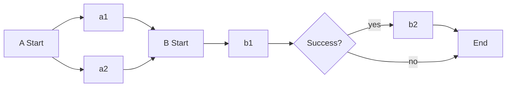

## entrypoint

`entrypoint`로 지정된 `template`이 workflow의 시작점이 됩니다.

```yaml
spec:
  entrypoint: <templateName>
```

## template

- https://argoproj.github.io/argo-workflows/fields/#template

`template`은 workflow에서 작업을 정의할 때 사용하는 실행 단위입니다. `container`, `script`, 등은 실행 가능한 하나의 작업을 정의하며, `steps`, `dag`는 정의된 template들의 실행 순서가 정의된 하나의 집합을 작업으로 정의합니다.

### `container`

- https://argoproj.github.io/argo-workflows/fields/#container

`container`는 원하는 컨테이너 이미지를 사용하여 Pod을 실행시키는 작업을 정의할 수 있습니다. 쿠버네티스의 container spec을 그대로 사용하시면 됩니다.

```yaml
spec:
  entrypoint: container-test
  templates:
    - name: container-test
      container:
        image: docker/whalesay
        command: [cowsay]
        args: ["hello world"]
```

`daemon`을 `true`로 설정하면 데몬이 호출된 템플릿 범위의 모든 작업이 완료될 때까지 실행됩니다. 전체 작업에서 임시로 사용될 데이터베이스를 생성하는 등의 용도로 사용할 수 있습니다.

```yaml
spec:
  template:
    - name: <templateName>
      daemon: true
      container:
        image: postgres:15.3
        ports:
          - name: postgres
            containerPort: 5432
        env:
          - name: PGDATA
            value: /var/lib/postgresql/data
          - name: POSTGRES_USER
            value: test
          - name: POSTGRES_PASSWORD
            value: test
        volumeMounts:
          - name: tmp-db
            mountPath: /var/lib/postgresql
```

### `containerSet`

- https://argoproj.github.io/argo-workflows/fields/#containersettemplate

### `script`

- https://argoproj.github.io/argo-workflows/fields/#scripttemplate

스크립트 실행을 바로 할 수 있도록 `source` 필드를 추가한 `container`의 래퍼입니다.

```yaml
spec:
  entrypoint: script-test
  templates:
    - name: script-test
      script:
        image: python:alpine3.6
        command: [python]
        source: |
          import random
          i = random.randint(1, 100)
          print(i)
```

### `resource`

`resource`는 쿠버네티스 리소스를 직접 선언할 수 있습니다.

- https://argoproj.github.io/argo-workflows/fields/#resourcetemplate

```yaml
spec:
  entrypoint: resource-test
  serviceAccountName: argo-workflow
  templates:
    - name: resource-test
      steps:
        - - name: submit-resource
            template: create-pod

        - - name: delete-resource
            arguments:
              parameters:
                - name: selector
                  value: cleanup=true
            template: delete-resource

    - name: create-pod
      resource:
        action: create
        manifest: |
          apiVersion: v1
          kind: Pod
          metadata:
            generateName: hello-world-
            labels:
              cleanup: "true"
          spec:
            containers:
            - name: hello-world
              image: docker/whalesay
              command: [cowsay]
              args: ["hello world"]

    - name: delete-resource
      inputs:
        parameters:
          - name: selector
      resource:
        action: delete
        flags: ["pod", "--selector", "{{inputs.parameters.selector}}"]
```

### `data`

- https://argoproj.github.io/argo-workflows/fields/#data

### `suspend`

- https://argoproj.github.io/argo-workflows/fields/#suspendtemplate

`suspend`는 workflow를 일시 중지시키는 작업을 정의할 수 있습니다. `argo resume`이나 `/api/v1/workflows/{namespace}/{name}/resume`를 호출하여 다시 시작할 수 있습니다.

```yaml
spec:
  entrypoint: suspend-test
  templates:
    - name: suspend-test
      suspend:
        {} # 무기한 중지
        # duration: "20s"
```

### `http`

- https://argoproj.github.io/argo-workflows/fields/#http

```yaml
spec:
  templates:
    - name: <templateName>
      http:
        url: <url>
        method: <method>
        headers:
          - name: <headerName> # ex) x-forwarded-user
            value: <headerValue>
        body: <body>
        successCondition: <successCondition>
```

- variables
  - `request.body`
  - `request.headers`: `map[string]string`
  - `response.url`: http.url과 동일합니다.
  - `response.method`: http.method와 동일합니다.
  - `response.statusCode`
  - `response.body`
  - `response.headers`: `map[string]string`

### `steps`

`steps`는 연속적인 template 실행 순서를 정의할 수 있는 방법 중 하나입니다. 리스트 안의 리스트로 구성됩니다.

- https://argoproj.github.io/argo-workflows/fields/#workflowstep

```yaml
spec:
  entrypoint: steps-test
  templates:
    - name: steps-test
      steps:
        - - name: a1
            inline:
              {}
              # <template>을 직접 선언할 수 있습니다.
          - name: a2
            template: work2
        - - name: b1
            template: work3
          - name: b2
            template: work4
            when: "{{steps.b1.outputs.result}} == success"
```

위와 같이 정의한 경우 아래와 같은 순서로 진행됩니다. `a1`, `a2`는 병렬로 실행되고, `b2`는 `b1`의 결과에 따라 실행됩니다.

<center>



</center>

### `dag`

`dag`는 연속적인 template 실행 순서를 정의할 수 있는 방법 중 하나입니다. 의존성이 없는 작업은 바로 실행됩니다.

- https://argoproj.github.io/argo-workflows/fields/#dagtemplate

```yaml
spec:
  entrypoint: dag-test
  templates:
    - name: dag-test
      dag:
        tasks:
          - name: a1
            inline:
              {}
              # <template>을 직접 선언할 수 있습니다.
          - name: a2
            template: work2
          - name: b1
            dependencies: [a1, a2]
            template: work3
          - name: b2
            dependencies: [b1]
            template: work4
            when: "{{tasks.b1.outputs.result}} == success"
```
