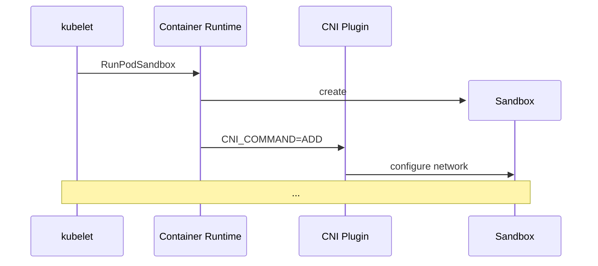

import useBaseUrl from "@docusaurus/useBaseUrl";
import DrwaIOViewer from "@site/src/components/DrawIOViewer";

## CNI

<center>
	<figure>
		<DrwaIOViewer src={useBaseUrl("img/mlops/network/calico/cni-with-calico-ipam.drawio")} />
		<figcaption>Calico CNI and Calico IPAM(pod-network-cidr=10.130.0.0/16)</figcaption>
		<figcaption>https://www.youtube.com/watch?v=JyLtg_SJ1lo</figcaption>
	</figure>
</center>

- [Network configuration format](#cni-설정)
- Execution Protocol
  - 플러그인은 실행파일이어야 합니다.
  - 플러그인은 환경 변수와 stdin을 통해 설정값을 받습니다.
  - 플러그인은 설정 성공 시 stdout, 실패 시 stderr로 결과를 반환합니다.
- Execution of Network Configurations
  - 컨테이너 런타임은 네트워크 설정을 해석하여 CNI 플러그인을 실행합니다.
  - 수명 주기
    - 컨테이너 런타임은 플러그인을 호출하기 전에 컨테이너에 대한 새 네트워크 네임스페이스를 생성해야 합니다.
    - ...
    - 컨테이너 런타임은 컨테이너의 네트워크 네임스페이스 정리를 담당합니다.
- Plugin Delegation
  - CNI 플러그인은 일부 기능을 다른 플러그인에 위임할 수 있습니다.(e.g., IPAM plugin)
  - 위임받은 플러그인은 실행파일이어야 합니다.
  - 위임받은 플러그인은 CNI 플러그인에 전달된 것과 동일한 환경 변수와 stdin을 모두 설정값으로 받아야합니다.
  - 위임받은 플러그인은 설정 성공 시 stdout, 실패 시 stderr로 결과를 반환합니다.
- Result Types
  - CNI 플러그인의 실행 결과에 대한 JSON 형식의 스키마가 있습니다.

Pod을 생성하면 CNI plugin은 아래와 같은 절차로 호출되어 네트워크를 설정합니다.



- Container Runtime은
  - Sandbox 컨테이너를 생성하고 Network Namespace를 생성합니다.
  - `/etc/cni/net.d/`에서 알파벳순으로 첫번째 CNI 설정 파일(`.conf`, `.conflist`)을 읽습니다.
  - 설정에 맞춰 CNI plugin의 `ADD` 명령어를 호출합니다.

## CNI 설정

### 규칙

:::info[Reference]

- [CNI GitHub / SPEC.md # Network Configuration Format](https://github.com/containernetworking/cni/blob/main/SPEC.md#section-1-network-configuration-format)

:::

- `cniVersion`, `cniVersions`
- `name`
- `plugins`
  - https://www.cni.dev/plugins/current/
  - https://github.com/containernetworking/plugins
  - plugin이 하나인 경우 `plugins`없이 상위에 임베딩 할 수 있습니다.
  - `type`을 제외한 나머지 필드는 플러그인마다 다르며, 정해진 값이 없습니다.
  - `type`: CNI 바이너리 이름과 매칭되는 값입니다.
    - `ls /opt/cni/bin`
  - `ipam`
    - `type`: IPAM 바이너리 이름과 매칭되는 값입니다.
      - https://www.cni.dev/plugins/current/ipam/
      - `dhcp`
      - `host-local`
      - `static`

### 예시

```json title="/etc/cni/net.d/10-calico.conflist"
{
	"cniVersion": "0.3.1",
	"name": "k8s-pod-network",
	"plugins": [
		{
			"type": "calico",
			// plugin specific parameters
			"datastore_type": "kubernetes",
			"ipam": {
				"type": "calico-ipam",
				"assign_ipv4": "true"
			},
			"policy": {
				"type": "k8s"
			},
			"kubernetes": {
				"kubeconfig": "/etc/cni/net.d/calico-kubeconfig"
			}

			//...
		}
	]
}
```

```json title="/etc/cni/net.d/00-multus.conf"
{
	"cniVersion": "0.3.1",
	"name": "multus-cni-network",
	"type": "multus-shim",
	"capabilities": {
		"bandwidth": true,
		"portMappings": true
	},
	"clusterNetwork": "/host/etc/cni/net.d/10-calico.conflist"
}
```
