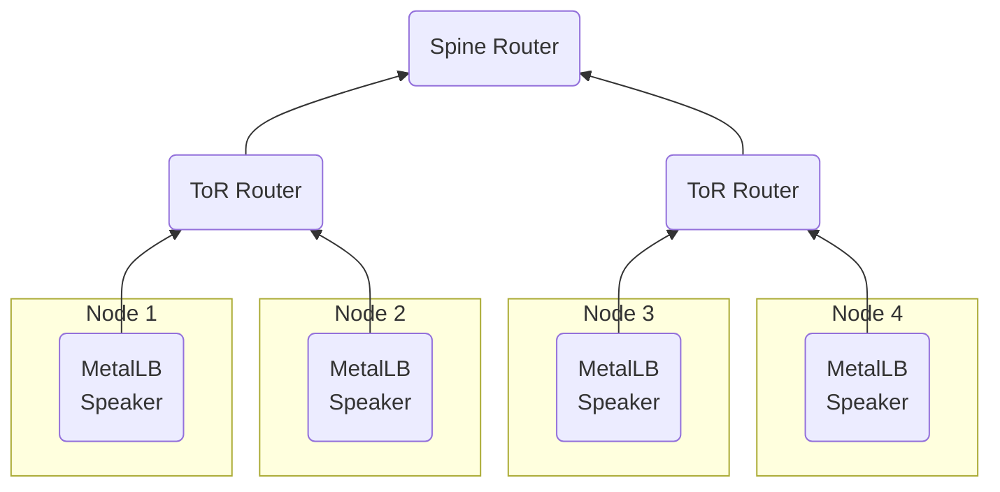

## BGP 사용하기



### L3 스위치 설정

:::info[Reference]

- [Cisco / Catalyst 9400 Series Switches / 17.12.x / Configuration BGP](https://www.cisco.com/c/en/us/td/docs/switches/lan/catalyst9400/software/release/17-12/configuration_guide/rtng/b_1712_rtng_9400_cg/configuring_bgp.html)

:::

```shell
Device> show version
# Cisco IOS XE Software, Version 17.12.02
# Cisco IOS Software [Dublin], Catalyst L3 Switch Software (CAT9K_IOSXE), Version 17.12.2, RELEASE SOFTWARE (fc2)
# ...
```

```shell
Device> show inventory
# ...
# PID: C9300X-24Y ...
# ...
```

```shell
Device> enable
# Password:
```

```shell
Device# configure terminal
```

```shell
Device(config)# ip routing
```

```shell
Device(config)# router bgp <ASN>
# 삭제: no router bgp <ASN>
```

```shell
neighbor <peerGroup> peer-group
# 삭제: no neighbor <peerGroup> peer-group
```

```shell
neighbor <peerGroup> remote-as <remoteASN>
```

```shell
neighbor <peerIP> peer-group <peerGroup>
```

```shell
neighbor <peerGroup> ebgp-multihop <hops>
```

```shell
maximum-paths <int>
```

Equal Cost Multi-Path(ECMP) 설정입니다. 기본값은 1입니다.

:::tip

```shell
traceroute <peerIP>
```

명령어를 통해 나온 hop 수를 기준으로 + 1~2 값을 설정합니다.

:::

```shell
end
```

```shell
show ip bgp neighbor
```

```shell
copy running-config startup-config
```

:::tip

peer가 인식하는 스위치의 IP 주소를 확인하기 위해 아래 명령어를 실행합니다.

```shell
Device# show ip route <peerIP>
```

`via <interface>` 형식으로 interface만 표시되는 경우 아래 명령어를 실행하여 IP 주소를 확인합니다.

```shell
Device# show run interface <interface>
```

:::

### BFDProfile

:::info[Reference]

- [MetalLB / API reference # BFDProfileSpec](https://metallb.io/apis/#bfdprofilespec)

:::

```yaml
apiVersion: metallb.io/v1beta1
kind: BFDProfile
metadata:
  name: <name>
  namespace: metallb-system
spec:
  detectMultiplier: 4
```

- `receiveInterval: 300ms`
- `transmitInterval: 300ms`
- `detectMultiplier: <int>`: 몇 번 실패하면 링크 끊김으로 판단할지에 대한 값입니다.

### BGPPeer

:::info[Reference]

- [MetalLB / API reference # BGPPeerSpec](https://metallb.io/apis/#bgppeerspec)

:::

```yaml
apiVersion: metallb.io/v1beta2
kind: BGPPeer
metadata:
  name: <name>
  namespace: metallb-system
spec:
  myASN: <ASN>
  peerASN: <peerASN>
  peerAddress: <peerAddress>
  ebgpMultiHop: true
```

- `myASN: <ASN>`
  - MetalLB 자기 자신에대한 Autonomous System Numbers(ASN)입니다.
  - 64512 ~ 65534는 Private ASN입니다.
- `peerASN: <peerASN>`
- `peerAddress: <peerAddress>`
- `ebgpMultiHop: false`
- `bfdProfile: <bfdProfileName>`

### BGPAdvertisement

:::info[Reference]

- [MetalLB / API reference # BGPAdvertisementSpec](https://metallb.io/apis/#bgpadvertisementspec)

:::

```yaml
apiVersion: metallb.io/v1beta1
kind: BGPAdvertisement
metadata:
  name: <name>
  namespace: metallb-system
spec:
  ipAddressPools:
    - <ipAddressPool>
  peers:
    - <peerName>
```

- `ipAddressPoolSelectors: []`
  - [LabelSelector](/docs/mlops/kubernetes/object-management/label#label-selector)

```shell
for speaker in $(kubectl get pods -n metallb-system -l app.kubernetes.io/component=speaker -o name); do
  kubectl exec -n metallb-system $speaker -c frr -- vtysh -c "show ip bgp summary"
done
```
