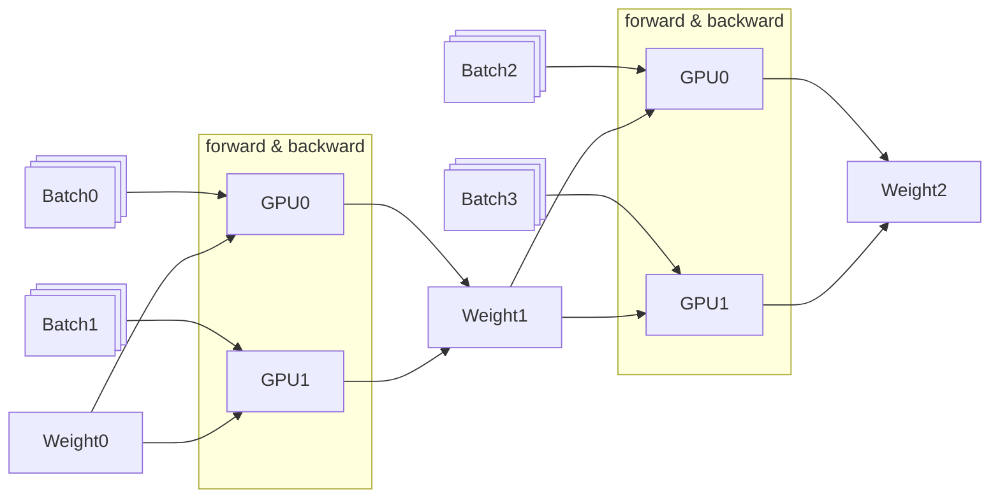
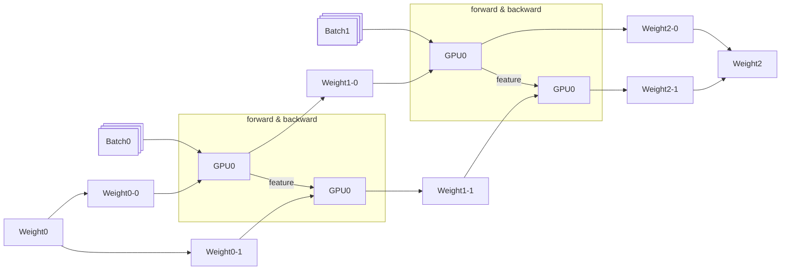

import useBaseUrl from "@docusaurus/useBaseUrl";

## Data Parallelism(DP)

Multi GPU 환경에서 데이터를 병렬화하여 모델을 학습하는 방법입니다. 매 스텝마다 $\Delta \mathbf{w}$를 집계하여 $W$를 업데이트하는 비용이 추가적으로 발생합니다.

모델이 커짐에 따라 발생하는 메모리 문제를 해결하기 위해 [ZeRO](https://www.microsoft.com/en-us/research/blog/zero-deepspeed-new-system-optimizations-enable-training-models-with-over-100-billion-parameters/)를 함께 사용할 수 있습니다.

## Pipeline Parallelism(PP)

Multi GPU 환경에서 모델을 레이어 단위로 분할하여 병렬화하는 방법입니다.

	
	<figcaption>
		[Figure 2 - GPipe: Easy Scaling with Micro-Batch Pipeline Parallelism](https://arxiv.org/pdf/1811.06965)
	</figcaption>

각 레이어는 이전 레이어의 출력을 입력으로 받아야하므로 일부 GPU가 아무일도 하지 않는 Bubble이라는 문제가 발생합니다.

## Tensor Parallelism(TP)

Multi GPU 환경에서 레이어 자체를 분할하여 병렬화하는 방법입니다.

## 3D Parallelism

	
	<figcaption>
		[Figure 1 - DeepSpeed: Extreme-scale model training for
		everyone](https://www.microsoft.com/en-us/research/blog/deepspeed-extreme-scale-model-training-for-everyone/)
	</figcaption>
	
	<figcaption>
		[Figure 2 - DeepSpeed: Extreme-scale model training for
		everyone](https://www.microsoft.com/en-us/research/blog/deepspeed-extreme-scale-model-training-for-everyone/)
	</figcaption>

