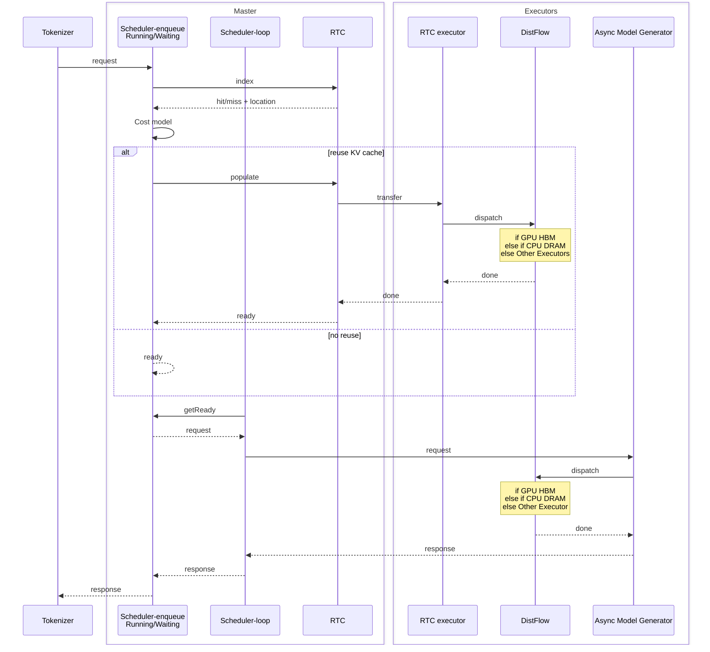

## FlowServe Engine

## Distributed Scheduling

### PD-aware Scheduling

34B 모델을 사용(TP=4)한 테스트에서 PD disaggregation을 사용한 경우와 아닌 경우 E2EL을 비교했을 때, 아래와 같은 결론을 얻었습니다.

$$
\dfrac{\text{PD disaggregation E2EL}}{\text{No PD disaggregation E2EL}} - 1 = \begin{cases}
\text{No PD disaggregation이 좋음} & \text{if } < 0  \\
\text{같음} & \text{if } = 0  \\
\text{PD disaggregation이 좋음} & \text{if } > 0
\end{cases}
$$

- Prefill token 수 대비 Decode token 수가 적은 경우 disaggregation을 사용하는 것이 더 좋습니다 ($> 0$).
- PD disaggregation을 사용하는 경우가 좋을 때가 사용하지 않는 경우가 좋을 때보다 더 큰 성능 차이를 보입니다 ($\max(> 0) > \max(< 0)$). 따라서 PD disaggregation만 선택하더라도 손실이 적습니다.
- RPS값이 달라지더라도 양상은 비슷합니다.

DeepServe는 이를 활용하기 위해 요청에 대한 Decode token 수를 예측하는 모델을 사용하여 라우팅을 수행해 봤고, 그 결과 10 RPS에서 성능향상을 보였습니다.

:::info[개인 의견]

Prompt 엔지니어링 등에 의해 Prefill token 수가 Decode token 수보다 많은 경우가 많다고 가정하면 Prefill token 수가 128 개 이상인 경우 PD disaggregation을 사용하고 그렇지 않은 경우 사용하지 않는 방식의 접근이 라우팅을 더 빠르게 할 수 있을 것 같습니다.

:::

## Fast Scaling

Huawei는 빠른 Scale out을 위해 아래와 같은 전략을 사용합니다.

- Scaler-Pre: 자원 스케쥴링을 피하기 위해 미리 Pod을 할당하여 자원을 점유합니다.
- Pre-load: Python 스크립트 시작, GPU 초기화 등을 진행하고 모델 로딩 전에 멈춥니다.
- Load
  - 원하는 모델을 사용중인 GPU를 그대로 복사해옵니다.(HCCL 또는 RoCE를 사용한 Huawei NPU fork라는 기능이 있다고합니다.)
  - 사용가능성이 있는 모델들을 CPU DRAM에 미리 로드해둡니다.
- Post-load: 더미 요청을 보내서 요청 처리시 필요한 모듈을 미리 메모리에 올려둡니다.
