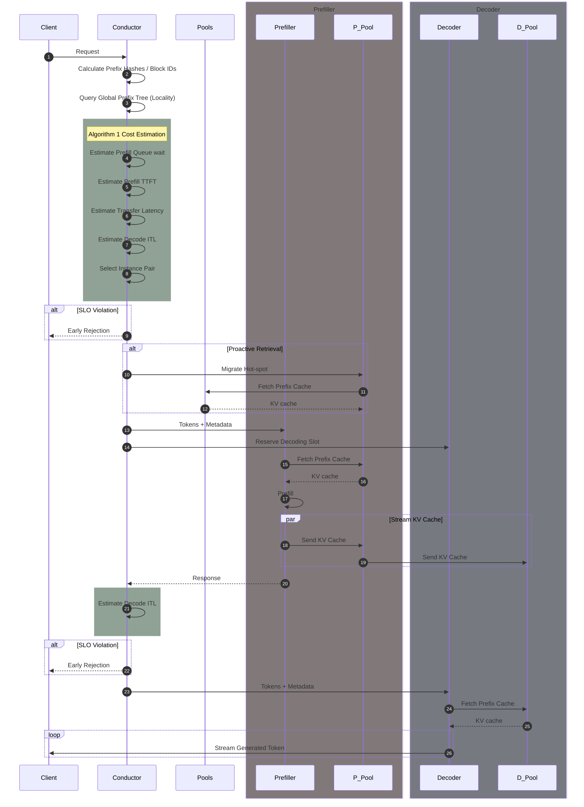

import useBaseUrl from "@docusaurus/useBaseUrl";

:::info[References]

- [Mooncake: A KVCache-centric Disaggregated Architecture for LLM Serving](https://arxiv.org/abs/2407.00079)

:::

## Introduction

<figure>
	

		
		 
		<figcaption>[Figure 1: Mooncake Architecture.](https://arxiv.org/html/2407.00079v3)</figcaption>
	

</figure>

Mooncake는 다음 Service Level Objectives (SLOs)를 고려하여 디자인되었습니다.

- Time To First Token (TTFT)
- Time Between Tokens (TBT) == Inter-Token Latency (ITL)

이를 만족시키기 위해

- Prefill Pool은 KV cache를 최대한 재활용하여 각 요청에 대한 컴퓨팅 시간을 단축해야 합니다.
- Decode Pool은 각 배치의 토큰 수를 최대한 늘려서 Model FLOPs Utilization (MFU)를 높여야 합니다.

**Conductor**는 이 분산된 컴포넌트들을 조율하는 글로벌 스케줄러입니다.

- **Request Dispatching**: 현재 KVCache와 워크로드의 분포를 기반으로 prefill/decode 인스턴스 쌍을 선택하여 요청을 분배합니다.
- **KVCache Management**: KVCache 블록의 미래 사용량을 예측하여 복제(replicate) 및 스왑(swap)을 수행합니다. 가장 자주 사용되는 블록(hottest)은 혼잡을 피하기 위해 여러 노드에 복제하고, 덜 사용되는 블록(coldest)은 비용 절감을 위해 swap out 합니다.
- **Overload Handling**: 시스템 부하가 높을 때, prefill 단계를 마친 후 디코딩 슬롯이 없을 것으로 예상되면 낭비를 막기 위해 요청을 조기 거절(early rejection)하는 역할도 수행합니다.

## Overview of Mooncake's Disaggregated Architecture

<figure>
	

		
		 
		<figcaption>[Figure 3: The KVCache pool in CPU memory.](https://arxiv.org/html/2407.00079v3)</figcaption>
	

</figure>

<figure>
	

		
		 
		<figcaption>[Figure 4: Workflow of inference instances.](https://arxiv.org/html/2407.00079v3)</figcaption>
	

</figure>

Mooncake는 GPU HBM, CPU DRAM, RDMA 등의 리소스를 활용하여 KV cache를 관리합니다.

CPU DRAM의 KV cache pool은

- cache를 paged block 형태로 저장합니다.
  - 각 block은 512 개의 토큰을 저장할 수 있습니다.
  - 각 block은 자기 자신과 이전 block에 대한 hash 값을 가지고 있습니다.
- Least Recently Used (LRU), Least Frequently Used (LFU) 등 요청 패턴에 따라 block을 축출합니다.
- GPU 연산과 KV cache pool 관리는 병렬로 수행됩니다.

## KVCache-centric Scheduling

Mooncake는 단순히 부하 분산(load balancing)을 하는 것을 넘어서, prefix cache aware 와 load aware 스케줄링을 수행합니다.

## Sampled Real-wrold Request Trace

- Input Sequence Length (ISL)의 평균은 7590 이였습니다.
- Output Sequence Length (OSL)의 평균은 182 였습니다.
- KV cache 용량을 1000 blocks에서 50000 blocks로 올렸을 때 cache hit ratio는 30%에서 50%로 증가했습니다.
- 그 이상 용량을 늘리는 경우 영향은 미미했지만 샘플링 된 결과이므로 용량은 크면 클 수록 cache hit ratio가 증가할 가능성이 있습니다.
- 특정 block들은 수만 번 재사용되는 반면, 50%의 block이 거의 재사용되지 않았습니다.
