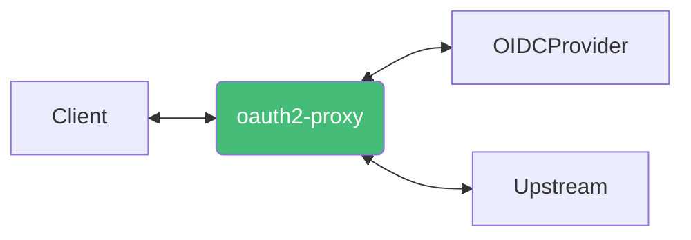
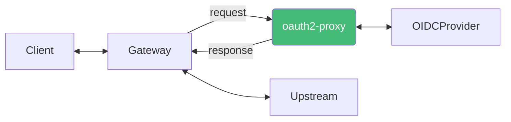

## 인증 방식

:::info
[설치 및 설정](/docs/mlops/oauth2-proxy/install.mdx) 문서는 별도로 분리되어 있습니다.
:::

### OAuth2 Reverse Proxy

OAuth2Proxy가 인증 역할과 리버스 프록시 역할 모두 수행

 

- `--upstream=<upstream-url>[,<upstream-url>...]`
  - 리버스 프록시에서 사용할 upstream 서버를 설정합니다
  - `/path`가 매핑됩니다

### OAuth2 Middleware

OAuth2Proxy가 인증 역할만 수행

- `--upstream=static://202`
  - upstream 서버를 설정하지 않고 인증이 성공한 경우 `202`, 실패한 경우 `401` 응답을 반환합니다
