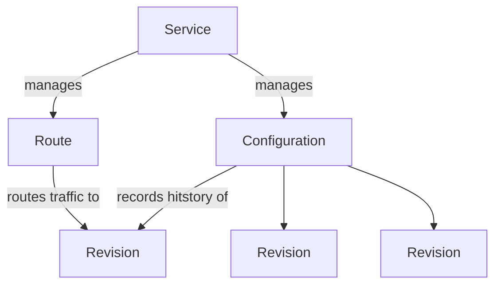

## Service

- https://github.com/knative/specs/blob/main/specs/serving/knative-api-specification-1.0.md#service-2

```yaml
apiVersion: serving.knative.dev/v1
kind: Service
metadata:
  name: <name>
  namespace: <namespace>
spec:
  template:
    metadata:
      annotations: {}
    spec:
      containerConcurrency: 0 # 0 == no-limit
      containers:
        - name: <containerName>
          image: <image>
          imagePullPolicy: IfNotPresent
          ports:
            # ports는 하나만 선언해야 합니다
            - name: http1 # http1|h2c
              containerPort: <port>
              protocol: TCP
          resources: {}
          env: []
  traffic: {}
```

- `template.metdata`
  - `annotations`
    - [Auto Scaling 설정하기](/docs/mlops/provisioning/knative/autoscaling)

## Route
