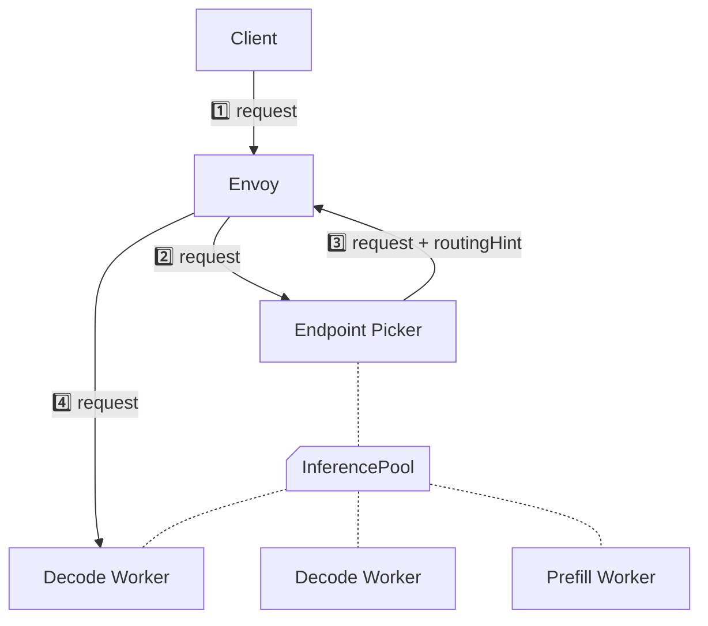
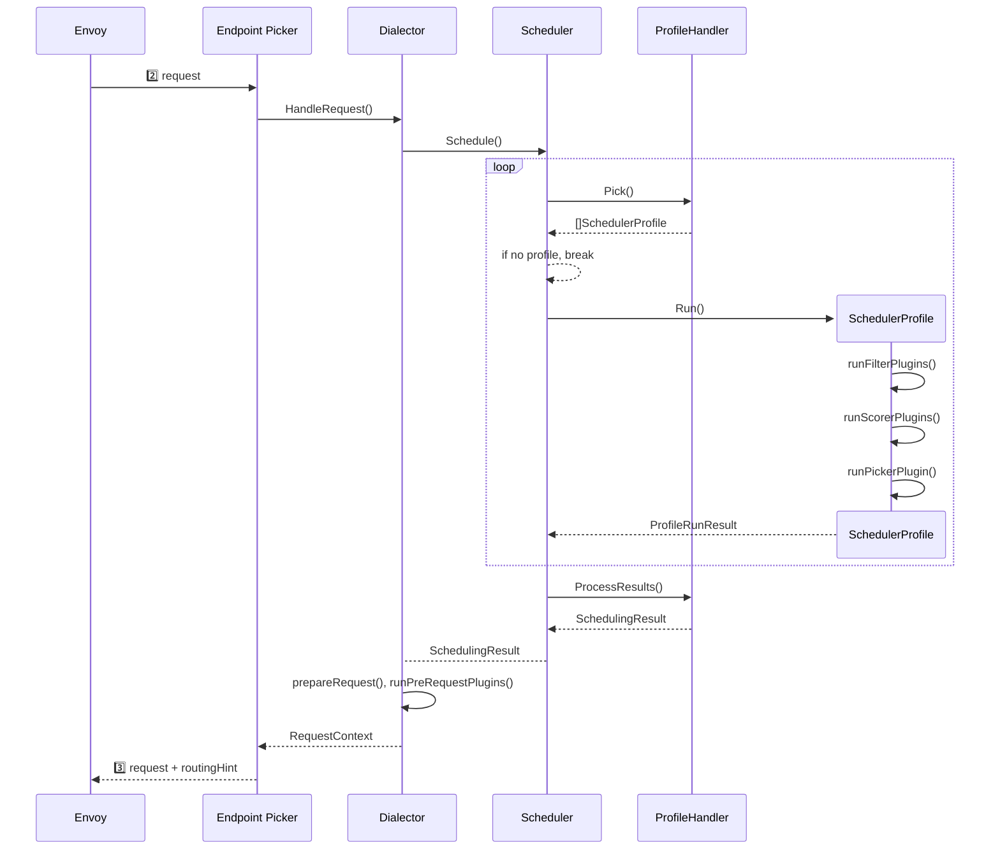

## Scheduler



- `ProfileHandler.Pick()`
  - 호출할 때, profile 리스트, 요청 내용, 이전 루프에서 실행된 profile에서 얻은 `CycleState`와 `ProfileRunResult`를 전달합니다.
  - 원하는 profile을 모두 실행시켰다고 판단되면 빈 리스트를 반환합니다.

## EndpointPickerConfig

:::info[References]

- [GIE / Guides / Configuring Plugins via text](https://gateway-api-inference-extension.sigs.k8s.io/guides/epp-configuration/config-text/)

:::

### 설정

```yaml
apiVersion: inference.networking.x-k8s.io/v1alpha1
kind: EndpointPickerConfig
plugins:
  - name: <name>
    type: <type>
    parameters:
      <key>: <value>
schedulingProfiles:
  - name: <name>
    plugins:
      - pluginRef: <pluginName>
        weight: <weight>
```

- `plugins: []`
  - SchedulerProfile에 등록할 **FilterPlugin**, **ScorerPlugin**, **PickerPlugin**과 **ProfileHandler**, **PreRequestPlugin**, **PostResponsePlugin**을 설정합니다.
  - ProfileHandler는 반드시 하나만 설정해야 합니다.
  - 설정한 PreRequestPlugin과 PostResponsePlugin은 모두 실행됩니다.
  - `name: <name>`
    - 설정하지 않으면 `type`이 사용됩니다.
  - `type: <type>`
    - EPP에 등록된 plugin type 중 하나를 지정합니다.
  - `parameters`
    - plugin에 전달할 파라미터를 설정합니다.
- `schedulingProfiles: []`
  - `name: <name>`
    - scheduler가 사용할 profile 이름을 설정합니다.
  - `plugins: []`
    - scheduler가 사용할 **FilterPlugin**, **ScorerPlugin**, **PickerPlugin**을 설정합니다.
    - PickerPlugin은 반드시 하나만 설정해야 합니다.
    - `pluginRef: <pluginName>`
    - `weight: 1`
      - plugin이 scorer일 때 사용되는 가중치입니다.

### 기본 Plugin Type

- ProfileHandler
  - `single-profile-handler`
- FilterPlugin
- ScorerPlugin
  - `prefix-cache-scorer`
    - `hashBlockSize: 64`
    - `maxPrefixBlocksToMatch: 256`
    - `lruCapacityPerServer: 31250`
  - `lora-affinity-scorer`
  - `kv-cache-utilization-scorer`
  - `queue-scorer`
  - `lora-affinity-scorer`
- PickerPlugin
  - `max-score-picker`
    - `maxNumOfEndpoints: 1`
  - `random-picker`
    - `maxNumOfEndpoints: 1`
- PreRequestPlugin
- PostResponsePlugin
