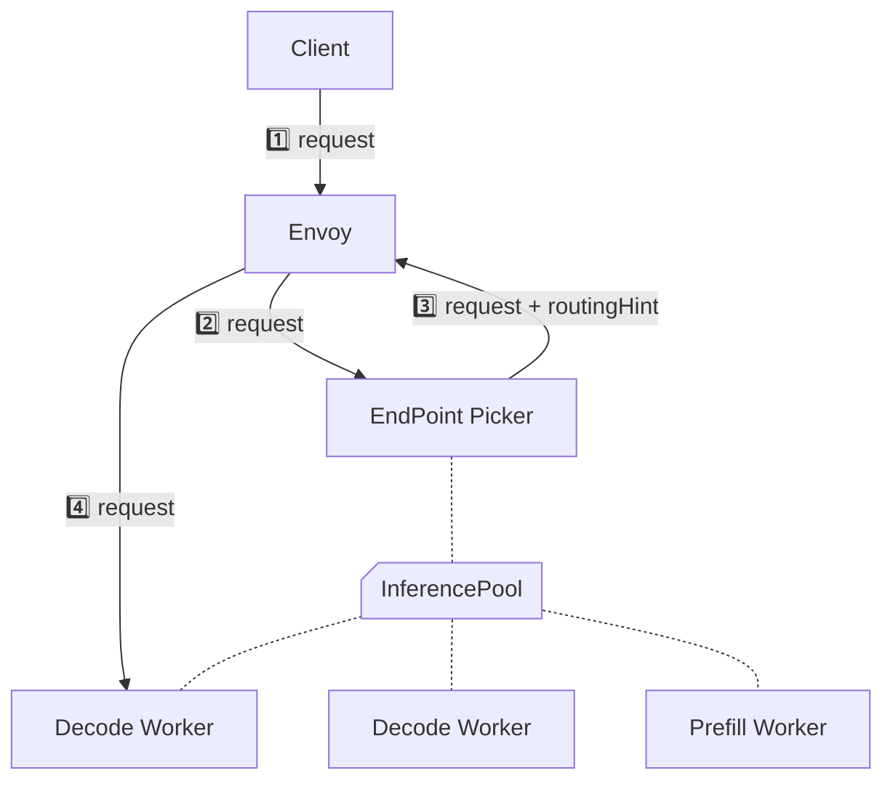

## EndPoint Picker (EPP)



## InferencePool

:::info[Reference]

- [Gateway API로 라우팅 관리하기 # HTTPRoute](/docs/mlops/kubernetes/network/gateway-api/route#httproute)
- [GIE / Reference / InferencePool](https://gateway-api-inference-extension.sigs.k8s.io/api-types/inferencepool/)

:::

```yaml
apiVersion: inference.networking.x-k8s.io/v1alpha2
kind: InferencePool
spec:
  selector:
    <key>: <value>
  targetPortNumber: 8000
  extensionRef:
    name: <eppServiceName>
```

- `selector`
  - pool에 포함할 Pod의 labels을 지정합니다.
- `targetPortNumber: <port>`
  - Pod의 포트를 지정합니다.
- `extensionRef`
  - `group: ""`
  - `kind: Service`
  - `name: <name>`
  - `portNumber: 9002`
  - `failureMode: FailClose|FailOpen`

```yaml
apiVersion: gateway.networking.k8s.io/v1
kind: HTTPRoute
spec:
  rules:
    - backendRefs:
        - group: inference.networking.x-k8s.io
          kind: InferencePool
          name: <inferencePoolName>
          port: 8000
```
